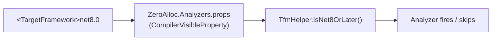

# Configuring ZeroAlloc.Analyzers

This guide explains how to control which rules fire, at what severity, and in which files. ZeroAlloc.Analyzers integrates fully with the standard .NET analyzer configuration model, so all the usual mechanisms work without any special setup.

---

## 1. Severity levels

Each diagnostic rule has a default severity that determines what happens when the rule fires during a build. The four levels are:

| Severity | Build effect | IDE effect |
|---|---|---|
| `error` | Build fails with an error | Red squiggle in editor |
| `warning` | Build emits a warning | Yellow squiggle in editor |
| `suggestion` / `info` | No build output | Faint squiggle or suggestion dot in IDE |
| `none` | Completely silenced | Nothing shown anywhere |

Rules in ZeroAlloc.Analyzers ship with one of two default severities:

- **Warning** — rules that flag a clearly suboptimal pattern where there is almost always a strictly better alternative (e.g., ZA0201 — use `stackalloc` instead of `new` for small fixed-size arrays). These produce compiler warnings and are visible in CI output.
- **Info / Suggestion** — rules that flag patterns that are *often* improvable but may have legitimate uses, or that require more context to judge (e.g., ZA0901 — consider `ArrayPool` for large allocations). These show as IDE hints only and do not appear in build output unless you explicitly promote them.

You can override the default severity for any rule using any of the mechanisms described in the sections below. The override takes effect immediately on the next build — no package reinstall is required.

---

## 2. Changing severity via .editorconfig

The recommended way to adjust severity is through `.editorconfig`. Drop a `.editorconfig` file at or above the project root and add `dotnet_diagnostic.<RuleId>.severity = <level>` entries under a `[*.cs]` section.

```ini
[*.cs]
# Downgrade a warning to suggestion (visible in IDE only, not in build output)
dotnet_diagnostic.ZA0601.severity = suggestion

# Silence a rule entirely — no squiggle, no build output
dotnet_diagnostic.ZA0105.severity = none

# Promote an info rule to a warning so it appears in CI output
dotnet_diagnostic.ZA0901.severity = warning

# Treat a specific warning as a hard error
dotnet_diagnostic.ZA0201.severity = error
```

**.editorconfig files are hierarchical.** When multiple `.editorconfig` files apply to a source file, the file closest to the source file wins for any given key. This means you can set a project-wide default at the repository root and then override it for a subdirectory by adding a second `.editorconfig` closer to those files. For example:

```
/repo/.editorconfig          ← dotnet_diagnostic.ZA0601.severity = warning
/repo/src/Legacy/.editorconfig  ← dotnet_diagnostic.ZA0601.severity = none
```

Files under `/repo/src/Legacy/` will see `none`; all other files will see `warning`.

If a `.editorconfig` file contains `root = true`, the search for parent `.editorconfig` files stops there. Place `root = true` in your repository root `.editorconfig` to prevent accidental inheritance from files outside the repo.

---

## 3. Per-file suppression via .editorconfig

The same `dotnet_diagnostic` entries can be scoped to glob patterns instead of `[*.cs]`, letting you silence rules for specific file categories without touching source code.

```ini
# Disable ZA0601 in all test files — test helpers often legitimately use
# less-optimal patterns for readability and setup convenience
[**/*Tests.cs]
dotnet_diagnostic.ZA0601.severity = none

# Disable allocation-site rules in generated code — the generator owns
# these files and cannot be configured to follow the analyzer's suggestions
[**/Generated/**/*.cs]
dotnet_diagnostic.ZA0101.severity = none
dotnet_diagnostic.ZA0102.severity = none
```

Common patterns and their typical use:

| Pattern | Typical use |
|---|---|
| `[**/*Tests.cs]` | xUnit / NUnit / MSTest test classes |
| `[**/*Spec.cs]` | BDD-style spec files |
| `[**/Generated/**/*.cs]` | Source-generated or T4-generated files |
| `[**/Migrations/**/*.cs]` | Entity Framework migration files |
| `[**/Benchmarks/**/*.cs]` | BenchmarkDotNet benchmark projects |

Note: glob patterns in `.editorconfig` are evaluated relative to the location of the `.editorconfig` file, not the project root. If your `.editorconfig` is at the repo root, `[**/Generated/**/*.cs]` will match any `Generated` folder anywhere in the repo.

---

## 4. Inline suppression

When you need to suppress a single occurrence rather than all occurrences in a file or directory, use an inline suppression in the source file. Two forms are available.

### Pragma form

The `#pragma warning` directive disables the rule for the lines between `disable` and `restore`:

```csharp
// Pragma form — suppresses the rule for a specific block of code.
// The comment after the rule ID is shown in IDE tooltips and in code review,
// so always document *why* the suppression is intentional.
#pragma warning disable ZA0105 // double lookup intentional for thread safety
var val = dict.ContainsKey(key) ? dict[key] : default;
#pragma warning restore ZA0105
```

Always pair `disable` with `restore` to limit the suppression to the narrowest possible scope. Suppressing without a matching `restore` silences the rule for the rest of the file.

### Attribute form

The `[SuppressMessage]` attribute targets a specific member and is visible during code review as part of the method signature:

```csharp
// Attribute form (method-level) — applies to the entire method body.
// The justification parameter is optional but strongly recommended.
[System.Diagnostics.CodeAnalysis.SuppressMessage(
    "Performance.Collections",
    "ZA0105:UseTryGetValue",
    Justification = "Called on a snapshot; concurrent access handled by the caller.")]
public string? GetValue(string key)
{
    if (dict.ContainsKey(key))
        return dict[key];
    return null;
}
```

The first argument is the diagnostic category (visible in the rule's documentation) and the second argument is `"<RuleId>:<Title>"`. The title portion after the colon is optional but improves readability of suppression audits.

The attribute can be applied at class, method, property, or assembly level. Assembly-level suppression (placed in `GlobalSuppressions.cs`) is equivalent to setting severity to `none` in `.editorconfig` and is generally the less discoverable option — prefer `.editorconfig` for project-wide decisions.

---

## 5. TFM-based rule gating

Some ZeroAlloc rules detect patterns that are only problematic (or only fixable) on specific .NET versions. For example, `CollectionsMarshal.GetValueRefOrAddDefault` (used by ZA0101) was introduced in .NET 8. There is no reason to fire that rule against a net6.0 project.

ZeroAlloc.Analyzers handles this automatically via a `CompilerVisibleProperty` that makes the project's `<TargetFramework>` visible to the analyzer at compile time:



When the project targets a framework that is too old for a rule, the analyzer's `Initialize` method sees the TFM at startup and simply does not register the syntax/symbol callbacks for that rule. The rule produces zero diagnostics and zero overhead — there is nothing to configure.

### TFM compatibility reference

The table below uses four representative rules to illustrate how TFM gating works. Rules with "Any" as their minimum TFM run unconditionally. Rules with an upper bound (e.g., `<net7.0`) only fire on older frameworks because the issue they flag was fixed in a later SDK.

| Rule | Min TFM | Active on net9.0 | Active on net6.0 | Active on net5.0 | Active on &lt;net5.0 |
|------|---------|:---:|:---:|:---:|:---:|
| ZA0101 — use `CollectionsMarshal` for hot-path dict mutations | net8.0 | ✓ | ✗ | ✗ | ✗ |
| ZA0103 — use `CollectionsMarshal.AsSpan` over `List<T>` copy | net5.0 | ✓ | ✓ | ✓ | ✗ |
| ZA0105 — use `TryGetValue` instead of double lookup | Any | ✓ | ✓ | ✓ | ✓ |
| ZA0801 — use `string.Concat` instead of interpolation (pre-optimization) | &lt;net7.0 | ✗ | ✓ | ✓ | ✓ |

For multi-targeted projects (`<TargetFrameworks>net8.0;net6.0</TargetFrameworks>`), the analyzer is invoked once per TFM and applies the appropriate gate for each compilation separately. You may therefore see a diagnostic in the `net8.0` build that does not appear in the `net6.0` build — this is expected and correct.

---

## 6. Disabling all rules

If you need to silence every performance diagnostic in a directory (for example, a directory of auto-generated files that you cannot modify), you can use the category-level severity override:

```ini
[**/Generated/**/*.cs]
dotnet_analyzer_diagnostic.category-Performance.severity = none
```

**Warning:** `dotnet_analyzer_diagnostic.category-Performance.severity = none` silences **all** analyzers in the `Performance` category, not just ZeroAlloc rules. This includes any other NuGet analyzer packages you have installed (e.g., Roslynator, StyleCop performance rules, Microsoft.CodeAnalysis.NetAnalyzers performance rules). Use this only when you are certain you want to disable all performance analysis for those files.

If you only want to silence ZeroAlloc rules specifically, enumerate them by rule ID (see section 3) or wait for a future release that may expose a package-level category flag.

For a project-wide disable (e.g., a legacy project you are not yet ready to clean up), you can place the entry at the top level:

```ini
[*.cs]
dotnet_analyzer_diagnostic.category-Performance.severity = none
```

This is an extreme measure. Consider disabling individual rules or promoting them to `suggestion` instead, so you retain IDE visibility without breaking the build.

---

## 7. Treating warnings as errors

If your project sets `<TreatWarningsAsErrors>true</TreatWarningsAsErrors>` in the `.csproj` or `Directory.Build.props`, all compiler warnings are promoted to errors — including ZeroAlloc Warning-severity diagnostics. This is a common CI hardening setting, and it means a new ZeroAlloc package version that introduces new Warning-severity rules will break your build on upgrade.

### Opting out specific rules from TreatWarningsAsErrors

Use the `<NoWarn>` MSBuild property to exclude specific rule IDs from the promotion:

```xml
<PropertyGroup>
  <TreatWarningsAsErrors>true</TreatWarningsAsErrors>
  <!-- These rules are valid concerns but we are deferring the fix to a later sprint -->
  <NoWarn>ZA0601;ZA0606</NoWarn>
</PropertyGroup>
```

`<NoWarn>` completely silences the listed rules (equivalent to `severity = none`). If you want the rules to remain visible as warnings in local development but not break CI, use the `.editorconfig` approach from section 2 in combination with a CI-specific `.editorconfig` or MSBuild condition instead.

### Opting out via .editorconfig alongside TreatWarningsAsErrors

You can also set a rule back to `warning` in `.editorconfig` after `TreatWarningsAsErrors` has been set, but this does **not** prevent the error promotion — `TreatWarningsAsErrors` is applied by the compiler after severity is resolved. To prevent a rule from being treated as an error you must either use `<NoWarn>`, downgrade the rule to `suggestion` in `.editorconfig`, or set it to `none`.

### Per-rule error promotion

Conversely, if `TreatWarningsAsErrors` is not set but you want specific ZeroAlloc rules to fail the build, set them to `error` in `.editorconfig`:

```ini
[*.cs]
# These two rules must never be violated in this codebase
dotnet_diagnostic.ZA0201.severity = error
dotnet_diagnostic.ZA0301.severity = error
```

This gives you targeted error enforcement without promoting every warning in the project.
