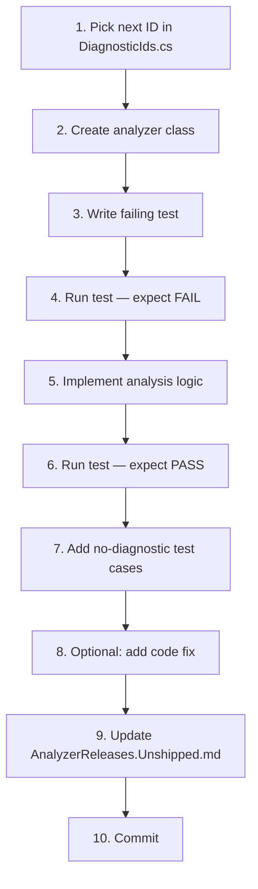

# Adding a New Rule

This guide walks through adding a new analyzer end-to-end, from picking an ID to writing tests and updating the release notes. We use a concrete fictional example throughout: **ZA0110 — Avoid Dictionary.Keys.Contains, use ContainsKey** — a rule that catches `dict.Keys.Contains(key)` (which allocates a `KeyCollection` view) and suggests `dict.ContainsKey(key)` instead.

## TDD Workflow



---

## Step 1: Pick the next ID

Open `src/ZeroAlloc.Analyzers/DiagnosticIds.cs`. Each rule category has its own block. The ZA01xx block covers Collections rules. Find the last constant in that block and add the next sequential ID:

```csharp
// ZA01xx — Collections
public const string UseFrozenDictionary = "ZA0101";
// ... existing rules ...
public const string AvoidZeroLengthArrayAllocation = "ZA0109";
public const string AvoidDictionaryKeysContains = "ZA0110";  // add this
```

The category mapping is defined in `src/ZeroAlloc.Analyzers/DiagnosticCategories.cs`. For a Collections rule, the category constant is `DiagnosticCategories.Collections` which maps to the string `"Performance.Collections"`.

---

## Step 2: Create the analyzer class

Create `src/ZeroAlloc.Analyzers/Analyzers/AvoidDictionaryKeysContainsAnalyzer.cs`:

```csharp
using System.Collections.Immutable;
using Microsoft.CodeAnalysis;
using Microsoft.CodeAnalysis.CSharp;
using Microsoft.CodeAnalysis.CSharp.Syntax;
using Microsoft.CodeAnalysis.Diagnostics;

namespace ZeroAlloc.Analyzers;

[DiagnosticAnalyzer(LanguageNames.CSharp)]
public sealed class AvoidDictionaryKeysContainsAnalyzer : DiagnosticAnalyzer
{
    private static readonly DiagnosticDescriptor Rule = new(
        DiagnosticIds.AvoidDictionaryKeysContains,
        "Avoid Dictionary.Keys.Contains, use ContainsKey",
        "Use 'ContainsKey' instead of 'Keys.Contains' to avoid allocating a KeyCollection view",
        DiagnosticCategories.Collections,
        DiagnosticSeverity.Warning,
        isEnabledByDefault: true);

    public override ImmutableArray<DiagnosticDescriptor> SupportedDiagnostics => [Rule];

    public override void Initialize(AnalysisContext context)
    {
        context.ConfigureGeneratedCodeAnalysis(GeneratedCodeAnalysisFlags.None);
        context.EnableConcurrentExecution();
        context.RegisterSyntaxNodeAction(AnalyzeInvocation, SyntaxKind.InvocationExpression);
    }

    private static void AnalyzeInvocation(SyntaxNodeAnalysisContext context)
    {
        var invocation = (InvocationExpressionSyntax)context.Node;

        // Match: <expr>.Contains(<arg>)
        if (invocation.Expression is not MemberAccessExpressionSyntax
            {
                Name.Identifier.Text: "Contains"
            } memberAccess)
        {
            return;
        }

        // The receiver must be a property access <expr>.Keys
        if (memberAccess.Expression is not MemberAccessExpressionSyntax
            {
                Name.Identifier.Text: "Keys"
            })
        {
            return;
        }

        // Verify via SemanticModel that the Contains call is on Dictionary<TKey,TValue>.KeyCollection
        var symbolInfo = context.SemanticModel.GetSymbolInfo(invocation);
        if (symbolInfo.Symbol is not IMethodSymbol methodSymbol)
            return;

        var containingType = methodSymbol.ContainingType;
        if (containingType == null)
            return;

        // Dictionary<TKey,TValue>.KeyCollection is the only type we care about
        if (containingType.OriginalDefinition.ToDisplayString()
            != "System.Collections.Generic.Dictionary<TKey, TValue>.KeyCollection")
        {
            return;
        }

        context.ReportDiagnostic(Diagnostic.Create(Rule, invocation.GetLocation()));
    }
}
```

Key points:

- `RegisterSyntaxNodeAction` on `SyntaxKind.InvocationExpression` means the callback fires for every method call. The syntactic pre-filter (checking the method name and receiver shape) keeps it fast before reaching the semantic check.
- `context.SemanticModel.GetSymbolInfo(invocation)` resolves the method symbol, which gives access to `ContainingType`.
- `OriginalDefinition.ToDisplayString()` is the standard pattern in this codebase (see `UseTryGetValueAnalyzer.cs`) for comparing generic types by their unbound form.
- `ConfigureGeneratedCodeAnalysis(GeneratedCodeAnalysisFlags.None)` suppresses the rule in generated code. `EnableConcurrentExecution()` allows the analyzer to run in parallel with others.

---

## Step 3: Write the first failing test

Create `tests/ZeroAlloc.Analyzers.Tests/ZA0110_AvoidDictionaryKeysContainsTests.cs`.

The test harness uses `CSharpAnalyzerVerifier<TAnalyzer>` from `ZeroAlloc.Analyzers.Tests.Verifiers`. Diagnostics are marked inline using `{|DiagnosticId:...|}`-style markers or with explicit `DiagnosticResult` objects — both styles are present in the codebase.

```csharp
using ZeroAlloc.Analyzers.Tests.Verifiers;

namespace ZeroAlloc.Analyzers.Tests;

public class ZA0110_AvoidDictionaryKeysContainsTests
{
    [Fact]
    public async Task DictionaryKeysContains_Reports()
    {
        var source = """
            using System.Collections.Generic;
            class C
            {
                bool Check(Dictionary<string, int> dict, string key)
                    => {|#0:dict.Keys.Contains(key)|};
            }
            """;

        var expected = CSharpAnalyzerVerifier<AvoidDictionaryKeysContainsAnalyzer>
            .Diagnostic(DiagnosticIds.AvoidDictionaryKeysContains)
            .WithLocation(0)
            .WithMessage("Use 'ContainsKey' instead of 'Keys.Contains' to avoid allocating a KeyCollection view");

        await CSharpAnalyzerVerifier<AvoidDictionaryKeysContainsAnalyzer>
            .VerifyAnalyzerAsync(source, "net8.0", expected);
    }
}
```

The `{|#0:...|}`  marker syntax pins the expected diagnostic to a location index. `WithLocation(0)` resolves that index. This is the same pattern used in `ZA0105_UseTryGetValueTests.cs`.

---

## Step 4: Run the test — expect FAIL

```bash
dotnet test tests/ZeroAlloc.Analyzers.Tests --filter "ZA0110" -v minimal
```

Expected output: the test fails because `AvoidDictionaryKeysContainsAnalyzer` does not exist yet. This is the red step in the TDD cycle — confirm the test is wired up correctly before writing the implementation.

---

## Step 5: Implement analysis logic

Add the analyzer class from Step 2. The critical pieces of the analysis logic are:

**Syntactic pre-filter** — reject invocations that cannot possibly match without touching the semantic model:

```csharp
// Match: <expr>.Contains(<arg>)
if (invocation.Expression is not MemberAccessExpressionSyntax
    { Name.Identifier.Text: "Contains" } memberAccess)
    return;

// The receiver must be a property access <expr>.Keys
if (memberAccess.Expression is not MemberAccessExpressionSyntax
    { Name.Identifier.Text: "Keys" })
    return;
```

**Semantic verification** — only trigger for the exact BCL type, not any type with a `Keys.Contains` surface:

```csharp
var symbolInfo = context.SemanticModel.GetSymbolInfo(invocation);
if (symbolInfo.Symbol is not IMethodSymbol methodSymbol)
    return;

if (containingType.OriginalDefinition.ToDisplayString()
    != "System.Collections.Generic.Dictionary<TKey, TValue>.KeyCollection")
    return;
```

**Report** — point the diagnostic at the full invocation expression so the squiggle covers `dict.Keys.Contains(key)`:

```csharp
context.ReportDiagnostic(Diagnostic.Create(Rule, invocation.GetLocation()));
```

---

## Step 6: Run the test — expect PASS

```bash
dotnet test tests/ZeroAlloc.Analyzers.Tests --filter "ZA0110" -v minimal
```

Expected output: the test passes. Move on to negative cases.

---

## Step 7: Add no-diagnostic test cases

Every analyzer needs tests that confirm it does NOT fire on correct code. Add these to the same test class:

```csharp
[Fact]
public async Task ContainsKey_NoDiagnostic()
{
    var source = """
        using System.Collections.Generic;
        class C
        {
            bool Check(Dictionary<string, int> dict, string key)
                => dict.ContainsKey(key); // correct — no diagnostic
        }
        """;
    await CSharpAnalyzerVerifier<AvoidDictionaryKeysContainsAnalyzer>
        .VerifyNoDiagnosticAsync(source);
}

[Fact]
public async Task HashSetContains_NoDiagnostic()
{
    var source = """
        using System.Collections.Generic;
        class C
        {
            bool Check(HashSet<string> set, string key)
                => set.Contains(key); // not a Dictionary.Keys — no diagnostic
        }
        """;
    await CSharpAnalyzerVerifier<AvoidDictionaryKeysContainsAnalyzer>
        .VerifyNoDiagnosticAsync(source);
}
```

`VerifyNoDiagnosticAsync` calls `VerifyAnalyzerAsync` with no expected diagnostics — the test fails if any diagnostic is reported.

Good negative cases to cover:

- The correct alternative (e.g. `dict.ContainsKey(key)`)
- A similar-looking pattern on a different type (e.g. `HashSet<T>.Contains`)
- Code that has the right method name but wrong receiver shape
- Edge cases involving interfaces or custom collection types

---

## Step 8: Optional — Add a code fix

If the diagnostic has a mechanical fix (as it does here: replace `dict.Keys.Contains(key)` with `dict.ContainsKey(key)`), add a code fix provider in the `src/ZeroAlloc.Analyzers.CodeFixes/` project.

```csharp
using System.Collections.Immutable;
using System.Composition;
using Microsoft.CodeAnalysis;
using Microsoft.CodeAnalysis.CodeActions;
using Microsoft.CodeAnalysis.CodeFixes;
using Microsoft.CodeAnalysis.CSharp.Syntax;

namespace ZeroAlloc.Analyzers.CodeFixes;

[ExportCodeFixProvider(LanguageNames.CSharp), Shared]
public sealed class AvoidDictionaryKeysContainsCodeFixProvider : CodeFixProvider
{
    public override ImmutableArray<string> FixableDiagnosticIds =>
        [DiagnosticIds.AvoidDictionaryKeysContains];

    public override FixAllProvider GetFixAllProvider() =>
        WellKnownFixAllProviders.BatchFixer;

    public override async Task RegisterCodeFixesAsync(CodeFixContext context)
    {
        var root = await context.Document.GetSyntaxRootAsync(context.CancellationToken);
        if (root == null) return;

        var diagnostic = context.Diagnostics[0];
        var node = root.FindNode(diagnostic.Location.SourceSpan);

        if (node is not InvocationExpressionSyntax invocation)
            return;

        context.RegisterCodeFix(
            CodeAction.Create(
                title: "Use ContainsKey",
                createChangedDocument: ct => RewriteAsync(context.Document, invocation, ct),
                equivalenceKey: DiagnosticIds.AvoidDictionaryKeysContains),
            diagnostic);
    }

    private static async Task<Document> RewriteAsync(
        Document document,
        InvocationExpressionSyntax invocation,
        CancellationToken ct)
    {
        var root = await document.GetSyntaxRootAsync(ct);
        if (root == null) return document;

        // invocation is: dict.Keys.Contains(key)
        // memberAccess.Expression is: dict.Keys
        // keysAccess.Expression is: dict
        var memberAccess = (MemberAccessExpressionSyntax)invocation.Expression;
        var keysAccess = (MemberAccessExpressionSyntax)memberAccess.Expression;
        var dictExpr = keysAccess.Expression;
        var keyArg = invocation.ArgumentList.Arguments[0];

        // Build: dict.ContainsKey(key)
        var replacement = SyntaxFactory.InvocationExpression(
            SyntaxFactory.MemberAccessExpression(
                SyntaxKind.SimpleMemberAccessExpression,
                dictExpr,
                SyntaxFactory.IdentifierName("ContainsKey")),
            SyntaxFactory.ArgumentList(
                SyntaxFactory.SingletonSeparatedList(keyArg)))
            .WithTriviaFrom(invocation);

        var newRoot = root.ReplaceNode(invocation, replacement);
        return document.WithSyntaxRoot(newRoot);
    }
}
```

Key points about the code fix structure:

- `FixableDiagnosticIds` must include the diagnostic ID from `DiagnosticIds.cs` — this is how the IDE links the fix to the squiggle.
- `WellKnownFixAllProviders.BatchFixer` enables "fix all in document / project / solution" for free.
- `RegisterCodeFixesAsync` locates the flagged syntax node via `root.FindNode(diagnostic.Location.SourceSpan)`.
- `equivalenceKey` must be unique per fix provider; using the diagnostic ID is the established pattern in this codebase (see `UseTryGetValueCodeFixProvider.cs`).
- The rewrite navigates the syntax tree by casting — `invocation.Expression` is the `MemberAccessExpressionSyntax` for `.Contains`, and its own `.Expression` is the `MemberAccessExpressionSyntax` for `.Keys`.

Test the code fix with `CSharpCodeFixVerifier<TAnalyzer, TCodeFix>`:

```csharp
[Fact]
public async Task DictionaryKeysContains_FixesToContainsKey()
{
    var source = """
        using System.Collections.Generic;
        class C
        {
            bool Check(Dictionary<string, int> dict, string key)
                => {|#0:dict.Keys.Contains(key)|};
        }
        """;

    var fixedSource = """
        using System.Collections.Generic;
        class C
        {
            bool Check(Dictionary<string, int> dict, string key)
                => dict.ContainsKey(key);
        }
        """;

    await CSharpCodeFixVerifier<
            AvoidDictionaryKeysContainsAnalyzer,
            AvoidDictionaryKeysContainsCodeFixProvider>
        .VerifyCodeFixAsync(source, fixedSource, DiagnosticIds.AvoidDictionaryKeysContains);
}
```

See [architecture.md](architecture.md) for more detail on how code fix providers are structured and tested in this project.

---

## Step 9: Update AnalyzerReleases.Unshipped.md

Open `src/ZeroAlloc.Analyzers/AnalyzerReleases.Unshipped.md` and add a row to the `### New Rules` table:

```markdown
| ZA0110 | Performance.Collections | Warning | AvoidDictionaryKeysContainsAnalyzer |
```

The full table format with header is:

```markdown
### New Rules

Rule ID | Category | Severity | Notes
--------|----------|----------|-------
...existing rows...
ZA0110 | Performance.Collections | Warning | AvoidDictionaryKeysContainsAnalyzer
```

This file is consumed by the Roslyn SDK build tooling to generate the analyzer release notes embedded in the NuGet package. Rules that appear here but not in `AnalyzerReleases.Shipped.md` are considered unshipped — on the next versioned release they will be moved to the shipped file. Always add new rules to the unshipped file, never directly to the shipped file.

---

## Step 10: Commit

Stage each changed file explicitly:

```bash
git add src/ZeroAlloc.Analyzers/DiagnosticIds.cs \
        src/ZeroAlloc.Analyzers/Analyzers/AvoidDictionaryKeysContainsAnalyzer.cs \
        tests/ZeroAlloc.Analyzers.Tests/ZA0110_AvoidDictionaryKeysContainsTests.cs \
        src/ZeroAlloc.Analyzers/AnalyzerReleases.Unshipped.md
git commit -m "feat: add ZA0110 AvoidDictionaryKeysContains analyzer"
```

If a code fix was added, also stage:

```bash
git add src/ZeroAlloc.Analyzers.CodeFixes/AvoidDictionaryKeysContainsCodeFixProvider.cs
```

---

## Checklist

Use this checklist before opening a pull request for a new rule:

- [ ] ID added to `src/ZeroAlloc.Analyzers/DiagnosticIds.cs`
- [ ] Analyzer class created in `src/ZeroAlloc.Analyzers/Analyzers/`
- [ ] `SupportedDiagnostics` returns the new descriptor
- [ ] `ConfigureGeneratedCodeAnalysis(GeneratedCodeAnalysisFlags.None)` called in `Initialize`
- [ ] `EnableConcurrentExecution()` called in `Initialize`
- [ ] Positive diagnostic test (expects the `ZAxxx` marker) written and passing
- [ ] Negative (no-diagnostic) test cases written covering the correct pattern and unrelated similar-looking code
- [ ] TFM gating added if the rule requires a minimum target framework (see `tfm-awareness.md`)
- [ ] Code fix added if the transformation is mechanical (see [architecture.md](architecture.md#code-fix-providers))
- [ ] `src/ZeroAlloc.Analyzers/AnalyzerReleases.Unshipped.md` updated with the new rule row
