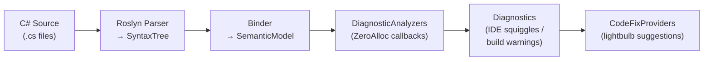

# Architecture

This guide explains the structure of the ZeroAlloc.Analyzers repository and how the Roslyn analyzer pipeline works, so you can navigate the codebase and contribute with confidence.

---

## Repository layout

| Path | Purpose |
|------|---------|
| `src/ZeroAlloc.Analyzers/` | Analyzer implementations (43 analyzers) |
| `src/ZeroAlloc.Analyzers/Analyzers/` | One .cs file per analyzer |
| `src/ZeroAlloc.Analyzers/DiagnosticIds.cs` | Central registry of all ZAxxx IDs |
| `src/ZeroAlloc.Analyzers/DiagnosticCategories.cs` | Category string constants |
| `src/ZeroAlloc.Analyzers/TfmHelper.cs` | Target-framework version detection |
| `src/ZeroAlloc.Analyzers.CodeFixes/` | Code fix providers (3 fixes) |
| `src/ZeroAlloc.Analyzers.Package/` | NuGet package manifest and .props file |
| `src/ZeroAlloc.Analyzers.Package/buildTransitive/` | MSBuild props that flow TFM into analyzers |
| `tests/ZeroAlloc.Analyzers.Tests/` | xUnit test suite |
| `tests/ZeroAlloc.Analyzers.Tests/Verifiers/` | Analyzer and code fix test harnesses |

---

## How Roslyn analyzers work

Roslyn is the C# compiler. It exposes the full compilation pipeline as a public API, allowing third-party code to participate at every stage — from parsing source text to binding symbols. Analyzers plug into this pipeline by inheriting from `DiagnosticAnalyzer` and are loaded by the compiler (or the IDE) from a NuGet package that targets the `analyzers/` directory convention.

An analyzer tells Roslyn what it cares about by implementing `Initialize(AnalysisContext context)`. Inside that method it registers callbacks for specific syntax node kinds (e.g., `SyntaxKind.InvocationExpression`) or semantic operations (e.g., `OperationKind.Loop`). Roslyn invokes each registered callback for every matching node it encounters during compilation, potentially in parallel across files.

Inside the callback the analyzer receives a context object that provides access to the matched node and to the `SemanticModel`, which maps syntax to resolved symbols and types. The analyzer examines the node — and the semantic model when type information is needed — and calls `context.ReportDiagnostic(...)` to emit a warning or informational message. The resulting diagnostic appears as a compiler warning in the build output and as a squiggle in the IDE.

Code fix providers (`CodeFixProvider`) are a complementary mechanism. They listen for specific diagnostic IDs and, when triggered, offer one or more `CodeAction` instances. The IDE presents these as lightbulb suggestions next to the diagnostic location. A code fix works by receiving the flagged syntax span and producing a new `Document` (or solution) with the transformed syntax tree.



---

## Analyzer anatomy

Every analyzer in `src/ZeroAlloc.Analyzers/Analyzers/` follows the same four-part structure. The skeleton below mirrors the actual pattern used in `UseTryGetValueAnalyzer.cs`:

```csharp
[DiagnosticAnalyzer(LanguageNames.CSharp)]
public sealed class ExampleAnalyzer : DiagnosticAnalyzer
{
    // 1. Descriptor — defines ID, title, message, category, severity
    private static readonly DiagnosticDescriptor Rule = new(
        DiagnosticIds.ExampleId,
        "Use TryGetValue instead of ContainsKey + indexer",
        "Use 'TryGetValue' instead of 'ContainsKey' followed by indexer access",
        DiagnosticCategories.Collections,
        DiagnosticSeverity.Warning,
        isEnabledByDefault: true);

    // 2. Supported diagnostics — tells Roslyn which rules this analyzer owns
    public override ImmutableArray<DiagnosticDescriptor> SupportedDiagnostics => [Rule];

    // 3. Initialize — register callbacks for syntax/operation types
    public override void Initialize(AnalysisContext context)
    {
        context.ConfigureGeneratedCodeAnalysis(GeneratedCodeAnalysisFlags.None);
        context.EnableConcurrentExecution();
        context.RegisterSyntaxNodeAction(AnalyzeNode, SyntaxKind.InvocationExpression);
    }

    // 4. Analysis callback — inspect the node, report if the pattern matches
    private static void AnalyzeNode(SyntaxNodeAnalysisContext context)
    {
        // ... inspect context.Node, context.SemanticModel ...
        context.ReportDiagnostic(Diagnostic.Create(Rule, location));
    }
}
```

**Section 1 — Descriptor:** A `DiagnosticDescriptor` is a static, shared object that captures everything about the rule: its ID (from `DiagnosticIds`), a short human-readable title, a parameterizable message format, a category (from `DiagnosticCategories`), a default severity, and whether it fires by default. The descriptor is created once as a `static readonly` field.

**Section 2 — SupportedDiagnostics:** Roslyn reads this property before calling `Initialize` so it knows which IDs the analyzer can produce. An analyzer that emits a diagnostic not listed here will have it silently dropped.

**Section 3 — Initialize:** This is where you tell Roslyn what to call you for. `ConfigureGeneratedCodeAnalysis(GeneratedCodeAnalysisFlags.None)` opts out of scanning generated code. `EnableConcurrentExecution()` allows Roslyn to invoke callbacks from multiple threads simultaneously — callbacks must therefore be stateless (all state passed via the context parameter). Registration methods include `RegisterSyntaxNodeAction`, `RegisterOperationAction`, `RegisterSymbolAction`, and `RegisterCompilationStartAction`, among others.

**Section 4 — Analysis callback:** The callback receives a context whose `.Node` property is already cast-ready to the registered `SyntaxKind`. Pattern matching on syntax nodes and calling `context.SemanticModel.GetSymbolInfo(...)` or `GetTypeInfo(...)` provides semantic facts. When the problematic pattern is confirmed, `context.ReportDiagnostic(Diagnostic.Create(Rule, node.GetLocation()))` emits the diagnostic.

---

## DiagnosticIds.cs and DiagnosticCategories.cs

`DiagnosticIds.cs` is the single source of truth for every ID string used in the project. When adding a new analyzer, always declare its ID constant here first — never inline a raw string in the descriptor. This makes it straightforward to search for every usage of an ID across analyzers, code fixes, and tests.

IDs follow the pattern `ZA` + four decimal digits. The first two digits encode the category group; the last two are a sequential number within that group:

| Range | Category |
|-------|---------|
| ZA01xx | Collections |
| ZA02xx | Strings |
| ZA03xx | Memory |
| ZA04xx | Logging |
| ZA05xx | Boxing |
| ZA06xx | LINQ |
| ZA07xx | Regex |
| ZA08xx | Enums |
| ZA09xx | Sealing |
| ZA10xx | Serialization |
| ZA11xx | Async |
| ZA14xx | Delegates |
| ZA15xx | Value Types |

`DiagnosticCategories.cs` defines the category strings that appear in diagnostic descriptors and in the IDE's rule list. Each constant is a dot-separated `"Performance.<Group>"` string (e.g., `"Performance.Collections"`). Always reference these constants — never hardcode the string directly in an analyzer — so that renaming a category requires only one change.

---

## TfmHelper

`TfmHelper` (`src/ZeroAlloc.Analyzers/TfmHelper.cs`) is an internal utility for reading the target framework of the project being compiled. Because some APIs only exist from a specific .NET version onward, analyzers that suggest those APIs must first confirm the TFM before emitting a diagnostic.

**How it reads the TFM:** `TryGetTfm(AnalyzerOptions options, out string tfm)` calls `options.AnalyzerConfigOptionsProvider.GlobalOptions.TryGetValue("build_property.TargetFramework", ...)`. MSBuild writes the project's `TargetFramework` property into a global `.editorconfig`-style file that Roslyn exposes through this API.

**Version predicates:** The helper exposes `IsNet5OrLater(string tfm)`, `IsNet6OrLater(string tfm)`, `IsNet7OrLater(string tfm)`, and `IsNet8OrLater(string tfm)`. All delegate to the central `IsNetOrLater(string tfm, int majorVersion)` method, which parses the numeric part of TFMs such as `net8.0` or `net9.0-windows` and rejects legacy TFMs like `net48`, `netstandard2.1`, or `netcoreapp3.1`.

**When to call it:** Call `TryGetTfm` inside the analysis callback (not in `Initialize`) so that the TFM is evaluated per-compilation rather than once at startup. Pass the retrieved `tfm` string directly to the appropriate predicate:

```csharp
private static void AnalyzeNode(SyntaxNodeAnalysisContext context)
{
    if (!TfmHelper.TryGetTfm(context.Options, out var tfm) || !TfmHelper.IsNet8OrLater(tfm))
        return;

    // ... rest of analysis ...
}
```

For the full rationale and edge cases see `docs/contributing/tfm-awareness.md`.

---

## Code fix providers

A `CodeFixProvider` is paired with one or more analyzers through the `FixableDiagnosticIds` property. When the IDE (or `dotnet format`) encounters a diagnostic whose ID is listed there, it asks the provider to register available fixes for that location.

The two key methods are:

- **`RegisterCodeFixesAsync`** — receives the `CodeFixContext` (which contains the flagged `Document` and the `Diagnostic`). It locates the syntax node from the diagnostic span via `root.FindNode(diagnostic.Location.SourceSpan)` and calls `context.RegisterCodeFix(CodeAction.Create(...), diagnostic)` to offer a lightbulb action.

- **`CreateChangedDocument` (or an equivalent private method)** — performs the actual tree transformation. It retrieves the `SyntaxRoot` from the document, builds replacement nodes using `SyntaxFactory`, calls `root.ReplaceNode(oldNode, newNode)`, and returns `document.WithSyntaxRoot(newRoot)`. The result is a new `Document` — syntax trees in Roslyn are immutable.

`UseTryGetValueCodeFixProvider` illustrates the full pattern: it locates the `ContainsKey` invocation from the diagnostic span, replaces it with a `TryGetValue` call (constructed via `SyntaxFactory`), and then walks the if-statement body with a `CSharpSyntaxRewriter` subclass (`IndexerToValueRewriter`) to replace every `dict[key]` indexer access with the newly introduced `value` variable.

Every code fix provider in this project also overrides `GetFixAllProvider()` and returns `WellKnownFixAllProviders.BatchFixer`, enabling the "fix all in document / project / solution" IDE commands.

---

## Test infrastructure

Tests use `Microsoft.CodeAnalysis.CSharp.Analyzer.Testing` (the official Roslyn testing helpers) together with xUnit.

### CSharpAnalyzerVerifier

`CSharpAnalyzerVerifier<TAnalyzer>` (`tests/ZeroAlloc.Analyzers.Tests/Verifiers/CSharpAnalyzerVerifier.cs`) is the primary test harness. Its key methods are:

- `VerifyAnalyzerAsync(source, targetFramework, expected)` — compiles `source`, injects the TFM, and asserts that exactly the `expected` diagnostics are produced.
- `VerifyNoDiagnosticAsync(source, targetFramework)` — asserts that no diagnostics are emitted for `source`.

**TFM injection:** The verifier adds a virtual `.globalconfig` file to `test.TestState.AnalyzerConfigFiles` with the content:

```
is_global = true
build_property.TargetFramework = net8.0
```

This is how `TfmHelper.TryGetTfm` receives a value during tests, mirroring what MSBuild provides at build time. Pass a different `targetFramework` string to test TFM-gated analyzers against older targets.

**Diagnostic location markers:** Expected diagnostic locations are specified inline in the source string using `{|#0:...|}`  markup. The `#0` is a location tag matched by `.WithLocation(0)` in the `DiagnosticResult`:

```csharp
var expected = CSharpAnalyzerVerifier<UseTryGetValueAnalyzer>
    .Diagnostic(DiagnosticIds.UseTryGetValue)
    .WithLocation(0)
    .WithMessage("Use 'TryGetValue' instead of 'ContainsKey' followed by indexer access");
```

**ReferenceAssemblies:** Tests compile against real .NET reference assemblies (e.g., `ReferenceAssemblies.Net.Net80`) so that `SemanticModel` resolves actual BCL types. The default overload of `VerifyAnalyzerAsync` uses `Net80`; pass a different `ReferenceAssemblies` instance when testing against a different TFM's API surface.

### Minimal test example

```csharp
public class ZA0105_UseTryGetValueTests
{
    [Fact]
    public async Task ContainsKey_FollowedByIndexer_Reports()
    {
        var source = """
            using System.Collections.Generic;

            class C
            {
                void M()
                {
                    var dict = new Dictionary<string, int>();
                    if ({|#0:dict.ContainsKey("key")|})
                    {
                        var value = dict["key"];
                    }
                }
            }
            """;

        var expected = CSharpAnalyzerVerifier<UseTryGetValueAnalyzer>
            .Diagnostic(DiagnosticIds.UseTryGetValue)
            .WithLocation(0)
            .WithMessage("Use 'TryGetValue' instead of 'ContainsKey' followed by indexer access");

        await CSharpAnalyzerVerifier<UseTryGetValueAnalyzer>
            .VerifyAnalyzerAsync(source, "net8.0", expected);
    }
}
```

Each test file is named `ZAxxxx_<AnalyzerName>Tests.cs` and lives directly under `tests/ZeroAlloc.Analyzers.Tests/`. A typical file covers at least three cases: the triggering pattern (expects a diagnostic), the already-correct pattern (expects no diagnostic), and any important negative / edge cases.
