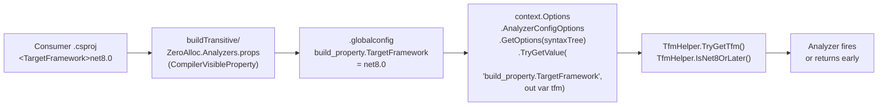

# TFM Awareness

ZeroAlloc.Analyzers rules are gated by the consuming project's target framework. A rule like ZA0101 (FrozenDictionary) should only fire on `net8.0`+ projects — firing it on a `net6.0` project would suggest an API that doesn't exist. This document explains the mechanism that makes this work and how to use it when writing new rules.

---

## 1. The Problem

Analyzers run as part of the Roslyn compiler pipeline. They receive syntax trees and semantic models, but they do not have direct access to MSBuild project properties such as `<TargetFramework>`. From inside an analyzer, there is no way to simply call `project.GetProperty("TargetFramework")`.

This matters for ZeroAlloc because many rules suggest APIs that were introduced in specific .NET versions. If the analyzer has no knowledge of the consuming project's TFM, it has two bad options:

- Fire unconditionally and produce false positives on older TFMs where the suggested API does not exist.
- Never fire at all, which defeats the purpose of the rule.

Roslyn provides a mechanism to bridge this gap: `CompilerVisibleProperty`.

---

## 2. The Mechanism — CompilerVisibleProperty

The file `src/ZeroAlloc.Analyzers.Package/buildTransitive/ZeroAlloc.Analyzers.props` contains:

```xml
<Project>
  <ItemGroup>
    <CompilerVisibleProperty Include="TargetFramework" />
  </ItemGroup>
</Project>
```

The `CompilerVisibleProperty` MSBuild item instructs the build system to forward the named MSBuild property into a `.globalconfig` file that is passed to the Roslyn compiler alongside source files. For a project targeting `net8.0`, this results in an entry like:

```
build_property.TargetFramework = net8.0
```

Analyzers can read this value at analysis time via `AnalyzerConfigOptions`. The property is accessed through `context.Options.AnalyzerConfigOptionsProvider.GlobalOptions.TryGetValue("build_property.TargetFramework", out var tfm)`.

The props file lives in the `buildTransitive` directory. This means it is automatically applied not just to direct consumers of the NuGet package, but also to any project that transitively references a project that depends on the package. This ensures TFM gating works correctly across the entire dependency graph.

---

## 3. The Flow — End to End



---

## 4. TfmHelper API

`TfmHelper` is an internal static class in `ZeroAlloc.Analyzers` that encapsulates all TFM reading and comparison logic. Its public surface is:

```csharp
// Reads the TargetFramework global config property from AnalyzerOptions.
// Returns true and sets tfm when the value is present and non-empty.
// Returns false and sets tfm to string.Empty when unavailable.
public static bool TryGetTfm(AnalyzerOptions options, out string tfm)

// Returns true when tfm represents a .NET (net5.0+) TFM at or above the given
// major version. Correctly excludes .NET Framework TFMs (net48, net472, etc.)
// and pre-.NET 5 runtimes (netcoreapp3.1, netstandard2.x).
public static bool IsNetOrLater(string tfm, int majorVersion)

// Convenience wrappers over IsNetOrLater for the most common version thresholds.
public static bool IsNet5OrLater(string tfm)
public static bool IsNet6OrLater(string tfm)
public static bool IsNet7OrLater(string tfm)
public static bool IsNet8OrLater(string tfm)
```

`IsNetOrLater` handles .NET TFMs with platform suffixes such as `net8.0-windows` by stripping the dash suffix before comparing the major version number. .NET Framework short TFMs (`net48`, `net472`, etc.) are identified by the absence of a dot in the version segment and always return `false`.

Here is the standard usage pattern inside an analyzer callback:

```csharp
public override void Initialize(AnalysisContext context)
{
    context.ConfigureGeneratedCodeAnalysis(GeneratedCodeAnalysisFlags.None);
    context.EnableConcurrentExecution();
    context.RegisterSyntaxNodeAction(Analyze, SyntaxKind.InvocationExpression);
}

private static void Analyze(SyntaxNodeAnalysisContext context)
{
    // Gate: only fire on net8.0+
    if (!TfmHelper.TryGetTfm(context.Options, out var tfm) || !TfmHelper.IsNet8OrLater(tfm))
        return;

    // ... rest of analysis
}
```

---

## 5. Gating Patterns

### Pattern A — Gate in the analysis callback

The most common pattern. The analyzer registers its action unconditionally in `Initialize`, but the callback returns immediately if the TFM check fails. The cost of the early return is negligible. This is the pattern used in the example above.

### Pattern B — Gate in Initialize using RegisterCompilationStartAction

Use this pattern when you want to avoid registering inner actions at all, or when checking the TFM once per compilation is preferable to checking once per syntax node. `UseFrozenDictionaryAnalyzer` uses this approach:

```csharp
public override void Initialize(AnalysisContext context)
{
    context.ConfigureGeneratedCodeAnalysis(GeneratedCodeAnalysisFlags.None);
    context.EnableConcurrentExecution();

    context.RegisterCompilationStartAction(compilationContext =>
    {
        // Check TFM once per compilation
        if (!TfmHelper.TryGetTfm(compilationContext.Options, out var tfm) || !TfmHelper.IsNet8OrLater(tfm))
            return;

        compilationContext.RegisterSymbolAction(ctx => AnalyzeField(ctx), SymbolKind.Field);
    });
}
```

Here the inner `RegisterSymbolAction` is never installed at all for non-qualifying TFMs, which is slightly more efficient when many symbols would otherwise be visited.

### Multi-targeted projects

When a project specifies `<TargetFrameworks>net6.0;net8.0</TargetFrameworks>` (plural), MSBuild invokes the compiler separately for each TFM. Each compiler invocation receives its own `.globalconfig` with the appropriate `build_property.TargetFramework` value. The analyzer therefore runs independently for each target, and TFM gating works correctly: diagnostics will be reported for the `net8.0` build and suppressed for the `net6.0` build.

---

## 6. Testing TFM-Gated Rules

The test verifier accepts a `targetFramework` string that is injected directly into a synthetic `.globalconfig` file, exactly replicating what MSBuild does at build time.

```csharp
[Fact]
public async Task OnNet8_Reports()
{
    var source = """
        using System.Collections.Generic;
        class C
        {
            static readonly Dictionary<string, int> _d = new();
        }
        """;
    // Expect ZA0101 on net8.0
    await CSharpAnalyzerVerifier<UseFrozenDictionaryAnalyzer>
        .VerifyAnalyzerAsync(source, "net8.0", DiagnosticResult...);
}

[Fact]
public async Task OnNet6_NoDiagnostic()
{
    var source = """...""";
    // net6.0 — rule not applicable, no diagnostic expected
    await CSharpAnalyzerVerifier<UseFrozenDictionaryAnalyzer>
        .VerifyAnalyzerAsync(source, "net6.0");
}
```

Internally, `CSharpAnalyzerVerifier.VerifyAnalyzerAsync` adds an `AnalyzerConfigFiles` entry at `/.globalconfig` containing:

```
is_global = true
build_property.TargetFramework = net8.0
```

This is the same format that MSBuild generates during a real build. Passing no `DiagnosticResult` arguments (or passing an empty array) asserts that no diagnostics are reported — the correct assertion for the older-TFM case.

The overload with an explicit `ReferenceAssemblies` parameter is available when the test needs runtime types that are not present in the default `ReferenceAssemblies.Net.Net80` set (for example, testing against `netstandard2.0` reference assemblies):

```csharp
await CSharpAnalyzerVerifier<MyAnalyzer>
    .VerifyAnalyzerAsync(source, "netstandard2.0", ReferenceAssemblies.NetStandard.NetStandard20);
```

---

## 7. Supported TFM Strings

`TfmHelper` does not maintain an explicit allowlist. Instead, `IsNetOrLater` applies structural parsing: it accepts any TFM of the form `netN.M` or `netN.M-suffix` where `N` is a parseable integer, and rejects everything else.

In practice, the TFM strings encountered in the wild and their behaviour are:

| TFM | `IsNet5OrLater` | `IsNet6OrLater` | `IsNet7OrLater` | `IsNet8OrLater` |
|---|---|---|---|---|
| `net9.0` | true | true | true | true |
| `net8.0` | true | true | true | true |
| `net8.0-windows` | true | true | true | true |
| `net7.0` | true | true | true | false |
| `net6.0` | true | true | false | false |
| `net5.0` | true | false | false | false |
| `netcoreapp3.1` | false | false | false | false |
| `netstandard2.1` | false | false | false | false |
| `netstandard2.0` | false | false | false | false |
| `net48` | false | false | false | false |
| `net472` | false | false | false | false |
| `net471` | false | false | false | false |
| `net47` | false | false | false | false |
| `net46` | false | false | false | false |
| `net45` | false | false | false | false |
| *(unknown / empty)* | false | false | false | false |

Unrecognized or empty strings — including the case where `build_property.TargetFramework` is absent from `.globalconfig` entirely — cause `TryGetTfm` to return `false`, so all version checks effectively treat the project as older than `net5.0`.
