# Getting Started with ZeroAlloc.Analyzers

## What is ZeroAlloc.Analyzers?

ZeroAlloc.Analyzers is a Roslyn analyzer NuGet package that detects allocation-heavy patterns in C# code and suggests zero or low-allocation alternatives. It covers 43 rules across 13 categories — from collection misuse and string concatenation to boxing, LINQ, async, and value type pitfalls. The package is multi-TFM aware: rules are automatically enabled or disabled based on the consuming project's `<TargetFramework>`, so you only see diagnostics that are actionable for your target runtime.

---

## Installation

Add the package to your project via the .NET CLI:

```bash
dotnet add package ZeroAlloc.Analyzers
```

Or add the `PackageReference` directly in your `.csproj` file:

```xml
<PackageReference Include="ZeroAlloc.Analyzers" Version="*">
  <PrivateAssets>all</PrivateAssets>
  <IncludeAssets>runtime; build; native; contentfiles; analyzers; buildtransitive</IncludeAssets>
</PackageReference>
```

The `<PrivateAssets>all</PrivateAssets>` setting ensures the analyzer is not propagated as a transitive dependency to consumers of your package — it stays a private development-time tool.

---

## First Use

After installing the package, simply build your project:

```bash
dotnet build
```

Diagnostics are emitted during compilation and appear both in your IDE and in the MSBuild output. For example, you might see output like:

```
warning ZA0201: Avoid string concatenation in loops. Consider using a StringBuilder or interpolated string handler. [MyProject.csproj]
warning ZA0601: Avoid LINQ methods in hot-path loops. Consider caching the result outside the loop. [MyProject.csproj]
info    ZA0107: Collection initialized without a known capacity. Consider pre-sizing with the expected element count. [MyProject.csproj]
```

Each diagnostic message includes the rule ID, a short description of the problem, and the file and line number where the issue was found. Rules with available code fixes also surface a suggested fix that can be applied directly from the IDE or via `dotnet format`.

---

## IDE Setup

ZeroAlloc.Analyzers works automatically in all major C# IDEs — no additional configuration is required beyond installing the package.

- **Visual Studio 2022** — Diagnostics appear as squiggly underlines in the editor. Rules that have code fixes surface a lightbulb icon with one-click suggestions.
- **JetBrains Rider** — Diagnostics are surfaced in the editor, the Errors & Warnings tool window, and the Inspection Results panel.
- **Visual Studio Code with C# Dev Kit** — Diagnostics appear inline in the editor via the language server, and fixes are accessible through the quick-fix menu (`Ctrl+.`).

Because the analyzer ships as a standard Roslyn analyzer inside the NuGet package, any editor that supports the .NET language server (OmniSharp, Roslyn LSP) will surface diagnostics without additional setup.

---

## TFM Awareness

Rules that rely on APIs introduced in specific .NET versions are automatically gated on the consuming project's `<TargetFramework>`. This means you will never see a diagnostic that suggests an API that does not exist in your target runtime.

For example:

- **ZA0101** (Use FrozenDictionary) only fires when targeting `net8.0` or later, because `FrozenDictionary<TKey, TValue>` was introduced in .NET 8.
- **ZA0203** (Use AsSpan instead of Substring) only fires on `net5.0`+.
- **ZA0801** (Avoid `Enum.HasFlag` boxing) fires only when targeting frameworks *below* `net7.0`, where the JIT does not yet optimize the call.

For multi-targeting projects (`<TargetFrameworks>` plural), each TFM compilation is analyzed independently with the correct rule set for that target.

See [configuration.md](configuration.md) for details on how TFM gating works and how to override it.

---

## Quick Suppression

If a diagnostic is not applicable to your codebase, you can suppress it in several ways.

### Inline pragma

```csharp
#pragma warning disable ZA0101
var lookup = new Dictionary<string, int>(data); // intentionally not frozen
#pragma warning restore ZA0101
```

### Per-file or project-wide via `.editorconfig`

```ini
[*.cs]
dotnet_diagnostic.ZA0101.severity = none
```

To downgrade a warning to a suggestion:

```ini
dotnet_diagnostic.ZA0601.severity = suggestion
```

To promote an info diagnostic to a warning or error:

```ini
dotnet_diagnostic.ZA0107.severity = warning
dotnet_diagnostic.ZA0109.severity = error
```

See [configuration.md](configuration.md) for the full suppression and severity-tuning guide, including how to suppress categories of rules at once.

---

## Rule Categories

ZeroAlloc.Analyzers organizes its 43 rules into 13 categories:

```mermaid
graph TD
    ZeroAlloc["ZeroAlloc.Analyzers"]
    ZeroAlloc --> C["Collections<br/>ZA01xx (9 rules)"]
    ZeroAlloc --> S["Strings<br/>ZA02xx (8 rules)"]
    ZeroAlloc --> M["Memory<br/>ZA03xx (2 rules)"]
    ZeroAlloc --> L["Logging<br/>ZA04xx (1 rule)"]
    ZeroAlloc --> B["Boxing<br/>ZA05xx (3 rules)"]
    ZeroAlloc --> LQ["LINQ<br/>ZA06xx (7 rules)"]
    ZeroAlloc --> R["Regex<br/>ZA07xx (1 rule)"]
    ZeroAlloc --> E["Enums<br/>ZA08xx (3 rules)"]
    ZeroAlloc --> SE["Sealing<br/>ZA09xx (1 rule)"]
    ZeroAlloc --> SZ["Serialization<br/>ZA10xx (1 rule)"]
    ZeroAlloc --> A["Async<br/>ZA11xx (3 rules)"]
    ZeroAlloc --> D["Delegates<br/>ZA14xx (1 rule)"]
    ZeroAlloc --> V["Value Types<br/>ZA15xx (2 rules)"]
```



---

## All Rules

The tables below list all 43 rules grouped by category. Rule IDs link to the corresponding section in each category's reference document. The **Min TFM** column shows the minimum target framework required for the rule to fire; `Any` means the rule applies to all supported frameworks.

### Collections (ZA01xx)

| Rule ID | Title | Severity | Min TFM |
|---------|-------|----------|---------|
| [ZA0101](rules/collections.md#za0101) | Use FrozenDictionary for read-only lookups | Info | net8.0 |
| [ZA0102](rules/collections.md#za0102) | Use FrozenSet for read-only membership tests | Info | net8.0 |
| [ZA0103](rules/collections.md#za0103) | Use CollectionsMarshal.AsSpan for List iteration | Info | net5.0 |
| [ZA0104](rules/collections.md#za0104) | Use SearchValues for repeated char/byte lookups | Info | net8.0 |
| [ZA0105](rules/collections.md#za0105) | Use TryGetValue instead of ContainsKey + indexer | Warning | Any |
| [ZA0106](rules/collections.md#za0106) | Avoid premature ToList/ToArray before LINQ | Warning | Any |
| [ZA0107](rules/collections.md#za0107) | Pre-size collections when capacity is known | Info | Any |
| [ZA0108](rules/collections.md#za0108) | Avoid redundant ToList/ToArray materialization | Warning | Any |
| [ZA0109](rules/collections.md#za0109) | Avoid zero-length array allocation | Warning | Any |

### Strings (ZA02xx)

| Rule ID | Title | Severity | Min TFM |
|---------|-------|----------|---------|
| [ZA0201](rules/strings.md#za0201) | Avoid string concatenation in loops | Warning | Any |
| [ZA0202](rules/strings.md#za0202) | Avoid chained string.Replace calls | Info | Any |
| [ZA0203](rules/strings.md#za0203) | Use AsSpan instead of Substring | Info | net5.0 |
| [ZA0204](rules/strings.md#za0204) | Use string.Create instead of string.Format | Info | net6.0 |
| [ZA0205](rules/strings.md#za0205) | Use CompositeFormat for repeated format strings | Info | net8.0 |
| [ZA0206](rules/strings.md#za0206) | Avoid span.ToString() before Parse | Info | net6.0 |
| [ZA0208](rules/strings.md#za0208) | Avoid string.Join boxing overload | Warning | Any |
| [ZA0209](rules/strings.md#za0209) | Avoid value type boxing in string concatenation | Warning | Any |

### Memory (ZA03xx)

| Rule ID | Title | Severity | Min TFM |
|---------|-------|----------|---------|
| [ZA0301](rules/memory.md#za0301) | Use stackalloc for small fixed-size buffers | Info | Any |
| [ZA0302](rules/memory.md#za0302) | Use ArrayPool for large temporary arrays | Info | Any |

### Logging (ZA04xx)

| Rule ID | Title | Severity | Min TFM |
|---------|-------|----------|---------|
| [ZA0401](rules/logging.md#za0401) | Use LoggerMessage source generator | Info | net6.0 |

### Boxing (ZA05xx)

| Rule ID | Title | Severity | Min TFM |
|---------|-------|----------|---------|
| [ZA0501](rules/boxing.md#za0501) | Avoid boxing value types in loops | Warning | Any |
| [ZA0502](rules/boxing.md#za0502) | Avoid closure allocations in loops | Info | Any |
| [ZA0504](rules/boxing.md#za0504) | Avoid defensive copies on readonly structs | Info | Any |

### LINQ (ZA06xx)

| Rule ID | Title | Severity | Min TFM |
|---------|-------|----------|---------|
| [ZA0601](rules/linq.md#za0601) | Avoid LINQ methods in loops | Warning | Any |
| [ZA0602](rules/linq.md#za0602) | Avoid params calls in loops | Info | Any |
| [ZA0603](rules/linq.md#za0603) | Use .Count/.Length instead of LINQ .Count() | Info | Any |
| [ZA0604](rules/linq.md#za0604) | Use .Count > 0 instead of LINQ .Any() | Info | Any |
| [ZA0605](rules/linq.md#za0605) | Use indexer instead of LINQ .First()/.Last() | Info | Any |
| [ZA0606](rules/linq.md#za0606) | Avoid foreach over interface-typed collection | Warning | Any |
| [ZA0607](rules/linq.md#za0607) | Avoid multiple enumeration of IEnumerable | Warning | Any |

### Regex (ZA07xx)

| Rule ID | Title | Severity | Min TFM |
|---------|-------|----------|---------|
| [ZA0701](rules/regex.md#za0701) | Use GeneratedRegex for compile-time regex | Info | net7.0 |

### Enums (ZA08xx)

| Rule ID | Title | Severity | Min TFM |
|---------|-------|----------|---------|
| [ZA0801](rules/enums.md#za0801) | Avoid Enum.HasFlag (boxes on pre-net7.0) | Info | &lt;net7.0 |
| [ZA0802](rules/enums.md#za0802) | Avoid Enum.ToString() allocations | Info | Any |
| [ZA0803](rules/enums.md#za0803) | Cache Enum.GetName/GetValues in loops | Info | Any |

### Sealing (ZA09xx)

| Rule ID | Title | Severity | Min TFM |
|---------|-------|----------|---------|
| [ZA0901](rules/sealing.md#za0901) | Consider sealing classes | Info | Any |

### Serialization (ZA10xx)

| Rule ID | Title | Severity | Min TFM |
|---------|-------|----------|---------|
| [ZA1001](rules/serialization.md#za1001) | Use JSON source generation | Info | net7.0 |

### Async (ZA11xx)

| Rule ID | Title | Severity | Min TFM |
|---------|-------|----------|---------|
| [ZA1101](rules/async.md#za1101) | Elide async/await on simple tail calls | Info | Any |
| [ZA1102](rules/async.md#za1102) | Dispose CancellationTokenSource | Info | Any |
| [ZA1104](rules/async.md#za1104) | Avoid Span&lt;T&gt; in async methods | Warning | Any |

### Delegates (ZA14xx)

| Rule ID | Title | Severity | Min TFM |
|---------|-------|----------|---------|
| [ZA1401](rules/delegates.md#za1401) | Use static lambda when no capture needed | Info | net5.0 |

### Value Types (ZA15xx)

| Rule ID | Title | Severity | Min TFM |
|---------|-------|----------|---------|
| [ZA1501](rules/value-types.md#za1501) | Override GetHashCode on struct keys | Info | Any |
| [ZA1502](rules/value-types.md#za1502) | Avoid finalizers, use IDisposable | Info | Any |

---

## Next Steps

- [Configuration guide](configuration.md) — Customize severities, suppress rules, and understand TFM gating in depth.
- [Contributing](contributing/contributing.md) — Learn how to add new rules, write tests, and submit pull requests.
