# Documentation Implementation Plan

> **For Claude:** REQUIRED SUB-SKILL: Use superpowers:executing-plans to implement this plan task-by-task.

**Goal:** Write extensive consumer + contributor documentation for ZeroAlloc.Analyzers in `docs/`, grouped by diagnostic category, with Mermaid diagrams and real-world examples.

**Architecture:** 18 Markdown files across `docs/`, `docs/rules/`, and `docs/contributing/`. Each rule category file covers all rules in that ZAxxxx namespace using a consistent template: Why → Mermaid (selective) → Before/After → Real-world example → Suppression. Two contributor files cover architecture and authoring.

**Tech Stack:** Markdown, Mermaid (graph TD / flowchart / sequenceDiagram), C# code snippets, .editorconfig snippets.

---

## Conventions Used in This Plan

### Rule Entry Template (repeat for every rule in a category file)

```markdown
## ZAxxx — Rule Title {#zaxxx}

> **Severity**: Warning | **Min TFM**: net8.0 | **Code fix**: Yes

### Why

2-4 sentences explaining the allocation/performance cost.

### Before

```csharp
// ❌ problematic pattern
```

### After

```csharp
// ✓ zero/low allocation alternative
```

### Real-world example

// Realistic larger scenario (cache layer, request handler, game loop, pipeline, etc.)

### Suppression

```csharp
#pragma warning disable ZAxxx
// or: dotnet_diagnostic.ZAxxx.severity = none  (in .editorconfig)
```
```

### Mermaid usage
- Use `flowchart LR` or `graph TD` for allocation flow / pipeline diagrams
- Use `sequenceDiagram` for async / disposal lifecycles
- Only add a diagram when it genuinely clarifies something code alone cannot

### Severity badge line format
`> **Severity**: Warning | **Min TFM**: Any | **Code fix**: No`

Valid severities: `Warning`, `Info`, `Disabled`
Valid TFMs: `Any`, `net5.0`, `net6.0`, `net7.0`, `net8.0`

---

## Task 1: Scaffold directory structure and getting-started.md

**Files:**
- Create: `docs/getting-started.md`
- Create: `docs/rules/.gitkeep` (then remove once rule files exist)

**Step 1: Create directories**

```bash
mkdir -p docs/rules docs/contributing
```

**Step 2: Write docs/getting-started.md**

Content sections:
1. **What is ZeroAlloc.Analyzers?** — 2-3 sentences. Roslyn analyzer package that detects allocation-heavy patterns and suggests zero/low-allocation alternatives. Multi-TFM aware.
2. **Installation**
   ```xml
   <PackageReference Include="ZeroAlloc.Analyzers" Version="x.x.x">
     <PrivateAssets>all</PrivateAssets>
     <IncludeAssets>runtime; build; native; contentfiles; analyzers; buildtransitive</IncludeAssets>
   </PackageReference>
   ```
3. **First use** — build the project, see diagnostics appear in IDE and on `dotnet build`
4. **IDE setup** — note that VS, Rider, and VS Code (with C# Dev Kit) all surface diagnostics automatically; no extra config needed
5. **TFM awareness** — short explanation that rules are automatically enabled/disabled based on `<TargetFramework>` in the .csproj; link to `configuration.md` for details
6. **Quick suppression** — one-liner showing `#pragma warning disable ZA0101` and .editorconfig approach
7. **Rule index** — Mermaid diagram showing the 13 categories and their ZAxxxx ranges:

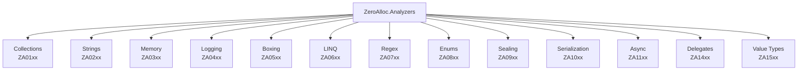

8. **Rule summary table** — abbreviated version (ID | Title | Severity | Min TFM) for all 43 rules, linking to the category doc

**Step 3: Commit**

```bash
git add docs/getting-started.md
git commit -m "docs: add getting-started guide"
```

---

## Task 2: configuration.md

**Files:**
- Create: `docs/configuration.md`

**Step 1: Write docs/configuration.md**

Content sections:
1. **Severity levels** — Warning, Info, None, Error — what each means in the build
2. **Changing severity via .editorconfig**
   ```ini
   [*.cs]
   # Downgrade a warning to info
   dotnet_diagnostic.ZA0601.severity = suggestion

   # Silence a rule entirely
   dotnet_diagnostic.ZA0105.severity = none

   # Promote an info to a warning
   dotnet_diagnostic.ZA0901.severity = warning
   ```
3. **Per-file suppression via .editorconfig**
   ```ini
   # Disable in test files
   [**/*Tests.cs]
   dotnet_diagnostic.ZA0601.severity = none
   ```
4. **Inline suppression**
   ```csharp
   #pragma warning disable ZA0105 // reason
   var val = dict.ContainsKey(key) ? dict[key] : default;
   #pragma warning restore ZA0105
   ```
   Also: `[System.Diagnostics.CodeAnalysis.SuppressMessage("Performance.Collections", "ZA0105")]`
5. **TFM-based rule gating** — diagram showing how `TargetFramework` flows through `.props` → compiler visible property → analyzer checks

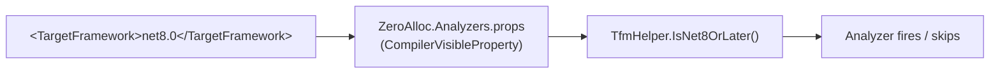

6. **Disabling all rules** (and why you probably shouldn't — only in generated code dirs)
7. **Treating warnings as errors** — note about `<TreatWarningsAsErrors>` interaction

**Step 2: Commit**

```bash
git add docs/configuration.md
git commit -m "docs: add configuration guide"
```

---

## Task 3: rules/collections.md (ZA0101–ZA0109)

**Files:**
- Create: `docs/rules/collections.md`

**Step 1: Write intro section**

Opening paragraph: Collections are the most common source of avoidable allocations in .NET code. The ZA01xx rules help you pick the right collection type, avoid redundant copies, and eliminate unnecessary enumeration overhead.

Include a Mermaid diagram showing the decision flow for picking a collection:

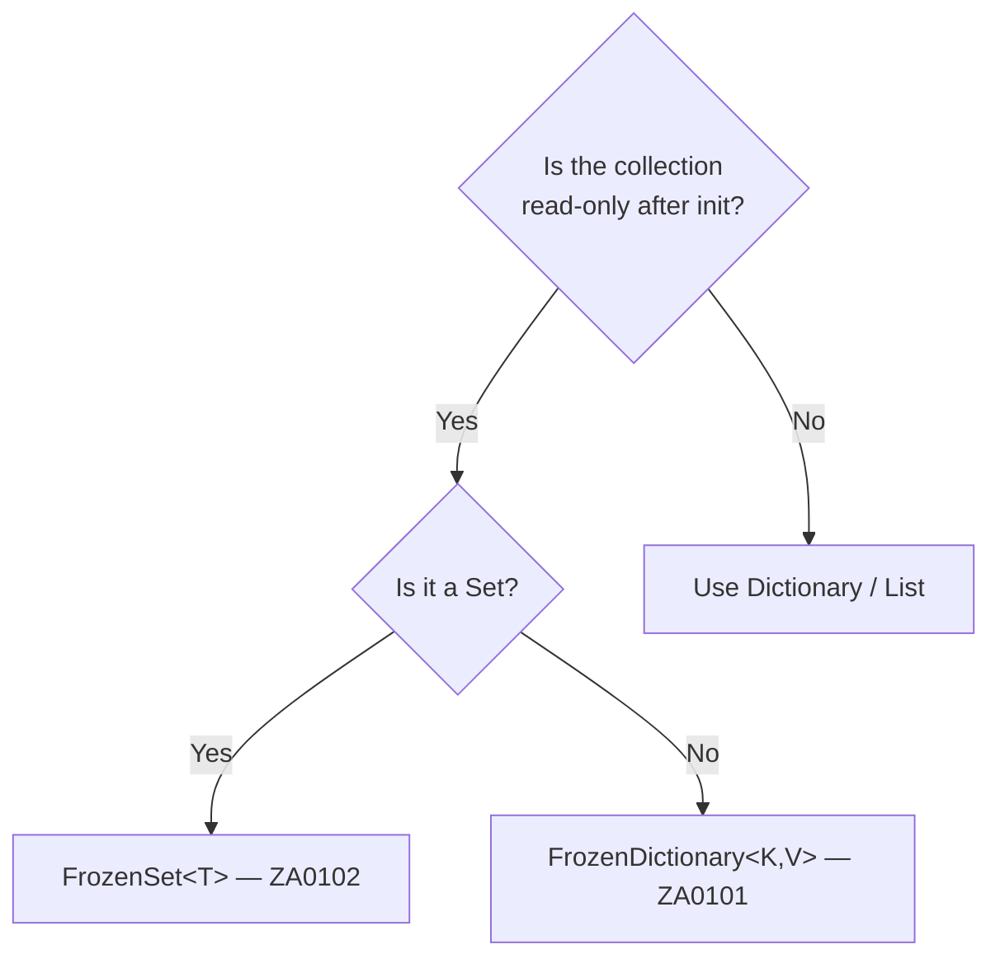

**Step 2: Write each rule entry**

**ZA0101 — Use FrozenDictionary for read-only lookups**
- Severity: Info | Min TFM: net8.0 | Code fix: No
- Why: `FrozenDictionary` uses a perfect hash and is optimised for reads. A `static readonly Dictionary` pays full hash + probe on every lookup. On net8.0+ you get measurably faster reads with no API change.
- Before: `private static readonly Dictionary<string, int> _map = new() { ["a"] = 1 };`
- After: `private static readonly FrozenDictionary<string, int> _map = new Dictionary<string, int> { ["a"] = 1 }.ToFrozenDictionary();`
- Real-world: HTTP header name → enum mapping in a middleware component (looked up on every request)

**ZA0102 — Use FrozenSet for read-only membership tests**
- Severity: Info | Min TFM: net8.0 | Code fix: No
- Why: Same as ZA0101 but for set membership. `FrozenSet.Contains` is optimised for repeated lookups.
- Before: `private static readonly HashSet<string> _allowed = new() { "GET", "POST" };`
- After: `private static readonly FrozenSet<string> _allowed = new HashSet<string> { "GET", "POST" }.ToFrozenSet();`
- Real-world: Allowed HTTP methods / content-type allowlist in a request validation filter

**ZA0103 — Use CollectionsMarshal.AsSpan for List<T> iteration**
- Severity: Info | Min TFM: net5.0 | Code fix: No
- Why: `foreach` over `List<T>` uses the enumerator (a struct, but with bounds checks per iteration). `CollectionsMarshal.AsSpan` gives a `Span<T>` over the backing array — zero allocation, no bounds checks in the loop.
- Before: `foreach (var item in list) { Process(item); }`
- After: `foreach (var item in CollectionsMarshal.AsSpan(list)) { Process(item); }`
- Real-world: Processing a list of parsed log entries in a hot path parser

**ZA0104 — Use SearchValues or FrozenSet for repeated char/byte lookups**
- Severity: Info | Min TFM: net8.0 | Code fix: No
- Why: `SearchValues<T>` is a specialised type that pre-computes a lookup structure for a fixed set of values. Calling `IndexOfAny(new[] { 'a', 'b' })` in a loop re-evaluates on every call.
- Before: `int idx = span.IndexOfAny(new[] { '<', '>', '&' });`
- After:
  ```csharp
  private static readonly SearchValues<char> _htmlChars = SearchValues.Create(['<', '>', '&']);
  int idx = span.IndexOfAny(_htmlChars);
  ```
- Real-world: HTML encoder scanning a string for characters that need escaping

**ZA0105 — Use TryGetValue instead of ContainsKey + indexer** *(has code fix)*
- Severity: Warning | Min TFM: Any | Code fix: Yes
- Why: Two dictionary lookups where one suffices.
- Before/After: classic ContainsKey → TryGetValue
- Real-world: Cache layer that checks then retrieves a cached response

**ZA0106 — Avoid premature ToList/ToArray before LINQ**
- Severity: Warning | Min TFM: Any | Code fix: No
- Why: Materialising a sequence only to immediately pass it to another LINQ operator forces an allocation before LINQ can do its work. LINQ operators operate on `IEnumerable<T>` and don't need a materialized list.
- Before: `var result = items.ToList().Where(x => x.IsActive).Select(x => x.Name);`
- After: `var result = items.Where(x => x.IsActive).Select(x => x.Name);`
- Real-world: Repository method that materialises before applying filters

**ZA0107 — Pre-size collections when capacity is known**
- Severity: Info | Min TFM: Any | Code fix: No
- Why: `List<T>` and `Dictionary<K,V>` start small and double their backing array as they grow — each doubling is an allocation + copy. Passing `capacity` avoids all of that.
- Before: `var result = new List<string>(); foreach (var item in source) result.Add(item.Name);`
- After: `var result = new List<string>(source.Count); foreach ...`
- Real-world: Mapping a known-size collection to a DTO list in a query handler

**ZA0108 — Avoid redundant ToList/ToArray materialization** *(has code fix)*
- Severity: Warning | Min TFM: Any | Code fix: Yes
- Why: A sequence already materialised (e.g. returned from a method returning `List<T>`) being passed to `.ToList()` again is a pointless copy.
- Before: `var list = GetItems().ToList();`  where `GetItems()` already returns `List<T>`
- After: `var list = GetItems();`
- Real-world: Service method wrapping a repository that already returns a list

**ZA0109 — Avoid zero-length array allocation, use Array.Empty<T>()** *(has code fix)*
- Severity: Warning | Min TFM: Any | Code fix: Yes
- Why: `new T[0]` allocates a new object on the heap every time. `Array.Empty<T>()` returns a cached singleton.
- Before: `return new string[0];`
- After: `return Array.Empty<string>();`
- Real-world: Default parameter values, empty result returns, sentinel values

**Step 3: Commit**

```bash
git add docs/rules/collections.md
git commit -m "docs: add collections rules (ZA01xx)"
```

---

## Task 4: rules/strings.md (ZA0201–ZA0209)

**Files:**
- Create: `docs/rules/strings.md`

**Step 1: Write intro section**

String operations are deceptively expensive — they are immutable reference types, so every transformation produces a new heap allocation. The ZA02xx rules help you avoid unnecessary string copies, prefer span-based operations, and use modern APIs.

Mermaid: string operation decision tree

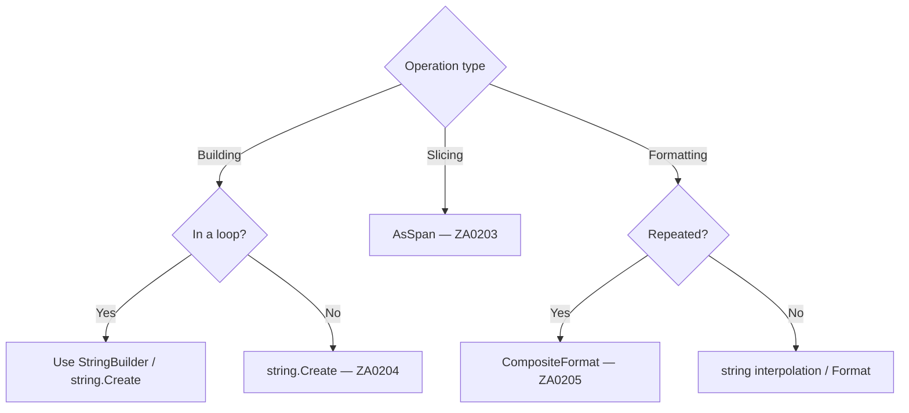

**Step 2: Write each rule entry**

**ZA0201 — Avoid string concatenation in loops**
- Severity: Warning | Min TFM: Any
- Why: Each `+=` in a loop creates a new string object. For N iterations this is O(N²) in time and O(N²) in allocations.
- Before/After: `+=` in loop → `StringBuilder`
- Real-world: Building CSV rows, HTML fragments, SQL clauses in a loop

**ZA0202 — Avoid chained string.Replace calls**
- Severity: Info | Min TFM: Any
- Why: Each `.Replace()` produces a new intermediate string. Three chained Replaces = three allocations.
- Before: `s.Replace("a", "b").Replace("c", "d").Replace("e", "f")`
- After: Use `StringBuilder` + `Append/Replace` in one pass, or `Regex.Replace` with a `MatchEvaluator`
- Real-world: Sanitising user input for display, normalising path separators

**ZA0203 — Use AsSpan instead of Substring**
- Severity: Info | Min TFM: net5.0
- Why: `Substring` always allocates a new string. `AsSpan(start, length)` returns a view over the original with no allocation — usable anywhere that accepts `ReadOnlySpan<char>`.
- Before: `var part = s.Substring(3, 5); int n = int.Parse(part);`
- After: `int n = int.Parse(s.AsSpan(3, 5));`
- Real-world: Parsing fixed-format log lines, protocol message fields

**ZA0204 — Use string.Create instead of string.Format**
- Severity: Info | Min TFM: net6.0
- Why: `string.Format` boxes value type args and allocates an intermediate object array. `string.Create` with an interpolated string handler (net6+) avoids both.
- Before: `string msg = string.Format("Hello, {0}! You have {1} messages.", name, count);`
- After: `string msg = $"Hello, {name}! You have {count} messages.";` (net6 handler is allocation-free for common cases) or `string.Create(CultureInfo.InvariantCulture, $"...")`
- Real-world: Constructing error messages, notification strings

**ZA0205 — Use CompositeFormat for repeated format strings**
- Severity: Info | Min TFM: net8.0
- Why: Parsing a format string is expensive. If the same format is used repeatedly, `CompositeFormat.Parse` does the parse once at startup and `string.Format(fmt, args)` reuses it.
- Before: `string.Format("Item {0} costs {1:C}", id, price)` called in a loop
- After:
  ```csharp
  private static readonly CompositeFormat _fmt = CompositeFormat.Parse("Item {0} costs {1:C}");
  string.Format(CultureInfo.InvariantCulture, _fmt, id, price);
  ```
- Real-world: Formatting rows in a report generator, pricing display in a loop

**ZA0206 — Avoid span.ToString() before Parse**
- Severity: Info | Min TFM: net6.0
- Why: If you have a `ReadOnlySpan<char>`, calling `.ToString()` to then pass to `int.Parse(string)` allocates unnecessarily. Modern parse overloads accept spans directly.
- Before: `int n = int.Parse(span.ToString());`
- After: `int n = int.Parse(span);`
- Real-world: Parsing fields from a CSV or binary protocol reader

**ZA0208 — Avoid string.Join overload that boxes non-strings**
- Severity: Warning | Min TFM: Any
- Why: `string.Join(separator, IEnumerable<object>)` boxes every value type element. Use the generic overload or convert before joining.
- Before: `string.Join(", ", new object[] { 1, 2, 3 })`
- After: `string.Join(", ", new int[] { 1, 2, 3 })` or `string.Join(", ", nums.Select(n => n.ToString()))`
- Real-world: Joining a list of IDs or enum values for a log message

**ZA0209 — Avoid value type boxing in string concatenation**
- Severity: Warning | Min TFM: Any
- Why: Concatenating a value type with `+` calls `.ToString()` (fine) but some overload paths box first. Using string interpolation or explicit `.ToString()` avoids boxing.
- Before: `string s = "Count: " + count;` where count is an `int`
- After: `string s = $"Count: {count}";`
- Real-world: Constructing log messages, exception messages

**Step 3: Commit**

```bash
git add docs/rules/strings.md
git commit -m "docs: add strings rules (ZA02xx)"
```

---

## Task 5: rules/memory.md (ZA0301–ZA0302)

**Files:**
- Create: `docs/rules/memory.md`

**Step 1: Write intro section**

Array allocations for temporary buffers are a significant source of GC pressure. The ZA03xx rules help you move small allocations to the stack and reuse large buffers from a pool.

Mermaid: choosing between stackalloc and ArrayPool

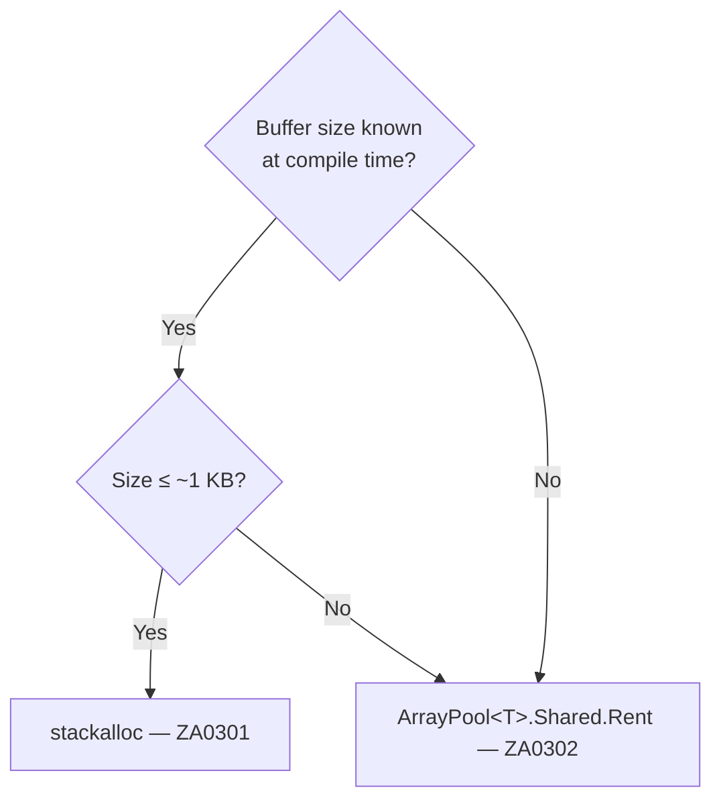

**Step 2: Write each rule entry**

**ZA0301 — Use stackalloc for small fixed-size buffers**
- Severity: Info | Min TFM: Any
- Why: `new byte[N]` for a small, fixed N allocates on the heap and will be collected. `stackalloc byte[N]` uses stack space — no heap allocation, no GC pressure, and the memory is freed automatically when the method returns.
- Guideline: use stackalloc for N ≤ ~256 bytes (stack is limited; large stackallocs risk StackOverflowException).
- Before: `byte[] buffer = new byte[16]; ReadData(buffer);`
- After: `Span<byte> buffer = stackalloc byte[16]; ReadData(buffer);`
- Real-world: Encoding a GUID to bytes, computing a small hash digest, building a short binary header

**ZA0302 — Use ArrayPool for large temporary arrays**
- Severity: Info | Min TFM: Any
- Why: A large temporary array (e.g. 4 KB read buffer) allocated per-call creates significant GC pressure. `ArrayPool<T>.Shared` maintains a pool of reusable arrays — rent before use, return when done.
- Pattern: always return in a `finally` block or use a helper.
- Before:
  ```csharp
  byte[] buffer = new byte[4096];
  int read = stream.Read(buffer, 0, buffer.Length);
  ```
- After:
  ```csharp
  byte[] buffer = ArrayPool<byte>.Shared.Rent(4096);
  try {
      int read = stream.Read(buffer, 0, 4096);
      // use buffer[0..read]
  } finally {
      ArrayPool<byte>.Shared.Return(buffer);
  }
  ```
- Real-world: Stream copy, JSON serialization scratch buffers, network packet processing

**Step 3: Commit**

```bash
git add docs/rules/memory.md
git commit -m "docs: add memory rules (ZA03xx)"
```

---

## Task 6: rules/logging.md (ZA0401) + rules/boxing.md (ZA0501–ZA0504)

**Files:**
- Create: `docs/rules/logging.md`
- Create: `docs/rules/boxing.md`

**Step 1: Write docs/rules/logging.md**

Intro: Structured logging is one of the hottest paths in a production service. The ZA04xx rules ensure you use compile-time source generation instead of reflection-based logging, which eliminates per-call allocations.

**ZA0401 — Use LoggerMessage source generator**
- Severity: Info | Min TFM: net6.0
- Why: `logger.LogInformation("Processed {Count} items", count)` boxes the `count` argument, allocates a `FormattedLogValues` object, and parses the template at runtime — on every call. The `[LoggerMessage]` source generator pre-compiles the template and creates a strongly-typed, allocation-free log method.
- Before:
  ```csharp
  logger.LogInformation("Processed {Count} items in {ElapsedMs}ms", count, sw.ElapsedMilliseconds);
  ```
- After:
  ```csharp
  public static partial class Log
  {
      [LoggerMessage(Level = LogLevel.Information, Message = "Processed {Count} items in {ElapsedMs}ms")]
      public static partial void ProcessedItems(ILogger logger, int count, long elapsedMs);
  }
  // Usage:
  Log.ProcessedItems(logger, count, sw.ElapsedMilliseconds);
  ```
- Real-world: Request processing middleware that logs every handled request

**Step 2: Write docs/rules/boxing.md**

Intro: Boxing occurs when a value type (struct, int, bool, enum, etc.) is implicitly converted to `object` or an interface. It allocates a heap object, copies the value into it, and eventually creates GC pressure. The ZA05xx rules detect common boxing patterns.

Mermaid showing boxing lifecycle:

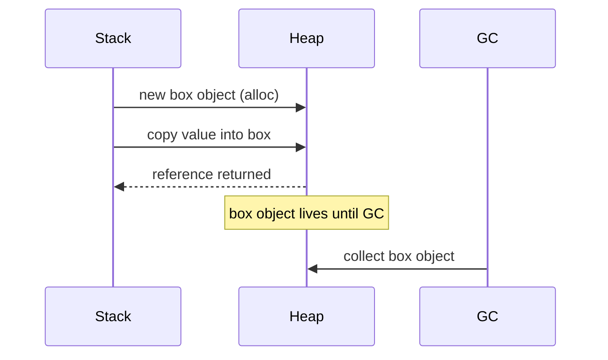

**ZA0501 — Avoid boxing value types in loops**
- Severity: Warning | Min TFM: Any
- Why: A boxing conversion inside a loop body executes on every iteration, multiplying allocations.
- Before: `foreach (var x in list) { object boxed = x; Process(boxed); }`
- After: Change `Process` to accept the concrete type, or use generics.
- Real-world: Event handler dispatching, plugin system that uses `object` for state

**ZA0502 — Avoid closure allocations in loops**
- Severity: Info | Min TFM: Any
- Why: A lambda that captures a loop variable causes the compiler to generate a closure class. If created inside the loop, a new closure object is allocated every iteration.
- Before: `for (int i = 0; i < n; i++) tasks.Add(Task.Run(() => Process(i)));`
- After: Extract the lambda or pass state via overloads that accept a `TState` parameter.
- Real-world: Parallel task dispatch capturing a loop index or collection element

**ZA0504 — Avoid defensive copies on readonly structs**
- Severity: Info | Min TFM: Any
- Why: When a method is called on a struct through an `in`/`readonly` field/parameter, the compiler may insert a defensive copy to protect against mutation — even if the struct is `readonly`. Marking the struct `readonly` eliminates these copies.
- Before: struct without `readonly` modifier accessed via `in` parameter → compiler copies
- After: `readonly struct MyStruct { ... }`
- Real-world: High-frequency math/geometry structs (`Vector3`, `Matrix4x4` style), value objects

**Step 3: Commit**

```bash
git add docs/rules/logging.md docs/rules/boxing.md
git commit -m "docs: add logging (ZA04xx) and boxing (ZA05xx) rules"
```

---

## Task 7: rules/linq.md (ZA0601–ZA0607)

**Files:**
- Create: `docs/rules/linq.md`

**Step 1: Write intro section**

LINQ is expressive but carries overhead: most LINQ operators allocate an enumerator object, and pipelines can cause sequences to be traversed multiple times. The ZA06xx rules help you use LINQ correctly and avoid accidental performance regressions.

Mermaid showing LINQ pipeline allocations:

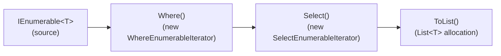

**Step 2: Write each rule entry**

**ZA0601 — Avoid LINQ methods in loops**
- Severity: Warning | Min TFM: Any
- Why: Every LINQ call allocates an iterator. Inside a loop body this multiplies the allocation count by the iteration count. Consider extracting the LINQ query outside the loop or replacing with a manual loop.
- Before: `for (int i = 0; i < n; i++) { var first = items.FirstOrDefault(x => x.Id == ids[i]); }`
- After: Build a `Dictionary` or pre-sort outside the loop; look up with O(1) access inside.
- Real-world: Matching order lines to products inside a processing loop

**ZA0602 — Avoid params calls in loops**
- Severity: Info | Min TFM: Any
- Why: A `params T[]` parameter allocates a new array on every call site invocation. Inside a loop this is one array per iteration.
- Before: `for (...) logger.Log(LogLevel.Info, "msg", arg1, arg2);` (params object[])
- After: Use structured logging with `[LoggerMessage]`, or overloads with explicit parameters.
- Real-world: Any hot-path code calling a params method (logging, string formatting, event firing)

**ZA0603 — Use .Count/.Length instead of LINQ .Count()**
- Severity: Info | Min TFM: Any
- Why: `IEnumerable<T>.Count()` enumerates the entire sequence. `List<T>.Count` and `T[].Length` are O(1) property reads. LINQ internally special-cases `ICollection<T>` but the call overhead still exists.
- Before: `if (list.Count() > 0)`
- After: `if (list.Count > 0)`
- Real-world: Guard clauses, pagination calculations

**ZA0604 — Use .Count > 0 instead of LINQ .Any()**
- Severity: Info | Min TFM: Any
- Why: `.Any()` on a materialised collection allocates an enumerator just to check if it's empty. `.Count > 0` is a direct property read.
- Before: `if (items.Any())`
- After: `if (items.Count > 0)` (for List/array) or keep `.Any()` for actual IEnumerable that isn't materialised
- Note in docs: `.Any()` is still correct for lazy sequences — this rule only fires on concrete collections.
- Real-world: Empty-check guards throughout service layers

**ZA0605 — Use indexer instead of LINQ .First()/.Last()**
- Severity: Info | Min TFM: Any
- Why: `.First()` and `.Last()` on a `List<T>` or array allocate an enumerator and traverse (for `.Last()`, the whole sequence). Direct indexing is O(1).
- Before: `var head = list.First(); var tail = list.Last();`
- After: `var head = list[0]; var tail = list[^1];`
- Real-world: Processing the first/last element of a sorted result set

**ZA0606 — Avoid foreach over interface-typed collection variable**
- Severity: Warning | Min TFM: Any
- Why: `foreach` on `IEnumerable<T>` calls `GetEnumerator()` through an interface dispatch, which boxes the enumerator struct (e.g. `List<T>.Enumerator`) into a heap object. If the variable is typed as `IEnumerable<T>` instead of `List<T>`, the boxing cannot be avoided.
- Before: `IEnumerable<Order> orders = GetOrders(); foreach (var o in orders)`
- After: `List<Order> orders = GetOrders(); foreach (var o in orders)` (or `var`)
- Real-world: Service method parameters, repository return values used in loops

**ZA0607 — Avoid multiple enumeration of IEnumerable<T>**
- Severity: Warning | Min TFM: Any
- Why: Enumerating an `IEnumerable<T>` twice runs the source query/iteration twice. For database queries or expensive computations this is catastrophically expensive; for any lazy source it is at minimum wasteful.
- Mermaid showing double enumeration:

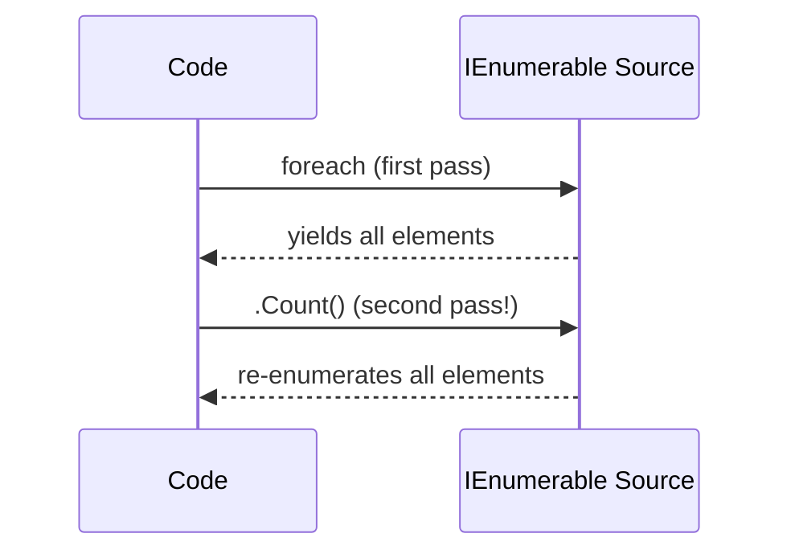

- Before:
  ```csharp
  var results = GetExpensiveQuery(); // IEnumerable<T>
  if (results.Any())
      Process(results); // enumerates again
  ```
- After: `var results = GetExpensiveQuery().ToList();`
- Real-world: EF Core query used for both a null-check and iteration

**Step 3: Commit**

```bash
git add docs/rules/linq.md
git commit -m "docs: add LINQ rules (ZA06xx)"
```

---

## Task 8: rules/regex.md + rules/enums.md + rules/sealing.md

**Files:**
- Create: `docs/rules/regex.md`
- Create: `docs/rules/enums.md`
- Create: `docs/rules/sealing.md`

**Step 1: Write docs/rules/regex.md**

Intro: Regex compilation is expensive. The ZA07xx rules push you toward compile-time source generation.

**ZA0701 — Use GeneratedRegex for compile-time regex**
- Severity: Info | Min TFM: net7.0
- Why: `new Regex(pattern)` compiles the regex at runtime. `[GeneratedRegex]` generates the state machine at compile time — faster first call, smaller warm-up, and AOT-safe.
- Before:
  ```csharp
  private static readonly Regex _emailRegex = new Regex(@"^[\w.]+@[\w.]+$", RegexOptions.Compiled);
  ```
- After:
  ```csharp
  [GeneratedRegex(@"^[\w.]+@[\w.]+$")]
  private static partial Regex EmailRegex();
  ```
- Real-world: Email validation, URL slug sanitisation, log line parsing

**Step 2: Write docs/rules/enums.md**

Intro: Enum operations have subtle allocation traps: `HasFlag` boxes on older runtimes, `ToString()` allocates, and `GetName`/`GetValues` in loops repeat expensive reflection.

**ZA0801 — Avoid Enum.HasFlag (boxes on pre-net7.0)**
- Severity: Info | Min TFM: <net7.0 (disabled on net7.0+)
- Why: Pre-net7.0 `Enum.HasFlag` boxes both arguments. On net7.0+ the JIT handles this without boxing. The rule fires only for projects targeting older runtimes.
- Before: `if (options.HasFlag(MyEnum.ReadWrite))`
- After: `if ((options & MyEnum.ReadWrite) == MyEnum.ReadWrite)`
- Real-world: Permission flags checked per-request on a pre-net7.0 service

**ZA0802 — Avoid Enum.ToString() allocations**
- Severity: Info | Min TFM: Any
- Why: `Enum.ToString()` uses reflection to find the name and allocates a new string every call. Cache the result or use a pre-built dictionary.
- Before: `string name = myEnum.ToString();` in a loop or hot path
- After: Cache with a `static readonly Dictionary<MyEnum, string>` or use a `switch` expression
- Real-world: Serialising enums to JSON/CSV in a tight loop

**ZA0803 — Cache Enum.GetName / GetValues results in loops**
- Severity: Info | Min TFM: Any
- Why: `Enum.GetValues<T>()` and `Enum.GetName<T>()` are reflection-based and non-trivial. Calling them inside a loop repeats the cost every iteration.
- Before: `foreach (var val in Enum.GetValues<Status>()) { ... }`
- After:
  ```csharp
  private static readonly Status[] _statusValues = Enum.GetValues<Status>();
  foreach (var val in _statusValues) { ... }
  ```
- Real-world: Rendering a dropdown list, building an enum-keyed lookup table at startup

**Step 3: Write docs/rules/sealing.md**

Intro: Virtual dispatch prevents the JIT from inlining and devirtualizing method calls. Sealing classes that are never subclassed is a low-risk, high-value optimization.

**ZA0901 — Consider sealing classes**
- Severity: Info | Min TFM: Any
- Why: An unsealed class allows virtual dispatch on all virtual/abstract members. The JIT can devirtualize and inline calls to sealed types, reducing overhead. If a class is not intended to be subclassed, `sealed` communicates intent and enables optimization.
- Before: `public class OrderProcessor { public virtual void Process(Order o) ... }`
- After: `public sealed class OrderProcessor { public void Process(Order o) ... }`
- Note: The rule only fires when no other type in the compilation derives from the class.
- Real-world: Service classes, repository implementations, handler classes in a mediator pattern

**Step 4: Commit**

```bash
git add docs/rules/regex.md docs/rules/enums.md docs/rules/sealing.md
git commit -m "docs: add regex (ZA07xx), enums (ZA08xx), sealing (ZA09xx) rules"
```

---

## Task 9: rules/serialization.md + rules/async.md

**Files:**
- Create: `docs/rules/serialization.md`
- Create: `docs/rules/async.md`

**Step 1: Write docs/rules/serialization.md**

Intro: Reflection-based JSON serialization has significant startup cost and per-call overhead. Source generators produce serialization code at compile time.

**ZA1001 — Use JSON source generation instead of reflection**
- Severity: Info | Min TFM: net7.0
- Why: `JsonSerializer.Serialize(obj)` on an unknown type uses reflection at runtime — slow first call, generates IL dynamically, and is incompatible with NativeAOT. Source-generated contexts (`[JsonSerializable]`) produce the serialization code ahead of time.
- Before:
  ```csharp
  string json = JsonSerializer.Serialize(order);
  ```
- After:
  ```csharp
  [JsonSerializable(typeof(Order))]
  public partial class AppJsonContext : JsonSerializerContext { }

  string json = JsonSerializer.Serialize(order, AppJsonContext.Default.Order);
  ```
- Real-world: ASP.NET Core minimal API response serialization, message queue publishers

**Step 2: Write docs/rules/async.md**

Intro: Async/await generates state machines. Unnecessary state machines, unreturned `CancellationTokenSource` instances, and `Span<T>` misuse in async methods are common traps.

Mermaid showing async state machine overhead:

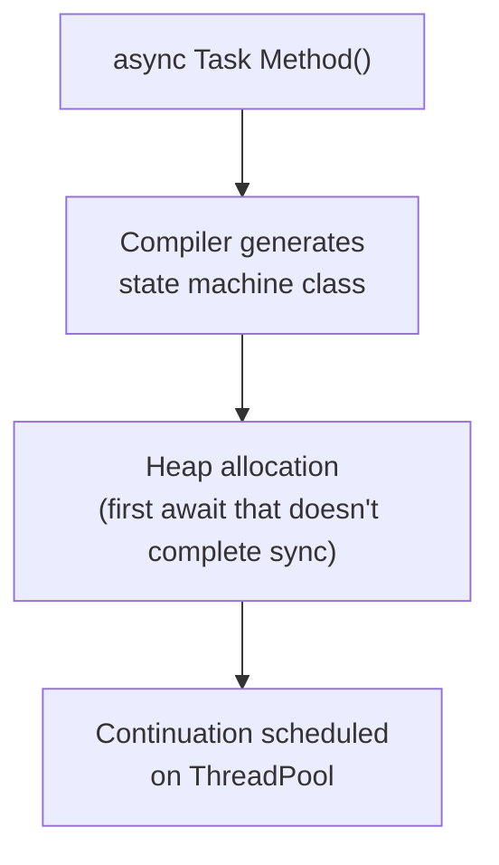

**ZA1101 — Elide async/await on simple tail calls**
- Severity: Info | Min TFM: Any
- Why: A method that does nothing except `return await SomeMethod()` generates a full state machine with no benefit. Removing `async/await` and returning the `Task` directly avoids the state machine allocation entirely.
- Before:
  ```csharp
  public async Task<string> GetValueAsync()
      => await _inner.GetValueAsync();
  ```
- After:
  ```csharp
  public Task<string> GetValueAsync()
      => _inner.GetValueAsync();
  ```
- Important caveat: this changes exception stack traces and can break `using`/`try-finally` — the rule only fires when it is safe to elide.
- Real-world: Thin pass-through wrappers, decorator/proxy types

**ZA1102 — Dispose CancellationTokenSource**
- Severity: Info | Min TFM: Any
- Why: `CancellationTokenSource` registers with the runtime timer infrastructure. Not disposing it leaks the registration.
- Before: `var cts = new CancellationTokenSource(timeout); var result = await op(cts.Token);`
- After: Wrap in `using`
- Real-world: Any timeout-bounded async operation, HTTP client calls with deadlines

**ZA1104 — Avoid Span<T> in async methods, use Memory<T>**
- Severity: Warning | Min TFM: Any
- Why: `Span<T>` is a ref struct and cannot be stored on the heap. Async state machines store all locals on the heap between `await` points. The compiler will error if `Span<T>` is used across an `await` — this rule catches the pattern earlier and suggests `Memory<T>` as the async-safe alternative.
- Before:
  ```csharp
  public async Task ProcessAsync(Span<byte> data) { ... await FlushAsync(); ... }
  ```
- After:
  ```csharp
  public async Task ProcessAsync(Memory<byte> data) { ... await FlushAsync(); ... }
  ```
- Real-world: Stream processing, buffer-passing async pipelines

**Step 3: Commit**

```bash
git add docs/rules/serialization.md docs/rules/async.md
git commit -m "docs: add serialization (ZA10xx) and async (ZA11xx) rules"
```

---

## Task 10: rules/delegates.md + rules/value-types.md

**Files:**
- Create: `docs/rules/delegates.md`
- Create: `docs/rules/value-types.md`

**Step 1: Write docs/rules/delegates.md**

Intro: Lambda expressions that capture variables allocate a closure object. Lambdas that capture nothing can be cached as a static delegate — eliminating the allocation entirely.

**ZA1401 — Use static lambda when no capture is needed**
- Severity: Info | Min TFM: net5.0 (C# 9 `static` lambda)
- Why: A non-static lambda is always allocated as a delegate object. If it captures nothing, adding the `static` modifier tells the compiler to cache it as a singleton, eliminating the per-call allocation.
- Before: `list.Sort((a, b) => a.Name.CompareTo(b.Name));`
- After: `list.Sort(static (a, b) => a.Name.CompareTo(b.Name));`
- Real-world: LINQ predicates, sort comparers, event handler registrations that don't close over instance state

**Step 2: Write docs/rules/value-types.md**

Intro: Structs used as dictionary keys or with finalizers have correctness and performance implications that are easy to miss.

**ZA1501 — Override GetHashCode on struct dictionary keys**
- Severity: Info | Min TFM: Any
- Why: The default `ValueType.GetHashCode()` implementation uses reflection to hash the fields — it is both slow and allocates. Any struct used as a `Dictionary<TKey, TValue>` key should override `GetHashCode()` (and `Equals`) with a direct implementation.
- Before: `Dictionary<MyStruct, string> dict; // MyStruct has no GetHashCode override`
- After:
  ```csharp
  readonly struct MyStruct : IEquatable<MyStruct>
  {
      public int X, Y;
      public override int GetHashCode() => HashCode.Combine(X, Y);
      public bool Equals(MyStruct other) => X == other.X && Y == other.Y;
      public override bool Equals(object? obj) => obj is MyStruct s && Equals(s);
  }
  ```
- Real-world: Coordinate types used as grid dictionary keys, composite key structs in caches

**ZA1502 — Avoid finalizers, use IDisposable**
- Severity: Info | Min TFM: Any
- Why: A type with a finalizer is promoted to the finalizer queue when collected, which adds latency and prevents the memory from being reclaimed in the first GC pass. The standard pattern is `IDisposable` + `GC.SuppressFinalize` — only use a finalizer as a safety net, never as the primary cleanup mechanism.
- Before: `class ResourceHolder { ~ResourceHolder() { CleanUp(); } }`
- After: Implement `IDisposable`, call `GC.SuppressFinalize(this)` in `Dispose`
- Real-world: Any type wrapping unmanaged handles (file handles, native memory, COM objects)

**Step 3: Commit**

```bash
git add docs/rules/delegates.md docs/rules/value-types.md
git commit -m "docs: add delegates (ZA14xx) and value-types (ZA15xx) rules"
```

---

## Task 11: contributing/architecture.md

**Files:**
- Create: `docs/contributing/architecture.md`

**Step 1: Write the file**

Content sections:

1. **Repository layout** — table of key directories and their roles
2. **How Roslyn analyzers work** — brief primer: `DiagnosticAnalyzer`, `RegisterSyntaxNodeAction` vs `RegisterOperationAction`, `AnalysisContext`
3. **Mermaid: Roslyn compilation pipeline**

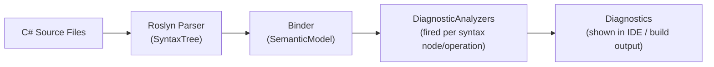

4. **Analyzer anatomy** — annotated skeleton of a ZeroAlloc analyzer showing: descriptor, `Initialize`, `AnalyzeXxx`, `context.ReportDiagnostic`
5. **DiagnosticIds.cs and DiagnosticCategories.cs** — conventions, how to pick the next ID
6. **TfmHelper** — brief overview, link to `tfm-awareness.md`
7. **Code fix providers** — how `CodeFixProvider` relates to a `DiagnosticAnalyzer`, the `RegisterCodeFixesAsync` / `CreateChangedDocument` pattern
8. **Test infrastructure** — `CSharpAnalyzerVerifier<T>`, how TFM is injected via `.globalconfig`, `ReferenceAssemblies`, example test shape

**Step 2: Commit**

```bash
git add docs/contributing/architecture.md
git commit -m "docs: add contributor architecture guide"
```

---

## Task 12: contributing/adding-a-rule.md

**Files:**
- Create: `docs/contributing/adding-a-rule.md`

**Step 1: Write the file**

Full end-to-end walkthrough for adding a new analyzer. Use a concrete fictional example: `ZA0110 — Avoid Dictionary.Keys.Contains, use ContainsKey`.

Steps:
1. Pick the next available ID in `DiagnosticIds.cs`
2. Add the constant
3. Create the analyzer class (provide template)
4. Register it (`RegisterSyntaxNodeAction` or `RegisterOperationAction`)
5. Write the first failing test (show the verifier API)
6. Run the test: `dotnet test --filter ZA0110`
7. Implement analysis logic (with code sample)
8. Run the test again — it should pass
9. Add no-diagnostic test cases
10. Optionally add a code fix (show `CodeFixProvider` template)
11. Add to `AnalyzerReleases.Unshipped.md`
12. Commit

Include a Mermaid flowchart of the TDD loop:

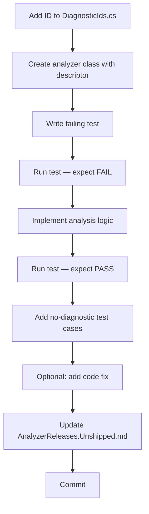

**Step 2: Commit**

```bash
git add docs/contributing/adding-a-rule.md
git commit -m "docs: add contributor guide for adding a new rule"
```

---

## Task 13: contributing/tfm-awareness.md

**Files:**
- Create: `docs/contributing/tfm-awareness.md`

**Step 1: Write the file**

Content:
1. **The problem** — analyzers run at build time and must know the consuming project's target framework to enable/disable rules correctly
2. **The mechanism** — `CompilerVisibleProperty` in `ZeroAlloc.Analyzers.props` makes `TargetFramework` visible inside the analyzer via `AnalyzerOptions`
3. **The flow** — Mermaid:

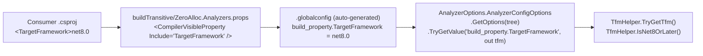

4. **TfmHelper API** — show all public methods with their semantics
5. **Gating a rule** — code pattern for checking TFM at the start of `Initialize` or inside the analysis callback
6. **Testing TFM-gated rules** — show the `tfm:` parameter in `CSharpAnalyzerVerifier.VerifyAnalyzerAsync` and how `.globalconfig` is injected in tests
7. **Supported TFM strings** — list of recognized strings (net5.0–net9.0, netstandard2.0, netcoreapp3.1, net4x legacy)

**Step 2: Commit**

```bash
git add docs/contributing/tfm-awareness.md
git commit -m "docs: add TFM awareness contributor guide"
```

---

## Done

All 18 documentation files written and committed. Verify with:

```bash
find docs/ -name "*.md" | sort
# Should list: getting-started.md, configuration.md,
# rules/{collections,strings,memory,logging,boxing,linq,regex,enums,sealing,serialization,async,delegates,value-types}.md
# contributing/{architecture,adding-a-rule,tfm-awareness}.md
```
