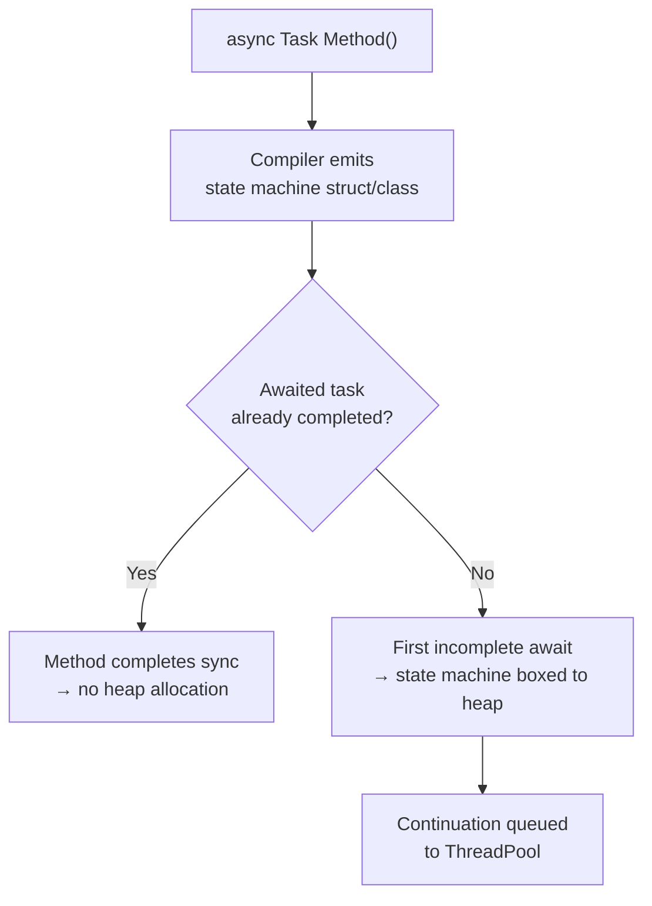

# Async (ZA11xx)

`async/await` generates a state machine class for every async method. When an awaited operation completes synchronously (which is common in caching, in-memory operations, and fast I/O), the state machine is never allocated — but the overhead of setting it up still exists. Unnecessary state machines, leaked `CancellationTokenSource` instances, and `Span<T>` misuse in async methods are common performance traps.



---

## ZA1101 — Elide async/await on simple tail calls {#za1101}

> **Severity**: Info | **Min TFM**: Any | **Code fix**: No

### Why

A method that does nothing except `return await someTask` generates a full state machine, an `AsyncTaskMethodBuilder`, and a continuation callback — just to unwrap and re-wrap the task. Removing `async/await` and returning the `Task` directly propagates it to the caller with zero overhead. The rule only fires when it is safe to elide: no `using`/`try-catch`/`finally` blocks, and no code after the await.

**Important caveat — stack trace fidelity:** Eliding `async/await` changes exception stack traces. With `async/await`, an exception thrown inside the awaited method is captured in the returned `Task` and re-thrown at the `await` point inside your method, so your method appears in the stack trace. When you return the `Task` directly, the exception propagates to your caller's `await` point instead, and your wrapper method is absent from the trace. For library code where stack trace fidelity is critical for debugging, you may choose to suppress this rule on a case-by-case basis.

### Before

```csharp
// ❌ state machine for no reason — the method only wraps a single await
public async Task<User?> GetUserAsync(int id, CancellationToken ct)
    => await _repository.FindByIdAsync(id, ct);

public async Task SaveAsync(User user, CancellationToken ct)
    => await _db.SaveChangesAsync(ct);
```

### After

```csharp
// ✓ just return the Task — zero state machine overhead
public Task<User?> GetUserAsync(int id, CancellationToken ct)
    => _repository.FindByIdAsync(id, ct);

public Task SaveAsync(User user, CancellationToken ct)
    => _db.SaveChangesAsync(ct);
```

### Real-world example

A caching decorator that wraps an inner `IUserService`. Most methods are simple cache-first pass-throughs with a single tail call. The `async` keyword on every method creates a state machine with no benefit; removing it where safe eliminates the overhead.

```csharp
public interface IUserService
{
    Task<User?> GetByIdAsync(int id, CancellationToken ct);
    Task<IReadOnlyList<User>> GetByRoleAsync(string role, CancellationToken ct);
    Task CreateAsync(User user, CancellationToken ct);
    Task UpdateAsync(User user, CancellationToken ct);
    Task DeleteAsync(int id, CancellationToken ct);
}

// ❌ Before: async/await on every method, even those with nothing to do after the single await
public sealed class CachingUserService : IUserService
{
    private readonly IUserService _inner;
    private readonly IDistributedCache _cache;
    private static readonly TimeSpan CacheTtl = TimeSpan.FromMinutes(5);

    public CachingUserService(IUserService inner, IDistributedCache cache)
    {
        _inner = inner;
        _cache = cache;
    }

    public async Task<User?> GetByIdAsync(int id, CancellationToken ct)
    {
        var key  = $"user:{id}";
        var hit  = await _cache.GetAsync(key, ct);
        if (hit is not null)
            return JsonSerializer.Deserialize<User>(hit);

        var user = await _inner.GetByIdAsync(id, ct);
        if (user is not null)
        {
            var bytes = JsonSerializer.SerializeToUtf8Bytes(user);
            await _cache.SetAsync(key, bytes, new DistributedCacheEntryOptions
            {
                AbsoluteExpirationRelativeToNow = CacheTtl
            }, ct);
        }

        return user;
    }

    // ❌ These three are pure pass-throughs — async/await creates a state machine for nothing
    public async Task<IReadOnlyList<User>> GetByRoleAsync(string role, CancellationToken ct)
        => await _inner.GetByRoleAsync(role, ct);

    public async Task CreateAsync(User user, CancellationToken ct)
        => await _inner.CreateAsync(user, ct);

    public async Task UpdateAsync(User user, CancellationToken ct)
        => await _inner.UpdateAsync(user, ct);

    // ❌ Same — simple tail call with no surrounding logic
    public async Task DeleteAsync(int id, CancellationToken ct)
        => await _inner.DeleteAsync(id, ct);
}

// ✓ After: elide async/await on the pure pass-through methods
public sealed class CachingUserService : IUserService
{
    private readonly IUserService _inner;
    private readonly IDistributedCache _cache;
    private static readonly TimeSpan CacheTtl = TimeSpan.FromMinutes(5);

    public CachingUserService(IUserService inner, IDistributedCache cache)
    {
        _inner = inner;
        _cache = cache;
    }

    // ✓ GetByIdAsync has real async work after the first await — keep async/await here
    public async Task<User?> GetByIdAsync(int id, CancellationToken ct)
    {
        var key = $"user:{id}";
        var hit = await _cache.GetAsync(key, ct);
        if (hit is not null)
            return JsonSerializer.Deserialize<User>(hit);

        var user = await _inner.GetByIdAsync(id, ct);
        if (user is not null)
        {
            var bytes = JsonSerializer.SerializeToUtf8Bytes(user);
            await _cache.SetAsync(key, bytes, new DistributedCacheEntryOptions
            {
                AbsoluteExpirationRelativeToNow = CacheTtl
            }, ct);
        }

        return user;
    }

    // ✓ Pure pass-throughs — return the Task directly, no state machine
    public Task<IReadOnlyList<User>> GetByRoleAsync(string role, CancellationToken ct)
        => _inner.GetByRoleAsync(role, ct);

    public Task CreateAsync(User user, CancellationToken ct)
        => _inner.CreateAsync(user, ct);

    public Task UpdateAsync(User user, CancellationToken ct)
        => _inner.UpdateAsync(user, ct);

    public Task DeleteAsync(int id, CancellationToken ct)
        => _inner.DeleteAsync(id, ct);
}
```

### Suppression

```csharp
#pragma warning disable ZA1101
// or in .editorconfig: dotnet_diagnostic.ZA1101.severity = none
```

---

## ZA1102 — Dispose CancellationTokenSource {#za1102}

> **Severity**: Info | **Min TFM**: Any | **Code fix**: No

### Why

`CancellationTokenSource` with a timeout delay (`new CancellationTokenSource(TimeSpan)`) registers a `Timer` with the system timer infrastructure. Not disposing it leaks the timer registration until the finalizer runs, which may be significantly delayed — especially in high-throughput server code where finalizer threads are under heavy load. Always wrap `CancellationTokenSource` in a `using` block or explicitly call `Dispose()` to release the timer registration deterministically.

### Before

```csharp
// ❌ timer registration leaked — finalizer may not run for a long time
var cts = new CancellationTokenSource(TimeSpan.FromSeconds(30));
var result = await _httpClient.GetAsync(url, cts.Token);
```

### After

```csharp
// ✓ timer released deterministically when the using block exits
using var cts = new CancellationTokenSource(TimeSpan.FromSeconds(30));
var result = await _httpClient.GetAsync(url, cts.Token);
```

### Real-world example

An HTTP client wrapper that applies per-request timeouts by creating a `CancellationTokenSource` for each call. Without disposal, every request leaks a timer registration. At 100 req/s, that accumulates to thousands of live timer registrations in the timer wheel before the finalizer thread has a chance to clean them up.

```csharp
// ❌ Before: CancellationTokenSource created but never disposed
public sealed class ResilientHttpClientBefore
{
    private readonly HttpClient _http;
    private readonly ILogger<ResilientHttpClientBefore> _logger;
    private static readonly TimeSpan DefaultTimeout = TimeSpan.FromSeconds(30);

    public ResilientHttpClientBefore(HttpClient http, ILogger<ResilientHttpClientBefore> logger)
    {
        _http   = http;
        _logger = logger;
    }

    public async Task<string> GetAsync(string url, CancellationToken externalCt = default)
    {
        // Leaked: the CancellationTokenSource registers a Timer; without Dispose() that
        // registration persists until the finalizer runs — which could be minutes later.
        var cts = CancellationTokenSource.CreateLinkedTokenSource(externalCt);
        cts.CancelAfter(DefaultTimeout);

        try
        {
            using var response = await _http.GetAsync(url, cts.Token);
            response.EnsureSuccessStatusCode();
            return await response.Content.ReadAsStringAsync(cts.Token);
        }
        catch (OperationCanceledException) when (!externalCt.IsCancellationRequested)
        {
            _logger.LogWarning("GET {Url} timed out after {Timeout}", url, DefaultTimeout);
            throw new TimeoutException($"Request to {url} timed out.");
        }
    }

    public async Task<T?> GetJsonAsync<T>(string url, CancellationToken externalCt = default)
    {
        var cts = new CancellationTokenSource(DefaultTimeout);   // leaked

        try
        {
            using var response = await _http.GetAsync(url, cts.Token);
            response.EnsureSuccessStatusCode();
            using var stream = await response.Content.ReadAsStreamAsync(cts.Token);
            return await JsonSerializer.DeserializeAsync<T>(stream, cancellationToken: cts.Token);
        }
        catch (OperationCanceledException)
        {
            _logger.LogWarning("GET {Url} timed out", url);
            throw new TimeoutException($"Request to {url} timed out.");
        }
    }

    public async Task PostJsonAsync<T>(string url, T body, CancellationToken externalCt = default)
    {
        var cts = new CancellationTokenSource(DefaultTimeout);   // leaked

        var json    = JsonSerializer.Serialize(body);
        var content = new StringContent(json, Encoding.UTF8, "application/json");

        try
        {
            using var response = await _http.PostAsync(url, content, cts.Token);
            response.EnsureSuccessStatusCode();
        }
        catch (OperationCanceledException)
        {
            _logger.LogWarning("POST {Url} timed out", url);
            throw new TimeoutException($"Request to {url} timed out.");
        }
    }
}

// ✓ After: every CancellationTokenSource is disposed via using var
public sealed class ResilientHttpClient
{
    private readonly HttpClient _http;
    private readonly ILogger<ResilientHttpClient> _logger;
    private static readonly TimeSpan DefaultTimeout = TimeSpan.FromSeconds(30);

    public ResilientHttpClient(HttpClient http, ILogger<ResilientHttpClient> logger)
    {
        _http   = http;
        _logger = logger;
    }

    public async Task<string> GetAsync(string url, CancellationToken externalCt = default)
    {
        // using var ensures Dispose() is called when the method exits — timer freed immediately.
        using var cts = CancellationTokenSource.CreateLinkedTokenSource(externalCt);
        cts.CancelAfter(DefaultTimeout);

        try
        {
            using var response = await _http.GetAsync(url, cts.Token);
            response.EnsureSuccessStatusCode();
            return await response.Content.ReadAsStringAsync(cts.Token);
        }
        catch (OperationCanceledException) when (!externalCt.IsCancellationRequested)
        {
            _logger.LogWarning("GET {Url} timed out after {Timeout}", url, DefaultTimeout);
            throw new TimeoutException($"Request to {url} timed out.");
        }
    }

    public async Task<T?> GetJsonAsync<T>(string url, CancellationToken externalCt = default)
    {
        using var cts = CancellationTokenSource.CreateLinkedTokenSource(externalCt);
        cts.CancelAfter(DefaultTimeout);

        try
        {
            using var response = await _http.GetAsync(url, cts.Token);
            response.EnsureSuccessStatusCode();
            using var stream = await response.Content.ReadAsStreamAsync(cts.Token);
            return await JsonSerializer.DeserializeAsync<T>(stream, cancellationToken: cts.Token);
        }
        catch (OperationCanceledException) when (!externalCt.IsCancellationRequested)
        {
            _logger.LogWarning("GET {Url} timed out", url);
            throw new TimeoutException($"Request to {url} timed out.");
        }
    }

    public async Task PostJsonAsync<T>(string url, T body, CancellationToken externalCt = default)
    {
        using var cts = CancellationTokenSource.CreateLinkedTokenSource(externalCt);
        cts.CancelAfter(DefaultTimeout);

        var json    = JsonSerializer.Serialize(body);
        var content = new StringContent(json, Encoding.UTF8, "application/json");

        try
        {
            using var response = await _http.PostAsync(url, content, cts.Token);
            response.EnsureSuccessStatusCode();
        }
        catch (OperationCanceledException) when (!externalCt.IsCancellationRequested)
        {
            _logger.LogWarning("POST {Url} timed out", url);
            throw new TimeoutException($"Request to {url} timed out.");
        }
    }
}
```

### Suppression

```csharp
#pragma warning disable ZA1102
// or in .editorconfig: dotnet_diagnostic.ZA1102.severity = none
```

---

## ZA1104 — Avoid Span\<T\> in async methods, use Memory\<T\> {#za1104}

> **Severity**: Warning | **Min TFM**: Any | **Code fix**: No

### Why

`Span<T>` is a `ref struct` — it can only live on the stack and cannot be stored on the heap. Async state machines must capture all local variables and method parameters on the heap between `await` points. Passing `Span<T>` to an async method either causes a compiler error (if the span is used across an `await` point) or silently restricts what the method can do. Use `Memory<T>` instead — it is a regular struct backed by a heap-allocated array or a `MemoryManager<T>`, which the state machine can safely capture and hold across suspensions.

### Before

```csharp
// ❌ Span<T> cannot be stored in the async state machine across an await
public async Task<int> ParseHeaderAsync(Span<byte> header, CancellationToken ct)
{
    await ValidateChecksumAsync(header, ct); // compiler error: Span<T> cannot be used in async method
    return BitConverter.ToInt32(header[4..8]);
}
```

### After

```csharp
// ✓ Memory<T> is heap-safe — the state machine captures it without restriction
public async Task<int> ParseHeaderAsync(Memory<byte> header, CancellationToken ct)
{
    await ValidateChecksumAsync(header, ct);
    return BitConverter.ToInt32(header.Span[4..8]);
}
```

### Real-world example

An async binary protocol parser that reads framed messages from a `PipeReader`. The parser awaits I/O to fill a buffer, then processes the frame. Using `Span<byte>` as the buffer parameter would prevent any `await` expression from appearing in the same method; `Memory<byte>` allows the state machine to hold the buffer across the fill-and-parse loop.

```csharp
// ❌ Before: Span<byte> parameter — async method cannot await across a Span usage
public sealed class MessageFrameParserBefore
{
    // This will not compile: 'Span<T>' cannot be used as a type argument and
    // cannot be captured in an async state machine.
    public async Task<ParseResult> ReadFrameAsync(
        Span<byte> buffer,        // ← compiler error in async context
        PipeReader reader,
        CancellationToken ct)
    {
        // The compiler prevents awaiting here because 'buffer' is a Span<T>
        // and the state machine cannot capture it on the heap.
        var readResult = await reader.ReadAsync(ct);   // compile error

        var sequence = readResult.Buffer;
        if (sequence.Length < 4)
        {
            reader.AdvanceTo(sequence.Start, sequence.End);
            return ParseResult.Incomplete;
        }

        int frameLength = BitConverter.ToInt32(buffer[..4]);
        if (sequence.Length < 4 + frameLength)
        {
            reader.AdvanceTo(sequence.Start, sequence.End);
            return ParseResult.Incomplete;
        }

        sequence.Slice(4, frameLength).CopyTo(buffer[4..]);
        reader.AdvanceTo(sequence.GetPosition(4 + frameLength));

        return new ParseResult(Success: true, BytesConsumed: 4 + frameLength);
    }
}

// ✓ After: Memory<byte> — async state machine can capture the buffer across await points
public sealed class MessageFrameParser
{
    private const int LengthPrefixBytes = 4;

    // Memory<byte> is an ordinary struct — the state machine stores it on the heap safely.
    public async Task<ParseResult> ReadFrameAsync(
        Memory<byte> buffer,
        PipeReader reader,
        CancellationToken ct)
    {
        while (true)
        {
            // ✓ Awaiting here is fine — 'buffer' (Memory<byte>) is captured by the state machine.
            var readResult = await reader.ReadAsync(ct);
            var sequence   = readResult.Buffer;

            if (readResult.IsCanceled)
                return ParseResult.Cancelled;

            if (sequence.Length >= LengthPrefixBytes)
            {
                // Read the 4-byte length prefix using Span<T> — safe inside a synchronous slice.
                Span<byte> prefixSpan = stackalloc byte[LengthPrefixBytes];
                sequence.Slice(0, LengthPrefixBytes).CopyTo(prefixSpan);
                int frameLength = BitConverter.ToInt32(prefixSpan);

                long totalBytes = LengthPrefixBytes + frameLength;
                if (sequence.Length >= totalBytes)
                {
                    // Copy the frame body into the caller's Memory<byte> buffer.
                    sequence.Slice(LengthPrefixBytes, frameLength).CopyTo(buffer.Span);
                    reader.AdvanceTo(sequence.GetPosition(totalBytes));

                    return new ParseResult(
                        Success:       true,
                        BytesConsumed: (int)totalBytes,
                        FrameData:     buffer[..frameLength]);
                }
            }

            reader.AdvanceTo(sequence.Start, sequence.End);

            if (readResult.IsCompleted)
                return ParseResult.EndOfStream;
        }
    }

    // ✓ Synchronous helper that operates on Span<T> — fine because it is not async
    private static int ReadLengthPrefix(ReadOnlySpan<byte> header)
        => BitConverter.ToInt32(header[..LengthPrefixBytes]);
}

public readonly record struct ParseResult(
    bool         Success,
    int          BytesConsumed,
    Memory<byte> FrameData)
{
    public static readonly ParseResult Incomplete   = new(false, 0, Memory<byte>.Empty);
    public static readonly ParseResult EndOfStream  = new(false, 0, Memory<byte>.Empty);
    public static readonly ParseResult Cancelled    = new(false, 0, Memory<byte>.Empty);
}
```

### Suppression

```csharp
#pragma warning disable ZA1104
// or in .editorconfig: dotnet_diagnostic.ZA1104.severity = none
```
