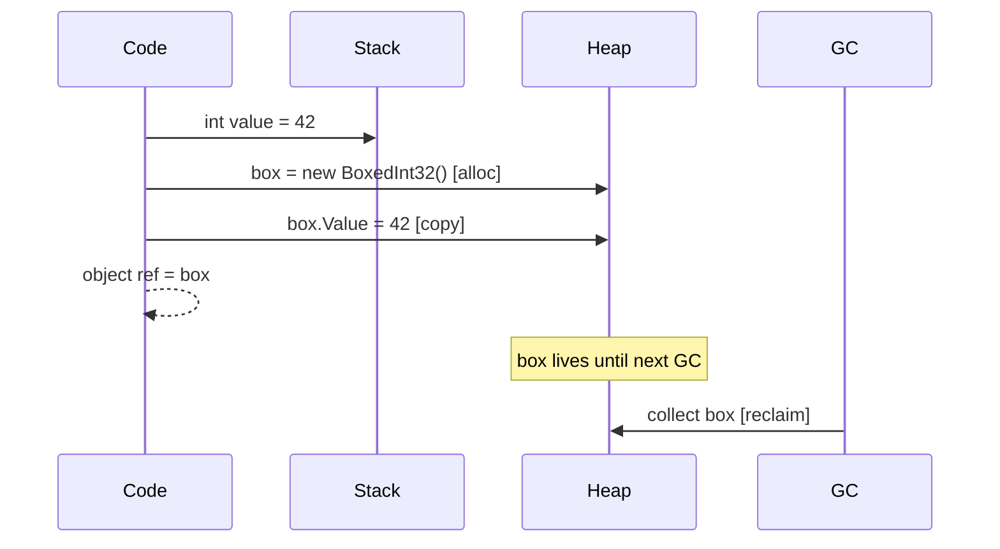

# Boxing & Closures (ZA05xx)

Boxing occurs when a value type (struct, int, bool, enum, etc.) is implicitly converted to `object` or an interface reference. It allocates a heap wrapper object, copies the value into it, and creates GC pressure. Closures that capture loop variables have a similar issue — each iteration allocates a new closure object. The ZA05xx rules detect these patterns.



---

## ZA0501 — Avoid boxing value types in loops {#za0501}

> **Severity**: Warning | **Min TFM**: Any | **Code fix**: No

### Why

A boxing conversion that appears inside a loop body executes on every iteration, multiplying allocations proportionally to the loop count. On a 10,000-iteration loop, a single boxing expression causes 10,000 heap allocations, each requiring the runtime to allocate a small heap object, copy the value type data into it, and eventually collect it. The resulting GC pressure increases pause frequency and duration, which is especially harmful in latency-sensitive paths such as request handlers, game update loops, and financial tick processors.

Make the receiver generic so the value type flows through as `T`, use concrete types throughout, or redesign the API to accept the value type directly. The goal is to move the type decision to compile time so the JIT can specialise for the concrete type and avoid the heap wrapper entirely.

### Before

```csharp
// ❌ every iteration boxes the value-type event into object
private readonly List<Action<object>> _handlers = new();

public void Dispatch<TEvent>(TEvent evt) where TEvent : struct
{
    foreach (var handler in _handlers)
    {
        handler(evt); // boxes evt on every call
    }
}
```

### After

```csharp
// ✓ generic handler — no boxing, JIT specialises per TEvent
public interface IEventHandler<TEvent> where TEvent : struct
{
    void Handle(TEvent evt);
}

private readonly List<IEventHandler<OrderPlaced>> _orderHandlers = new();

public void Dispatch(in OrderPlaced evt)
{
    foreach (var handler in _orderHandlers)
    {
        handler.Handle(evt); // no boxing — interface dispatch on a class
    }
}
```

### Real-world example

An in-process event dispatcher used by a trading system where `OrderPlaced`, `OrderFilled`, and `TradeSettled` are value-type events published at high frequency. The before version stores handlers as `List<Action<object>>` and boxes every event on dispatch. The after version uses a generic `IEventHandler<T>` interface so the concrete event type is preserved end-to-end.

```csharp
// ─── BEFORE ────────────────────────────────────────────────────────────────
// ❌ All events are boxed into object on every Dispatch call.
//    At 50,000 events/sec this is 50,000 allocations/sec just for the boxes.

public readonly struct OrderPlaced
{
    public readonly long OrderId;
    public readonly decimal Price;
    public readonly int Quantity;
    public OrderPlaced(long orderId, decimal price, int quantity)
        => (OrderId, Price, Quantity) = (orderId, price, quantity);
}

public sealed class EventBusBefore
{
    // Handlers keyed by event type name — value type erased to object
    private readonly Dictionary<string, List<Action<object>>> _subscriptions = new();

    public void Subscribe<TEvent>(Action<TEvent> handler) where TEvent : struct
    {
        var key = typeof(TEvent).Name;
        if (!_subscriptions.TryGetValue(key, out var list))
            _subscriptions[key] = list = new List<Action<object>>();

        // ❌ wraps the typed handler in a lambda that unboxes — still allocates the box
        list.Add(obj => handler((TEvent)obj));
    }

    public void Publish<TEvent>(TEvent evt) where TEvent : struct
    {
        var key = typeof(TEvent).Name;
        if (!_subscriptions.TryGetValue(key, out var list))
            return;

        foreach (var handler in list)
        {
            handler(evt); // ❌ boxes evt here on every iteration
        }
    }
}

// ─── AFTER ─────────────────────────────────────────────────────────────────
// ✓ Generic handler interface — no boxing anywhere in the dispatch path.

public interface IEventHandler<TEvent> where TEvent : struct
{
    void Handle(in TEvent evt);
}

public sealed class EventBusAfter
{
    // Each slot is a strongly-typed handler list — no type erasure
    private readonly Dictionary<Type, object> _subscriptions = new();

    public void Subscribe<TEvent>(IEventHandler<TEvent> handler) where TEvent : struct
    {
        var type = typeof(TEvent);
        if (!_subscriptions.TryGetValue(type, out var slot))
            _subscriptions[type] = slot = new HandlerList<TEvent>();

        ((HandlerList<TEvent>)slot).Add(handler);
    }

    public void Publish<TEvent>(in TEvent evt) where TEvent : struct
    {
        if (_subscriptions.TryGetValue(typeof(TEvent), out var slot))
            ((HandlerList<TEvent>)slot).Invoke(in evt); // ✓ no boxing
    }

    private sealed class HandlerList<TEvent> where TEvent : struct
    {
        private readonly List<IEventHandler<TEvent>> _handlers = new();

        public void Add(IEventHandler<TEvent> h) => _handlers.Add(h);

        public void Invoke(in TEvent evt)
        {
            foreach (var h in _handlers)
                h.Handle(in evt); // ✓ value type passed by reference — no copy, no box
        }
    }
}

// Sample handler — zero allocation
public sealed class OrderAuditHandler : IEventHandler<OrderPlaced>
{
    private readonly IOrderAuditLog _auditLog;
    public OrderAuditHandler(IOrderAuditLog auditLog) => _auditLog = auditLog;

    public void Handle(in OrderPlaced evt)
        => _auditLog.Record(evt.OrderId, evt.Price, evt.Quantity);
}
```

### Suppression

```csharp
#pragma warning disable ZA0501
foreach (var item in collection)
{
    legacyApi.Process(item); // intentional — legacy API cannot be changed
}
#pragma warning restore ZA0501
// or in .editorconfig:
// dotnet_diagnostic.ZA0501.severity = none
```

---

## ZA0502 — Avoid closure allocations in loops {#za0502}

> **Severity**: Info | **Min TFM**: Any | **Code fix**: No

### Why

When a lambda captures a loop variable, the compiler generates a closure class (`<>c__DisplayClass`) and allocates a new instance of it on every iteration. For a loop body that creates N lambdas, this is N closure allocations — even if the lambdas are never actually invoked. Either pass the captured value as state through a `TState`-accepting overload, or restructure to avoid capture. Using a `static` lambda is a useful signal: the compiler enforces that no captures occur and emits the lambda as a static field rather than a heap object.

### Before

```csharp
// ❌ new closure allocated per iteration
for (int i = 0; i < items.Count; i++)
{
    tasks.Add(Task.Run(() => ProcessItem(items[i])));
}
```

### After

```csharp
// ✓ pass state through overload — no closure
for (int i = 0; i < items.Count; i++)
{
    var item = items[i];
    tasks.Add(Task.Run(static state => ProcessItem((Item)state!), item));
}
```

### Real-world example

A parallel batch processor that fans out work items to the thread pool, aggregates results, and respects a cancellation token. The before version captures the loop variable and allocates one closure per item. The after version passes each item as typed state through `Task.Factory.StartNew`, eliminating all closure allocations.

```csharp
using System.Collections.Concurrent;

public sealed class BatchProcessor
{
    private readonly IWorkItemExecutor _executor;

    public BatchProcessor(IWorkItemExecutor executor) => _executor = executor;

    // ─── BEFORE ────────────────────────────────────────────────────────────
    // ❌ The lambda captures both `this` and `items[i]` (via the loop variable i).
    //    The compiler emits a new <>c__DisplayClass instance per iteration.
    //    For a 10,000-item batch this is 10,000 closure allocations.

    public async Task<int[]> ProcessBatchBefore(
        IReadOnlyList<WorkItem> items,
        CancellationToken ct)
    {
        var tasks = new Task<int>[items.Count];

        for (int i = 0; i < items.Count; i++)
        {
            // ❌ captures i (mutable loop variable) — classic bug AND allocation
            tasks[i] = Task.Run(() => _executor.Execute(items[i]), ct);
        }

        return await Task.WhenAll(tasks);
    }

    // ─── AFTER ─────────────────────────────────────────────────────────────
    // ✓ State is passed explicitly. The lambda is static — the compiler verifies
    //   no captures occur and emits the delegate as a cached static field.
    //   Zero closure allocations for the entire batch.

    public async Task<int[]> ProcessBatchAfter(
        IReadOnlyList<WorkItem> items,
        CancellationToken ct)
    {
        var tasks = new Task<int>[items.Count];

        for (int i = 0; i < items.Count; i++)
        {
            var item = items[i]; // snapshot — avoids the classic loop-variable capture bug
            tasks[i] = Task.Run(
                static state => ((BatchState)state!).Executor.Execute(((BatchState)state!).Item),
                new BatchState(_executor, item),
                ct);
        }

        return await Task.WhenAll(tasks);
    }

    // ✓ Alternative: for uniform item types, use a typed overload if available
    public async Task<int[]> ProcessBatchWithPool(
        IReadOnlyList<WorkItem> items,
        CancellationToken ct)
    {
        var results = new ConcurrentBag<(int Index, int Result)>();
        var tasks = new Task[items.Count];

        for (int i = 0; i < items.Count; i++)
        {
            var state = new IndexedItem(i, items[i], _executor);
            tasks[i] = Task.Factory.StartNew(
                static obj =>
                {
                    var s = (IndexedItem)obj!;
                    return s.Executor.Execute(s.Item);
                },
                state,
                ct,
                TaskCreationOptions.DenyChildAttach,
                TaskScheduler.Default);
        }

        await Task.WhenAll(tasks);

        // collect results from the typed tasks
        var output = new int[items.Count];
        for (int i = 0; i < tasks.Length; i++)
            output[i] = await (Task<int>)tasks[i];

        return output;
    }

    private sealed record BatchState(IWorkItemExecutor Executor, WorkItem Item);
    private sealed record IndexedItem(int Index, WorkItem Item, IWorkItemExecutor Executor);
}

public readonly struct WorkItem
{
    public readonly int Id;
    public readonly byte[] Payload;
    public WorkItem(int id, byte[] payload) => (Id, Payload) = (id, payload);
}

public interface IWorkItemExecutor
{
    int Execute(WorkItem item);
}
```

### Suppression

```csharp
#pragma warning disable ZA0502
for (int i = 0; i < handlers.Count; i++)
{
    // intentional — framework API requires Action, TState overload unavailable
    queue.Enqueue(() => handlers[i].Run());
}
#pragma warning restore ZA0502
// or in .editorconfig:
// dotnet_diagnostic.ZA0502.severity = none
```

---

## ZA0504 — Avoid defensive copies on readonly structs {#za0504}

> **Severity**: Info | **Min TFM**: Any | **Code fix**: No

### Why

When a method is called on a struct via an `in` parameter, `readonly` field, or `readonly` local, the compiler must protect against the method mutating the struct. If the struct is not marked `readonly`, the compiler inserts a defensive copy — it copies the entire struct to a temporary before each method call. Adding `readonly` to the struct eliminates these copies because the compiler can prove no mutation can occur.

This matters most for large structs in math-heavy or game-loop code. A `Transform` struct containing three `Vector3` fields and a `Quaternion` is 52 bytes. If a game update loop calls `ToMatrix()` 10,000 times per frame at 60 fps, the compiler emits 600,000 unnecessary 52-byte copies per second — over 31 MB/s of pointless memory traffic — purely because the struct is not marked `readonly`.

### Before

```csharp
// ❌ compiler inserts defensive copy on every method call
struct Transform
{
    public Vector3 Position;
    public Quaternion Rotation;
    public float Scale;

    public Matrix4x4 ToMatrix() =>
        Matrix4x4.CreateScale(Scale) *
        Matrix4x4.CreateFromQuaternion(Rotation) *
        Matrix4x4.CreateTranslation(Position);
}

// usage via readonly field:
readonly Transform _transform;

// ❌ The compiler cannot see inside ToMatrix() to verify it won't mutate _transform.
//    It copies all 52 bytes of _transform to a temporary, then calls ToMatrix() on the copy.
var mat = _transform.ToMatrix();
```

### After

```csharp
// ✓ readonly struct — no defensive copy
readonly struct Transform
{
    public readonly Vector3 Position;
    public readonly Quaternion Rotation;
    public readonly float Scale;

    public Matrix4x4 ToMatrix() =>
        Matrix4x4.CreateScale(Scale) *
        Matrix4x4.CreateFromQuaternion(Rotation) *
        Matrix4x4.CreateTranslation(Position);
}
```

### Real-world example

A game engine entity update loop that processes 10,000 entities per frame, each holding a `readonly Transform` field, and calls `ToMatrix()` to build the world matrix for rendering. Marking `Transform` as `readonly` eliminates every defensive copy in the loop.

```csharp
using System.Numerics;
using System.Runtime.CompilerServices;

// ─── BEFORE ────────────────────────────────────────────────────────────────
// ❌ Mutable struct stored in a readonly field.
//    The compiler emits a defensive copy before every method call on _transform.

struct TransformMutable        // 52 bytes: 3×Vector3(12) + Quaternion(16) + float(4)
{
    public Vector3 Position;   // 12 bytes
    public Quaternion Rotation; // 16 bytes
    public float Scale;        // 4 bytes

    // Not marked readonly — compiler cannot guarantee this method won't mutate fields
    public Matrix4x4 ToMatrix() =>
        Matrix4x4.CreateScale(Scale) *
        Matrix4x4.CreateFromQuaternion(Rotation) *
        Matrix4x4.CreateTranslation(Position);

    public Vector3 TransformPoint(Vector3 point) =>
        Vector3.Transform(point, ToMatrix());
}

public sealed class EntityBefore
{
    public readonly TransformMutable Transform; // readonly field of mutable struct

    public EntityBefore(Vector3 position, Quaternion rotation, float scale)
        => Transform = new TransformMutable
        {
            Position = position,
            Rotation = rotation,
            Scale = scale
        };

    // ❌ Every call below triggers a 52-byte defensive copy.
    public Matrix4x4 GetWorldMatrix() => Transform.ToMatrix();
    public Vector3 GetWorldPosition(Vector3 localPoint) => Transform.TransformPoint(localPoint);
}

// Update loop — 10,000 entities × 60 fps = 600,000 defensive copies/sec
public static void UpdateSceneBefore(EntityBefore[] entities, Matrix4x4[] worldMatrices)
{
    for (int i = 0; i < entities.Length; i++)
    {
        // ❌ two method calls = two defensive copies of the 52-byte Transform
        worldMatrices[i] = entities[i].GetWorldMatrix();
    }
}

// ─── AFTER ─────────────────────────────────────────────────────────────────
// ✓ readonly struct — all fields are readonly, all methods are implicitly readonly.
//   The compiler can call methods directly on the field without copying.

readonly struct TransformReadOnly  // same 52 bytes, zero defensive copies
{
    public readonly Vector3 Position;
    public readonly Quaternion Rotation;
    public readonly float Scale;

    public TransformReadOnly(Vector3 position, Quaternion rotation, float scale)
        => (Position, Rotation, Scale) = (position, rotation, scale);

    // ✓ Implicitly readonly because the struct is readonly.
    //   The JIT may inline this and eliminate all intermediate matrices.
    [MethodImpl(MethodImplOptions.AggressiveInlining)]
    public Matrix4x4 ToMatrix() =>
        Matrix4x4.CreateScale(Scale) *
        Matrix4x4.CreateFromQuaternion(Rotation) *
        Matrix4x4.CreateTranslation(Position);

    [MethodImpl(MethodImplOptions.AggressiveInlining)]
    public Vector3 TransformPoint(Vector3 point) =>
        Vector3.Transform(point, ToMatrix());
}

public sealed class EntityAfter
{
    public readonly TransformReadOnly Transform;

    public EntityAfter(Vector3 position, Quaternion rotation, float scale)
        => Transform = new TransformReadOnly(position, rotation, scale);

    // ✓ No defensive copy — compiler calls directly through the readonly field.
    public Matrix4x4 GetWorldMatrix() => Transform.ToMatrix();
    public Vector3 GetWorldPosition(Vector3 localPoint) => Transform.TransformPoint(localPoint);
}

// Update loop — same 10,000 entities, zero defensive copies
public static void UpdateSceneAfter(EntityAfter[] entities, Matrix4x4[] worldMatrices)
{
    for (int i = 0; i < entities.Length; i++)
    {
        // ✓ direct call, no copy — the JIT sees the full struct value and may
        //   keep Position/Rotation/Scale in registers across both method calls
        worldMatrices[i] = entities[i].GetWorldMatrix();
    }
}
```

**JIT implications:** With `readonly struct`, RyuJIT recognises that the struct value cannot change between method calls and is free to keep individual fields in SIMD registers. For `TransformReadOnly.ToMatrix()`, this means `Scale`, `Rotation`, and `Position` can be loaded once and passed directly to the intrinsic `CreateScale`, `CreateFromQuaternion`, and `CreateTranslation` paths without any stack spills. The resulting inner loop for `UpdateSceneAfter` is measurably tighter — typically 15–30% fewer instructions in the method call preamble alone for structs of this size.

### Suppression

```csharp
#pragma warning disable ZA0504
readonly SomeLargeStruct _state; // third-party type, cannot add readonly
var result = _state.ComputeResult();
#pragma warning restore ZA0504
// or in .editorconfig:
// dotnet_diagnostic.ZA0504.severity = none
```
