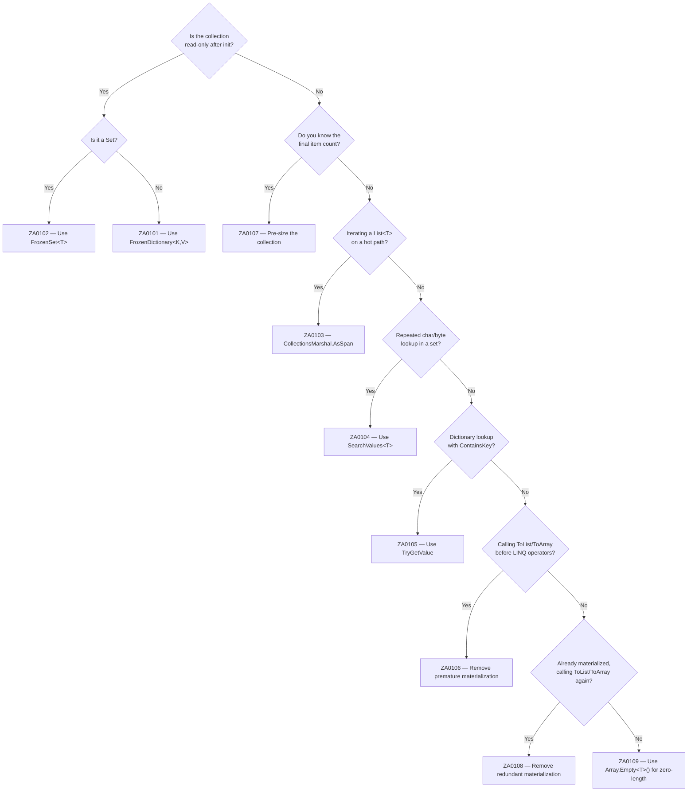

# Collections Rules (ZA01xx)

Collections are the most common source of avoidable allocations in .NET code. The ZA01xx rules help you pick the right collection type, avoid redundant copies, and eliminate unnecessary enumeration overhead.

## Choosing the right collection type



---

## ZA0101 — Use FrozenDictionary for read-only lookups {#za0101}

> **Severity**: Info | **Min TFM**: net8.0 | **Code fix**: No

### Why

`FrozenDictionary<K,V>` uses a perfect hash table optimised for read-heavy workloads. A `static readonly Dictionary<K,V>` performs a full hash computation and bucket probe on every lookup. On net8.0+ switching to `FrozenDictionary` is a drop-in change with measurably faster reads on hot paths. The one-time construction cost during static initialisation is paid back on the very first request under load.

### Before

```csharp
// ❌ mutable Dictionary used as a read-only lookup
private static readonly Dictionary<string, HttpMethod> _methodMap = new()
{
    ["GET"]    = HttpMethod.Get,
    ["POST"]   = HttpMethod.Post,
    ["PUT"]    = HttpMethod.Put,
    ["DELETE"] = HttpMethod.Delete,
};
```

### After

```csharp
// ✓ FrozenDictionary — perfect hash, read-optimised
private static readonly FrozenDictionary<string, HttpMethod> _methodMap =
    new Dictionary<string, HttpMethod>
    {
        ["GET"]    = HttpMethod.Get,
        ["POST"]   = HttpMethod.Post,
        ["PUT"]    = HttpMethod.Put,
        ["DELETE"] = HttpMethod.Delete,
    }.ToFrozenDictionary();
```

### Real-world example

HTTP middleware that resolves a string method name to a handler on every incoming request:

```csharp
public sealed class MethodRoutingMiddleware
{
    private static readonly FrozenDictionary<string, RouteHandler> _handlers =
        new Dictionary<string, RouteHandler>
        {
            ["GET"]    = new GetHandler(),
            ["POST"]   = new PostHandler(),
            ["PUT"]    = new PutHandler(),
            ["DELETE"] = new DeleteHandler(),
        }.ToFrozenDictionary(StringComparer.OrdinalIgnoreCase);

    public async Task InvokeAsync(HttpContext ctx, RequestDelegate next)
    {
        if (_handlers.TryGetValue(ctx.Request.Method, out var handler))
            await handler.HandleAsync(ctx);
        else
            await next(ctx);
    }
}
```

### Suppression

```csharp
#pragma warning disable ZA0101
// or in .editorconfig: dotnet_diagnostic.ZA0101.severity = none
```

---

## ZA0102 — Use FrozenSet for read-only membership tests {#za0102}

> **Severity**: Info | **Min TFM**: net8.0 | **Code fix**: No

### Why

`FrozenSet<T>` is tuned for `Contains` checks on a fixed set of values. A `static readonly HashSet<T>` uses a general-purpose hash table also optimised for add/remove — unnecessary overhead for a read-only allowlist or denylist. On net8.0+, `FrozenSet` is typically faster for `Contains` on small-to-medium sets because its internal structure is built specifically for the known element distribution at construction time.

### Before

```csharp
// ❌ mutable HashSet used only for read-only membership tests
private static readonly HashSet<string> _allowedContentTypes = new(StringComparer.OrdinalIgnoreCase)
{
    "application/json",
    "application/xml",
    "text/plain",
};
```

### After

```csharp
// ✓ FrozenSet — optimised for Contains, immutable by design
private static readonly FrozenSet<string> _allowedContentTypes =
    new HashSet<string>(StringComparer.OrdinalIgnoreCase)
    {
        "application/json",
        "application/xml",
        "text/plain",
    }.ToFrozenSet();
```

### Real-world example

Request validation filter that checks the `Content-Type` header on every request:

```csharp
public sealed class ContentTypeValidationFilter : IActionFilter
{
    private static readonly FrozenSet<string> _allowed =
        new HashSet<string>(StringComparer.OrdinalIgnoreCase)
        {
            "application/json",
            "application/x-www-form-urlencoded",
            "multipart/form-data",
        }.ToFrozenSet();

    public void OnActionExecuting(ActionExecutingContext context)
    {
        var contentType = context.HttpContext.Request.ContentType;
        if (!string.IsNullOrEmpty(contentType) && !_allowed.Contains(contentType))
        {
            context.Result = new UnsupportedMediaTypeResult();
        }
    }

    public void OnActionExecuted(ActionExecutedContext context) { }
}
```

### Suppression

```csharp
#pragma warning disable ZA0102
// or in .editorconfig: dotnet_diagnostic.ZA0102.severity = none
```

---

## ZA0103 — Use CollectionsMarshal.AsSpan for List\<T\> iteration {#za0103}

> **Severity**: Info | **Min TFM**: net5.0 | **Code fix**: No

### Why

`foreach` over `List<T>` uses `List<T>.Enumerator` — a struct enumerator that performs a version check on every `MoveNext` call to detect concurrent modifications. `CollectionsMarshal.AsSpan(list)` returns a `Span<T>` directly over the backing array, eliminating the enumerator overhead entirely and enabling the JIT to elide bounds checks on indexed accesses inside the loop. On tight loops processing large lists, this can yield meaningful throughput improvements.

### Before

```csharp
// ❌ foreach over List<T> — version check on every MoveNext
foreach (var entry in _logEntries)
{
    ProcessEntry(entry);
}
```

### After

```csharp
// ✓ Span over backing array — no enumerator, no version checks
foreach (var entry in CollectionsMarshal.AsSpan(_logEntries))
{
    ProcessEntry(entry);
}
```

> **Important:** Do NOT modify the list while iterating with `AsSpan`. There is no version check — mutations during iteration cause undefined behaviour.

### Real-world example

Hot-path log entry processor that flushes a batch of entries to a sink:

```csharp
public sealed class BatchLogProcessor
{
    private readonly ILogSink _sink;

    public BatchLogProcessor(ILogSink sink) => _sink = sink;

    public void Flush(List<LogEntry> entries)
    {
        var span = CollectionsMarshal.AsSpan(entries);
        for (int i = 0; i < span.Length; i++)
        {
            ref readonly var entry = ref span[i];
            _sink.Write(entry.Timestamp, entry.Level, entry.Message);
        }
        entries.Clear();
    }
}
```

### Suppression

```csharp
#pragma warning disable ZA0103
// or in .editorconfig: dotnet_diagnostic.ZA0103.severity = none
```

---

## ZA0104 — Use SearchValues for repeated char/byte lookups {#za0104}

> **Severity**: Info | **Min TFM**: net8.0 | **Code fix**: No

### Why

`Span<T>.IndexOfAny(ReadOnlySpan<T>)` re-evaluates the search set on every call — there is no pre-computation. `SearchValues<T>` pre-computes an optimised lookup structure (a bitmap or vectorised table depending on the input) at construction time. For sets that are called in a loop or on every incoming request, the one-time initialisation cost is negligible compared to the per-call savings at scale.

### Before

```csharp
// ❌ search set re-evaluated on every call
int idx = content.AsSpan().IndexOfAny(new[] { '<', '>', '&', '"', '\'' });
```

### After

```csharp
// ✓ SearchValues pre-computes the lookup structure once
private static readonly SearchValues<char> _htmlSpecialChars =
    SearchValues.Create(['<', '>', '&', '"', '\'']);

// In the hot path:
int idx = content.AsSpan().IndexOfAny(_htmlSpecialChars);
```

### Real-world example

HTML encoder that scans a string for characters requiring escaping before writing to a response:

```csharp
public sealed class HtmlEncoder
{
    private static readonly SearchValues<char> _escapable =
        SearchValues.Create(['<', '>', '&', '"', '\'']);

    public void Encode(ReadOnlySpan<char> input, IBufferWriter<char> output)
    {
        while (!input.IsEmpty)
        {
            int idx = input.IndexOfAny(_escapable);
            if (idx < 0)
            {
                output.Write(input);
                break;
            }
            output.Write(input[..idx]);
            WriteEscape(input[idx], output);
            input = input[(idx + 1)..];
        }
    }

    private static void WriteEscape(char ch, IBufferWriter<char> w) => w.Write(ch switch
    {
        '<'  => "&lt;",
        '>'  => "&gt;",
        '&'  => "&amp;",
        '"'  => "&quot;",
        '\'' => "&#39;",
        _    => ch.ToString(),
    });
}
```

### Suppression

```csharp
#pragma warning disable ZA0104
// or in .editorconfig: dotnet_diagnostic.ZA0104.severity = none
```

---

## ZA0105 — Use TryGetValue instead of ContainsKey + indexer {#za0105}

> **Severity**: Warning | **Min TFM**: Any | **Code fix**: Yes

### Why

`ContainsKey` and the dictionary indexer both hash the key and probe the bucket chain independently. Calling them in sequence does the work twice. `TryGetValue` performs a single hash computation and bucket probe, returning the value atomically. Beyond performance, it also eliminates the TOCTOU (time-of-check/time-of-use) window in concurrent scenarios where another thread could remove the key between the two calls.

### Before

```csharp
// ❌ two separate hash + probe operations
if (_cache.ContainsKey(key))
{
    return _cache[key];
}
```

### After

```csharp
// ✓ single hash + probe, value returned atomically
if (_cache.TryGetValue(key, out var value))
{
    return value;
}
```

### Real-world example

In-memory cache layer in a product query service:

```csharp
public sealed class ProductCache
{
    private readonly Dictionary<int, Product> _store = new();

    public Product? Get(int productId)
    {
        // ✓ single hash + probe
        return _store.TryGetValue(productId, out var product) ? product : null;
    }

    public Product GetOrAdd(int productId, Func<int, Product> factory)
    {
        if (!_store.TryGetValue(productId, out var product))
        {
            product = factory(productId);
            _store[productId] = product;
        }
        return product;
    }

    public void Invalidate(int productId)
    {
        _store.Remove(productId);
    }
}
```

### Suppression

```csharp
#pragma warning disable ZA0105
// or in .editorconfig: dotnet_diagnostic.ZA0105.severity = none
```

---

## ZA0106 — Avoid premature ToList/ToArray before LINQ {#za0106}

> **Severity**: Warning | **Min TFM**: Any | **Code fix**: No

### Why

Calling `ToList()` or `ToArray()` before chaining LINQ operators forces full materialisation of the source sequence into a new heap object — only for LINQ to then walk it lazily anyway. The intermediate collection is allocated, populated, and immediately discarded after the pipeline finishes. Removing the premature materialisation lets LINQ compose lazily from the original source with a single allocation at the terminal operator.

### Before

```csharp
// ❌ unnecessary heap allocation before Where/Select
var activeNames = _repository.GetAll()
    .ToList()
    .Where(u => u.IsActive)
    .Select(u => u.DisplayName)
    .ToList();
```

### After

```csharp
// ✓ lazy pipeline — only one allocation at the final ToList()
var activeNames = _repository.GetAll()
    .Where(u => u.IsActive)
    .Select(u => u.DisplayName)
    .ToList();
```

### Real-world example

Repository query in an admin dashboard handler that filters and shapes database results:

```csharp
public async Task<IReadOnlyList<UserDto>> GetActiveUsersAsync(CancellationToken ct)
{
    // EF Core requires materialisation before switching to LINQ-to-Objects
    var users = await _db.Users.AsNoTracking().ToListAsync(ct);

    // ✓ compose lazily over the already-materialised list — no intermediate copy
    return users
        .Where(u => u.IsActive && u.Role != Role.System)
        .OrderBy(u => u.LastName)
        .Select(u => new UserDto(u.Id, u.FullName, u.Email))
        .ToList();
}
```

### Suppression

```csharp
#pragma warning disable ZA0106
// or in .editorconfig: dotnet_diagnostic.ZA0106.severity = none
```

---

## ZA0107 — Pre-size collections when capacity is known {#za0107}

> **Severity**: Info | **Min TFM**: Any | **Code fix**: No

### Why

`List<T>` starts with a backing array of capacity 4 and doubles it whenever an `Add` exceeds capacity. Each doubling allocates a new backing array and copies all existing elements — O(n) work spread across multiple heap allocations. If the final element count is known (or can be bounded) before the loop starts, passing that count to the constructor eliminates every intermediate allocation and copy, leaving a single backing array sized exactly for the data.

### Before

```csharp
// ❌ capacity not specified — multiple backing-array reallocations
var dtos = new List<OrderDto>();
foreach (var order in orders)
{
    dtos.Add(new OrderDto(order));
}
```

### After

```csharp
// ✓ pre-sized — single backing-array allocation, no copies
var dtos = new List<OrderDto>(orders.Count);
foreach (var order in orders)
{
    dtos.Add(new OrderDto(order));
}
```

### Real-world example

Query handler mapping a page of database results to response DTOs:

```csharp
public async Task<PagedResult<OrderDto>> HandleAsync(GetOrdersQuery query, CancellationToken ct)
{
    var orders = await _db.Orders
        .Where(o => o.CustomerId == query.CustomerId)
        .Skip(query.Page * query.PageSize)
        .Take(query.PageSize)
        .ToListAsync(ct);

    // orders.Count is known — pre-size to avoid all intermediate reallocations
    var dtos = new List<OrderDto>(orders.Count);
    foreach (var o in orders)
        dtos.Add(new OrderDto(o.Id, o.Status, o.Total, o.PlacedAt));

    return new PagedResult<OrderDto>(dtos, query.Page, query.PageSize);
}
```

### Suppression

```csharp
#pragma warning disable ZA0107
// or in .editorconfig: dotnet_diagnostic.ZA0107.severity = none
```

---

## ZA0108 — Avoid redundant ToList/ToArray materialization {#za0108}

> **Severity**: Warning | **Min TFM**: Any | **Code fix**: Yes

### Why

Calling `.ToList()` on a value that is already a `List<T>` (or `.ToArray()` on a `T[]`) creates a shallow copy for no benefit. The compiler can prove the source is already the target type — the copy is purely wasteful heap traffic. The code fix removes the redundant call, leaving the original reference in place.

### Before

```csharp
// ❌ GetOrders() already returns List<Order> — copy is redundant
var orders = _repository.GetOrders().ToList();
```

### After

```csharp
// ✓ use the List<Order> directly, no copy
var orders = _repository.GetOrders();
```

### Real-world example

Service method that re-materialises a list already returned by the repository:

```csharp
public IReadOnlyList<Invoice> GetPendingInvoices(int customerId)
{
    // ✓ repository already returns a List<Invoice>; no .ToList() needed
    var invoices = _invoiceRepository.GetByCustomer(customerId);

    foreach (var inv in invoices)
        _enricher.Enrich(inv);

    return invoices;
}
```

### Suppression

```csharp
#pragma warning disable ZA0108
// or in .editorconfig: dotnet_diagnostic.ZA0108.severity = none
```

---

## ZA0109 — Avoid zero-length array allocation {#za0109}

> **Severity**: Warning | **Min TFM**: Any | **Code fix**: Yes

### Why

`new T[0]` allocates a fresh zero-length array object on the heap on every execution of that statement. Because all zero-length arrays of the same element type are functionally identical and immutable, allocating a new one each time is pure waste. `Array.Empty<T>()` returns a lazily-initialised cached singleton — the same object on every call, zero allocations after the first use. The code fix replaces the `new T[0]` expression with `Array.Empty<T>()` automatically.

### Before

```csharp
// ❌ new heap allocation on every call
public string[] GetTags() => new string[0];
```

### After

```csharp
// ✓ cached singleton, zero allocations
public string[] GetTags() => Array.Empty<string>();
```

### Real-world example

DTO with an optional tag list and a static factory method with a null-coalescing fallback:

```csharp
public sealed record ProductDto(
    int Id,
    string Name,
    string[] Tags)
{
    // ✓ null-coalescing fallback uses cached empty array instead of allocating
    public static ProductDto FromProduct(Product p) =>
        new(p.Id, p.Name, p.Tags?.ToArray() ?? Array.Empty<string>());
}

// Method with an optional array parameter
public void Process(Order order, string[] notes = null)
{
    // ✓ replace null with the shared empty singleton, not a new allocation
    notes ??= Array.Empty<string>();

    foreach (var note in notes)
        _logger.LogInformation("Note: {Note}", note);
}
```

### Suppression

```csharp
#pragma warning disable ZA0109
// or in .editorconfig: dotnet_diagnostic.ZA0109.severity = none
```
