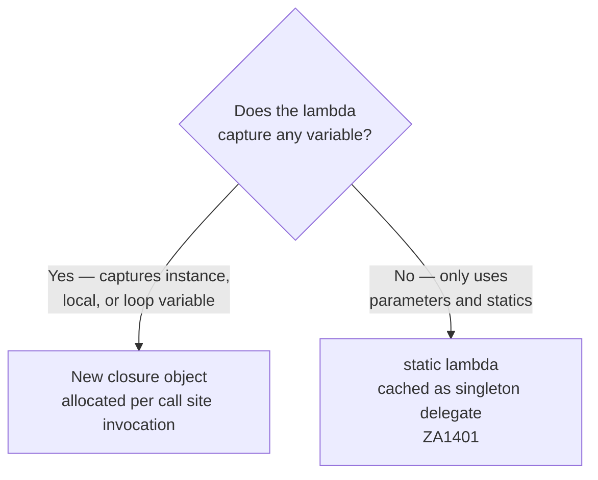

# Delegates (ZA14xx)

Lambda expressions in C# can either capture variables from their enclosing scope (creating a closure object on the heap) or capture nothing (making them eligible for caching as a static singleton delegate). The ZA14xx rules help you eliminate unnecessary delegate allocations by using `static` lambdas where no capture is needed.



---

## ZA1401 — Use static lambda when no capture is needed {#za1401}

> **Severity**: Info | **Min TFM**: net5.0 (C# 9 `static` lambda modifier) | **Code fix**: No

### Why

A non-static lambda expression is compiled to a delegate that may be allocated on every invocation at the call site, unless the compiler can prove it is allocation-free. Adding the `static` modifier explicitly tells the compiler — and the reader — that the lambda captures nothing. The compiler can then cache it as a singleton, eliminating the per-call allocation. The `static` modifier also serves as a guardrail: if you accidentally add a capture later, the compiler will error immediately rather than silently introducing a hidden allocation.

### Before

```csharp
// ❌ lambda may be allocated per call (no static modifier)
var sorted = products.OrderBy(p => p.Name);
var filtered = orders.Where(o => o.Status == OrderStatus.Pending);
list.Sort((a, b) => a.Priority.CompareTo(b.Priority));
```

### After

```csharp
// ✓ static lambda — cached singleton, zero allocation
var sorted = products.OrderBy(static p => p.Name);
var filtered = orders.Where(static o => o.Status == OrderStatus.Pending);
list.Sort(static (a, b) => a.Priority.CompareTo(b.Priority));
```

### Real-world example

A query builder class applies several LINQ predicates and projections across multiple call sites. Without `static`, each call to `GetPendingOrders` or `ToSummaries` may re-allocate the lambda delegate. With `static`, the runtime caches each delegate as a singleton once and reuses it on every subsequent call.

```csharp
using System;
using System.Collections.Generic;
using System.Linq;

public enum OrderStatus { Pending, Shipped, Cancelled }

public sealed class Order
{
    public int    Id         { get; init; }
    public string CustomerName { get; init; } = "";
    public OrderStatus Status  { get; init; }
    public int    Priority   { get; init; }
    public decimal TotalAmount { get; init; }
    public DateTime PlacedAt  { get; init; }
}

public sealed class OrderSummary
{
    public int    Id           { get; init; }
    public string CustomerName { get; init; } = "";
    public decimal TotalAmount { get; init; }
}

// ❌ Before: all lambdas are non-static, may allocate per call
public static class OrderQueryBuilderBefore
{
    public static IEnumerable<Order> GetPendingOrders(IEnumerable<Order> orders)
        => orders.Where(o => o.Status == OrderStatus.Pending);

    public static IEnumerable<Order> GetHighPriorityOrders(IEnumerable<Order> orders)
        => orders
            .Where(o => o.Status != OrderStatus.Cancelled)
            .OrderByDescending(o => o.Priority)
            .ThenBy(o => o.PlacedAt);

    public static IEnumerable<OrderSummary> ToSummaries(IEnumerable<Order> orders)
        => orders.Select(o => new OrderSummary
        {
            Id           = o.Id,
            CustomerName = o.CustomerName,
            TotalAmount  = o.TotalAmount,
        });

    public static decimal GetTotalRevenue(IEnumerable<Order> orders)
        => orders
            .Where(o => o.Status == OrderStatus.Shipped)
            .Sum(o => o.TotalAmount);
}

// ✓ After: all lambdas that capture nothing are marked static
public static class OrderQueryBuilderAfter
{
    public static IEnumerable<Order> GetPendingOrders(IEnumerable<Order> orders)
        => orders.Where(static o => o.Status == OrderStatus.Pending);

    public static IEnumerable<Order> GetHighPriorityOrders(IEnumerable<Order> orders)
        => orders
            .Where(static o => o.Status != OrderStatus.Cancelled)
            .OrderByDescending(static o => o.Priority)
            .ThenBy(static o => o.PlacedAt);

    public static IEnumerable<OrderSummary> ToSummaries(IEnumerable<Order> orders)
        => orders.Select(static o => new OrderSummary
        {
            Id           = o.Id,
            CustomerName = o.CustomerName,
            TotalAmount  = o.TotalAmount,
        });

    public static decimal GetTotalRevenue(IEnumerable<Order> orders)
        => orders
            .Where(static o => o.Status == OrderStatus.Shipped)
            .Sum(static o => o.TotalAmount);
}
```

**When `static` cannot be used — captures are required:**

If the lambda reads a local variable, a method parameter, or an instance member (`this`), the compiler must close over it and cannot cache the delegate as a singleton. Attempting to add `static` in these cases produces a compile error, which is intentional — it forces you to acknowledge the allocation.

```csharp
public static class OrderQueryBuilderCapture
{
    // ✓ 'static' is NOT applicable here — 'minimumPriority' is a captured parameter.
    // The compiler creates a closure object per call, which is unavoidable.
    public static IEnumerable<Order> GetOrdersAbovePriority(
        IEnumerable<Order> orders, int minimumPriority)
        => orders.Where(o => o.Priority >= minimumPriority);   // captures minimumPriority

    // ✓ Also NOT static — 'this._currentUserId' is an instance field capture.
    // Consider passing the value as a parameter to make the lambda static.
    private readonly int _currentUserId = 42;

    public IEnumerable<Order> GetMyOrders(IEnumerable<Order> orders)
        => orders.Where(o => o.Id == _currentUserId);          // captures this

    // ✓ Refactored: pass the value explicitly → lambda can now be static
    public static IEnumerable<Order> GetOrdersForUser(
        IEnumerable<Order> orders, int userId)
        => orders.Where(static o => o.Id == userId);           // ❌ still captures userId!
        // Actually: pass userId through a local or use a different approach such as
        // orders.Where(o => o.Id == userId) — or restructure to avoid the capture.
}
```

> **Note:** The "refactored" example above illustrates that a lambda inside a non-static method that reads any local still captures it. The only way to make a lambda truly `static` is if it references no locals, parameters of the enclosing method, or instance members — only its own parameters and static members.

### Suppression

```csharp
#pragma warning disable ZA1401
var query = items.Where(x => x.IsActive);
#pragma warning restore ZA1401
// or in .editorconfig:
// dotnet_diagnostic.ZA1401.severity = none
```
