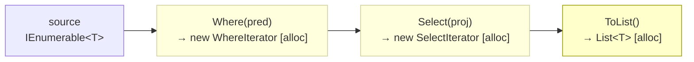

# LINQ (ZA06xx)

LINQ is expressive but carries overhead: most operators allocate an enumerator object or iterator state machine on the heap, and lazy pipelines can cause sequences to be traversed multiple times. The ZA06xx rules help you use LINQ correctly, avoid accidental performance regressions, and replace it with direct collection access when possible.



---

## ZA0601 — Avoid LINQ methods in loops {#za0601}

> **Severity**: Warning | **Min TFM**: Any | **Code fix**: No

### Why

Every LINQ method call (`FirstOrDefault`, `Where`, `Any`, `Count`, etc.) allocates an iterator object or enumerator on the heap. When called inside a loop body, this multiplies the allocation count by the iteration count — a loop over 10,000 items that calls `FirstOrDefault` on each iteration produces 10,000 iterator allocations that the GC must eventually collect. Extract the query outside the loop, or replace with a pre-built dictionary for O(1) lookup instead of O(N) linear search.

### Before

```csharp
// ❌ LINQ inside a loop — O(N²) allocations
void FulfillOrders(IReadOnlyList<OrderLine> lines, IReadOnlyList<Product> catalog)
{
    for (int i = 0; i < lines.Count; i++)
    {
        // Allocates a new WhereIterator every iteration
        var product = catalog.FirstOrDefault(p => p.Id == lines[i].ProductId);
        if (product is null)
            throw new InvalidOperationException($"Unknown product {lines[i].ProductId}");

        lines[i].UnitPrice = product.Price;
    }
}
```

### After

```csharp
// ✓ Build lookup once outside the loop — O(N) total, O(1) per lookup
void FulfillOrders(IReadOnlyList<OrderLine> lines, IReadOnlyList<Product> catalog)
{
    var productById = catalog.ToDictionary(p => p.Id);

    for (int i = 0; i < lines.Count; i++)
    {
        if (!productById.TryGetValue(lines[i].ProductId, out var product))
            throw new InvalidOperationException($"Unknown product {lines[i].ProductId}");

        lines[i].UnitPrice = product.Price;
    }
}
```

### Real-world example

An order fulfillment processor that resolves product information for every line item in a purchase order. In the hot path (batch imports of thousands of orders), the LINQ version creates one `WhereIterator` per line item, each of which must scan the entire `catalog` list. The dictionary version pays a single allocation upfront and resolves every subsequent lookup in O(1).

```csharp
public sealed class OrderFulfillmentService
{
    private readonly IProductRepository _products;
    private readonly IOrderRepository _orders;

    public OrderFulfillmentService(IProductRepository products, IOrderRepository orders)
    {
        _products = products;
        _orders = orders;
    }

    // ❌ Before: LINQ inside foreach — scales as O(lines × catalog)
    public async Task FulfillBatchBefore(IReadOnlyList<PurchaseOrder> batch)
    {
        var catalog = await _products.GetAllAsync();

        foreach (var order in batch)
        {
            foreach (var line in order.Lines)
            {
                // New WhereIterator allocated for every line in every order
                var product = catalog.FirstOrDefault(p => p.Id == line.ProductId);
                if (product is null)
                    continue;

                line.Description = product.Description;
                line.UnitPrice   = product.Price;
                line.TaxRate     = product.TaxCategory.Rate;
            }
        }
    }

    // ✓ After: dictionary lookup — O(catalog) to build, O(1) per line
    public async Task FulfillBatchAfter(IReadOnlyList<PurchaseOrder> batch)
    {
        var catalog    = await _products.GetAllAsync();
        var productMap = catalog.ToDictionary(p => p.Id);   // one allocation

        foreach (var order in batch)
        {
            foreach (var line in order.Lines)
            {
                if (!productMap.TryGetValue(line.ProductId, out var product))
                    continue;

                line.Description = product.Description;
                line.UnitPrice   = product.Price;
                line.TaxRate     = product.TaxCategory.Rate;
            }
        }
    }
}
```

### Suppression

```csharp
#pragma warning disable ZA0601
// or in .editorconfig: dotnet_diagnostic.ZA0601.severity = none
```

---

## ZA0602 — Avoid params calls in loops {#za0602}

> **Severity**: Info | **Min TFM**: Any | **Code fix**: No

### Why

A `params T[]` parameter causes the compiler to emit a `new T[] { ... }` array allocation at every call site. Inside a loop with N iterations that means N array objects, each of which the GC must track and eventually collect. This is especially common with structured logging APIs (e.g., `ILogger.LogDebug(string, params object[] args)`) where every message argument is boxed into an `object[]`. Use source-generated `[LoggerMessage]` delegates for logging, explicit non-params overloads where available, or restructure to call the method once outside the loop.

### Before

```csharp
// ❌ params object[] allocated on every iteration
public class BatchProcessor
{
    private readonly ILogger<BatchProcessor> _logger;

    public void ProcessBatch(IReadOnlyList<WorkItem> items)
    {
        foreach (var item in items)
        {
            // Compiler emits: new object[] { item.Id, item.Tag, item.Priority }
            _logger.LogDebug(
                "Processing item {Id} with tag {Tag} and priority {Priority}",
                item.Id, item.Tag, item.Priority);

            DoWork(item);
        }
    }
}
```

### After

```csharp
// ✓ [LoggerMessage] source-generates a strongly typed, zero-allocation delegate
public partial class BatchProcessor
{
    private readonly ILogger<BatchProcessor> _logger;

    [LoggerMessage(Level = LogLevel.Debug,
        Message = "Processing item {Id} with tag {Tag} and priority {Priority}")]
    private static partial void LogProcessingItem(
        ILogger logger, int id, string tag, int priority);

    public void ProcessBatch(IReadOnlyList<WorkItem> items)
    {
        foreach (var item in items)
        {
            LogProcessingItem(_logger, item.Id, item.Tag, item.Priority);
            DoWork(item);
        }
    }
}
```

### Real-world example

A background job service that processes batches of data-ingestion tasks and logs progress for each item. With high-throughput batches (tens of thousands of items), the params-based logging path allocates a fresh `object[]` per item plus boxes every value-type argument. The `[LoggerMessage]` approach eliminates both the array allocation and the boxing.

```csharp
// ❌ Before: ingestion loop with params-based logging
public sealed class DataIngestionJob
{
    private readonly ILogger<DataIngestionJob> _logger;
    private readonly IIngestionPipeline _pipeline;

    public DataIngestionJob(ILogger<DataIngestionJob> logger, IIngestionPipeline pipeline)
    {
        _logger   = logger;
        _pipeline = pipeline;
    }

    public async Task RunAsync(IReadOnlyList<DataRecord> records, CancellationToken ct)
    {
        for (int i = 0; i < records.Count; i++)
        {
            ct.ThrowIfCancellationRequested();

            var record = records[i];

            // params object[] { i, records.Count, record.Source, record.SizeBytes } — allocated every iteration
            _logger.LogDebug(
                "Ingesting record {Index}/{Total} from {Source} ({Bytes} bytes)",
                i + 1, records.Count, record.Source, record.SizeBytes);

            await _pipeline.IngestAsync(record, ct);
        }
    }
}

// ✓ After: source-generated LoggerMessage — no params array, no boxing
public sealed partial class DataIngestionJob
{
    private readonly ILogger<DataIngestionJob> _logger;
    private readonly IIngestionPipeline _pipeline;

    [LoggerMessage(Level = LogLevel.Debug,
        Message = "Ingesting record {Index}/{Total} from {Source} ({Bytes} bytes)")]
    private static partial void LogIngesting(
        ILogger logger, int index, int total, string source, long bytes);

    public DataIngestionJob(ILogger<DataIngestionJob> logger, IIngestionPipeline pipeline)
    {
        _logger   = logger;
        _pipeline = pipeline;
    }

    public async Task RunAsync(IReadOnlyList<DataRecord> records, CancellationToken ct)
    {
        for (int i = 0; i < records.Count; i++)
        {
            ct.ThrowIfCancellationRequested();

            var record = records[i];
            LogIngesting(_logger, i + 1, records.Count, record.Source, record.SizeBytes);

            await _pipeline.IngestAsync(record, ct);
        }
    }
}
```

### Suppression

```csharp
#pragma warning disable ZA0602
// or in .editorconfig: dotnet_diagnostic.ZA0602.severity = none
```

---

## ZA0603 — Use .Count/.Length instead of LINQ .Count() {#za0603}

> **Severity**: Info | **Min TFM**: Any | **Code fix**: No

### Why

`IEnumerable<T>.Count()` creates an enumerator and walks the sequence to tally elements. `List<T>.Count` and `T[].Length` are simple property reads backed by an integer field — O(1) with zero allocation. Even though LINQ's `Count()` extension method internally special-cases `ICollection<T>` to avoid full traversal, the method call overhead, interface dispatch, and delegate creation are still present. When you already have a concrete `List<T>`, `T[]`, `ICollection<T>`, or `IReadOnlyCollection<T>`, use the property directly.

### Before

```csharp
// ❌ LINQ .Count() on a List<T> — avoidable overhead
int total = items.Count();

if (orders.Count() > 0)
    Flush(orders);

int pageCount = (int)Math.Ceiling(items.Count() / (double)pageSize);
```

### After

```csharp
// ✓ Direct property access — O(1), no allocation
int total = items.Count;

if (orders.Count > 0)
    Flush(orders);

int pageCount = (int)Math.Ceiling(items.Count / (double)pageSize);
```

### Real-world example

A pagination helper that computes the total number of pages and generates page metadata for a large result set. Every call to `Count()` incurs unnecessary overhead when the underlying type is already a `List<T>`.

```csharp
public sealed class PaginationHelper<T>
{
    // ❌ Before: LINQ .Count() on a concrete list
    public PagedResult<T> BuildBefore(List<T> items, int pageSize, int pageIndex)
    {
        if (pageSize <= 0) throw new ArgumentOutOfRangeException(nameof(pageSize));

        int totalItems = items.Count();                                          // ← overhead
        int totalPages = (int)Math.Ceiling(items.Count() / (double)pageSize);   // ← overhead again
        bool hasNext   = pageIndex < items.Count() - 1;                         // ← third call

        var page = items
            .Skip(pageIndex * pageSize)
            .Take(pageSize)
            .ToList();

        return new PagedResult<T>(page, totalItems, totalPages, pageIndex, hasNext);
    }

    // ✓ After: direct .Count property — three O(1) field reads
    public PagedResult<T> BuildAfter(List<T> items, int pageSize, int pageIndex)
    {
        if (pageSize <= 0) throw new ArgumentOutOfRangeException(nameof(pageSize));

        int totalItems = items.Count;
        int totalPages = (int)Math.Ceiling(totalItems / (double)pageSize);
        bool hasNext   = pageIndex < totalPages - 1;

        var page = items
            .Skip(pageIndex * pageSize)
            .Take(pageSize)
            .ToList();

        return new PagedResult<T>(page, totalItems, totalPages, pageIndex, hasNext);
    }
}
```

### Suppression

```csharp
#pragma warning disable ZA0603
// or in .editorconfig: dotnet_diagnostic.ZA0603.severity = none
```

---

## ZA0604 — Use .Count > 0 instead of LINQ .Any() {#za0604}

> **Severity**: Info | **Min TFM**: Any | **Code fix**: No

### Why

`.Any()` on a materialised collection (`List<T>`, `T[]`, `ICollection<T>`) allocates an enumerator just to check whether the first element exists, then immediately disposes it. `.Count > 0` is a single integer comparison against a cached field — no allocation, no interface dispatch.

**Important note:** `.Any()` is still correct — and often preferred — for lazy `IEnumerable<T>` sequences, LINQ query pipelines, or whenever a predicate is passed (e.g., `.Any(x => x.IsActive)`). In those cases `.Any()` short-circuits the sequence and avoids materialising it. This rule only fires when the source is a known materialised collection and no predicate is provided.

### Before

```csharp
// ❌ .Any() on a materialized List<T> — allocates enumerator unnecessarily
if (pendingItems.Any())
    ProcessBatch(pendingItems);
```

### After

```csharp
// ✓ .Count > 0 — single integer comparison, no allocation
if (pendingItems.Count > 0)
    ProcessBatch(pendingItems);
```

### Real-world example

A multi-stage document processing service where several methods guard against empty batches before performing expensive operations. Each `.Any()` call on a concrete `List<T>` allocates a short-lived enumerator object, adding GC pressure in high-throughput scenarios.

```csharp
public sealed class DocumentProcessingService
{
    private readonly IValidator _validator;
    private readonly IIndexer _indexer;
    private readonly IAuditLog _audit;

    // ❌ Before: .Any() guards on List<T> throughout the class
    public ProcessingReport ProcessBefore(List<Document> documents)
    {
        if (!documents.Any())                          // allocates enumerator
            return ProcessingReport.Empty;

        var valid = documents.Where(d => d.IsValid).ToList();

        if (!valid.Any())                              // allocates another enumerator
            return ProcessingReport.NoneValid;

        _indexer.Index(valid);

        var indexed = valid.Where(d => d.IsIndexed).ToList();

        if (indexed.Any())                             // allocates yet another enumerator
            _audit.Record(indexed);

        return new ProcessingReport(documents.Any(d => d.HasWarnings), indexed.Count);
    }

    // ✓ After: .Count > 0 or .Count comparisons throughout
    public ProcessingReport ProcessAfter(List<Document> documents)
    {
        if (documents.Count == 0)
            return ProcessingReport.Empty;

        var valid = documents.Where(d => d.IsValid).ToList();

        if (valid.Count == 0)
            return ProcessingReport.NoneValid;

        _indexer.Index(valid);

        var indexed = valid.Where(d => d.IsIndexed).ToList();

        if (indexed.Count > 0)
            _audit.Record(indexed);

        // NOTE: .Any(predicate) is fine and preferred here — no alternative without LINQ
        return new ProcessingReport(documents.Any(d => d.HasWarnings), indexed.Count);
    }
}
```

### Suppression

```csharp
#pragma warning disable ZA0604
// or in .editorconfig: dotnet_diagnostic.ZA0604.severity = none
```

---

## ZA0605 — Use indexer instead of LINQ .First()/.Last() {#za0605}

> **Severity**: Info | **Min TFM**: Any | **Code fix**: No

### Why

`.First()` and `.Last()` on a `List<T>` or array allocate an enumerator. More critically, `.Last()` traverses the entire sequence from the beginning before returning the final element, making it O(N). Direct indexer access (`list[0]` for the first element, `list[^1]` for the last) is O(1) with no allocation. This rule only fires on concrete indexed collections (`List<T>`, `T[]`, `IList<T>`, `IReadOnlyList<T>`), not on arbitrary `IEnumerable<T>` where `.Last()` is the only option.

### Before

```csharp
// ❌ .First()/.Last() on a List<T> — allocates enumerator; .Last() also traverses entire list
var oldest = sortedEvents.First();
var newest = sortedEvents.Last();
```

### After

```csharp
// ✓ Direct indexer — O(1), no allocation
var oldest = sortedEvents[0];
var newest = sortedEvents[^1];
```

### Real-world example

A sorted event log reader that loads a window of audit events and returns both the oldest and the most recent for display in a UI timeline component. The list is already sorted by timestamp ascending, so the first and last elements are exactly what is needed.

```csharp
public sealed class EventLogReader
{
    private readonly IEventStore _store;

    public EventLogReader(IEventStore store) => _store = store;

    // ❌ Before: .First() and .Last() on a sorted List<AuditEvent>
    public TimelineSummary GetSummaryBefore(string entityId, DateTimeOffset since)
    {
        // Returns List<AuditEvent> sorted ascending by Timestamp
        var events = _store.GetEvents(entityId, since);

        if (events.Count == 0)
            return TimelineSummary.Empty;

        var oldest = events.First();   // allocates enumerator, returns events[0]
        var newest = events.Last();    // allocates enumerator, walks all N events to return events[^1]

        return new TimelineSummary(
            EntityId:    entityId,
            OldestEvent: oldest,
            NewestEvent: newest,
            EventCount:  events.Count,
            Duration:    newest.Timestamp - oldest.Timestamp);
    }

    // ✓ After: direct indexer — O(1) per access, zero allocations
    public TimelineSummary GetSummaryAfter(string entityId, DateTimeOffset since)
    {
        var events = _store.GetEvents(entityId, since);

        if (events.Count == 0)
            return TimelineSummary.Empty;

        var oldest = events[0];    // direct field read
        var newest = events[^1];   // direct field read via index-from-end

        return new TimelineSummary(
            EntityId:    entityId,
            OldestEvent: oldest,
            NewestEvent: newest,
            EventCount:  events.Count,
            Duration:    newest.Timestamp - oldest.Timestamp);
    }

    // ✓ Additional example: reading checkpoint boundaries from a sorted array
    public (AuditEvent First, AuditEvent Last) GetCheckpointBounds(AuditEvent[] checkpoints)
    {
        if (checkpoints.Length == 0)
            throw new InvalidOperationException("No checkpoints available.");

        // ❌ Before: checkpoints.First() / checkpoints.Last()
        // ✓ After:
        return (checkpoints[0], checkpoints[^1]);
    }
}
```

### Suppression

```csharp
#pragma warning disable ZA0605
// or in .editorconfig: dotnet_diagnostic.ZA0605.severity = none
```

---

## ZA0606 — Avoid foreach over interface-typed collection variable {#za0606}

> **Severity**: Warning | **Min TFM**: Any | **Code fix**: No

### Why

`foreach` on a variable typed as `IEnumerable<T>` calls `GetEnumerator()` via interface dispatch, which returns an `IEnumerator<T>` — an interface reference. If the underlying concrete type returns a struct enumerator (like `List<T>.Enumerator`), that struct gets boxed into a heap-allocated wrapper object. Using the concrete type or `var` instead lets the compiler bind to the strongly-typed `GetEnumerator()` overload, which returns the struct directly and avoids boxing entirely. This is a silent performance trap because the code looks identical — only the declared type of the variable differs.

### Before

```csharp
// ❌ Declared as IEnumerable<T> — GetEnumerator() dispatched via interface → boxes the struct enumerator
IEnumerable<Order> orders = _repository.GetPending();
foreach (var o in orders)
    Process(o);
```

### After

```csharp
// ✓ Declared as List<Order> (or var) — compiler uses List<T>.GetEnumerator() → struct, no boxing
List<Order> orders = _repository.GetPending();
foreach (var o in orders)
    Process(o);

// ✓ Using var is equally correct and infers the concrete type
var orders2 = _repository.GetPending();
foreach (var o in orders2)
    Process(o);
```

### Real-world example

A service class that retrieves pending orders from a repository and processes each one. The repository method is typed to return `List<Order>` internally, but the result is assigned to `IEnumerable<Order>` at the call site, silently introducing boxing on every iteration.

```csharp
public interface IOrderRepository
{
    List<Order> GetPending();      // concrete return type
    List<Order> GetOverdue();
}

public sealed class OrderProcessingService
{
    private readonly IOrderRepository _repository;
    private readonly INotificationSender _notifications;

    public OrderProcessingService(
        IOrderRepository repository,
        INotificationSender notifications)
    {
        _repository    = repository;
        _notifications = notifications;
    }

    // ❌ Before: IEnumerable<T> variable → boxes List<T>.Enumerator on every foreach
    public void ProcessPendingBefore()
    {
        IEnumerable<Order> pending = _repository.GetPending();    // interface variable
        IEnumerable<Order> overdue = _repository.GetOverdue();    // interface variable

        foreach (var order in pending)    // boxes List<Order>.Enumerator
        {
            order.Status = OrderStatus.Processing;
            _notifications.Notify(order.CustomerId, "Your order is being processed.");
        }

        foreach (var order in overdue)    // boxes List<Order>.Enumerator
        {
            order.Status = OrderStatus.Cancelled;
            _notifications.Notify(order.CustomerId, "Your order has been cancelled.");
        }
    }

    // ✓ After: var infers List<Order> → compiler emits direct call to List<T>.GetEnumerator()
    public void ProcessPendingAfter()
    {
        var pending = _repository.GetPending();    // inferred as List<Order>
        var overdue = _repository.GetOverdue();    // inferred as List<Order>

        foreach (var order in pending)    // uses List<Order>.Enumerator struct directly — no boxing
        {
            order.Status = OrderStatus.Processing;
            _notifications.Notify(order.CustomerId, "Your order is being processed.");
        }

        foreach (var order in overdue)    // uses List<Order>.Enumerator struct directly — no boxing
        {
            order.Status = OrderStatus.Cancelled;
            _notifications.Notify(order.CustomerId, "Your order has been cancelled.");
        }
    }
}
```

### Suppression

```csharp
#pragma warning disable ZA0606
// or in .editorconfig: dotnet_diagnostic.ZA0606.severity = none
```

---

## ZA0607 — Avoid multiple enumeration of IEnumerable\<T\> {#za0607}

> **Severity**: Warning | **Min TFM**: Any | **Code fix**: No

### Why

Enumerating an `IEnumerable<T>` twice (or more) re-executes the source — running a LINQ query pipeline, a database query, or a file read from the beginning each time. This is at best wasteful (redundant CPU work) and at worst catastrophically expensive (multiple database round trips, multiple file system reads, or non-deterministic results from a generator that yields different data on each pass). Materialise the sequence once with `.ToList()` or `.ToArray()` before using the result more than once.

```mermaid
sequenceDiagram
    participant Code
    participant Source as IEnumerable&lt;T&gt; Source

    Code->>Source: foreach (1st pass — iterates all)
    Source-->>Code: yields N elements
    Code->>Source: .Any() or .Count() (2nd pass!)
    Source-->>Code: re-enumerates from scratch
    Note over Source: DB query / file / compute runs TWICE
```

### Before

```csharp
// ❌ Two enumerations — .Any() triggers first pass, foreach triggers second pass
var results = _repository.GetActiveOrders(); // returns IEnumerable<Order>
if (results.Any())
    foreach (var order in results) // second enumeration!
        Process(order);
```

### After

```csharp
// ✓ Materialise once — single enumeration, .Count and foreach share the same list
var results = _repository.GetActiveOrders().ToList();
if (results.Count > 0)
    foreach (var order in results)
        Process(order);
```

### Real-world example

An EF Core query is exposed as `IEnumerable<T>` from the repository layer. The calling service first checks whether results exist (`.Any()`) and then iterates the results (`.Count()` + `foreach`). Because the sequence is not materialised, each operator re-executes the SQL query against the database — three round trips where one would suffice.

```csharp
public interface IOrderRepository
{
    // ❌ Exposes IEnumerable<T> — callers cannot tell whether it's safe to enumerate more than once
    IEnumerable<Order> GetActiveOrders(DateTimeOffset since);
}

public sealed class OrderSummaryService
{
    private readonly IOrderRepository _repository;
    private readonly ILogger<OrderSummaryService> _logger;

    public OrderSummaryService(IOrderRepository repository, ILogger<OrderSummaryService> logger)
    {
        _repository = repository;
        _logger     = logger;
    }

    // ❌ Before: three enumerations → three SQL round trips (EF Core re-runs the query each time)
    public OrderSummary BuildSummaryBefore(DateTimeOffset since)
    {
        var orders = _repository.GetActiveOrders(since);   // lazy — no query yet

        if (!orders.Any())                                 // 1st SQL round trip
        {
            _logger.LogInformation("No active orders since {Since}", since);
            return OrderSummary.Empty;
        }

        int total = orders.Count();                        // 2nd SQL round trip

        decimal revenue = 0m;
        foreach (var order in orders)                      // 3rd SQL round trip
            revenue += order.TotalAmount;

        return new OrderSummary(TotalOrders: total, TotalRevenue: revenue, Since: since);
    }

    // ✓ After: materialise once with ToList() — single SQL round trip
    public OrderSummary BuildSummaryAfter(DateTimeOffset since)
    {
        var orders = _repository.GetActiveOrders(since).ToList();   // 1 SQL round trip

        if (orders.Count == 0)
        {
            _logger.LogInformation("No active orders since {Since}", since);
            return OrderSummary.Empty;
        }

        int     total   = orders.Count;
        decimal revenue = 0m;

        foreach (var order in orders)
            revenue += order.TotalAmount;

        return new OrderSummary(TotalOrders: total, TotalRevenue: revenue, Since: since);
    }
}

// ✓ Also fix the repository to signal intent via the return type
public sealed class EfOrderRepository : IOrderRepository
{
    private readonly AppDbContext _db;

    public EfOrderRepository(AppDbContext db) => _db = db;

    // Return List<T> so callers know it's already materialised and safe to enumerate multiple times
    public List<Order> GetActiveOrders(DateTimeOffset since)
        => _db.Orders
              .Where(o => o.Status == OrderStatus.Active && o.CreatedAt >= since)
              .OrderBy(o => o.CreatedAt)
              .ToList();
}
```

### Suppression

```csharp
#pragma warning disable ZA0607
// or in .editorconfig: dotnet_diagnostic.ZA0607.severity = none
```
