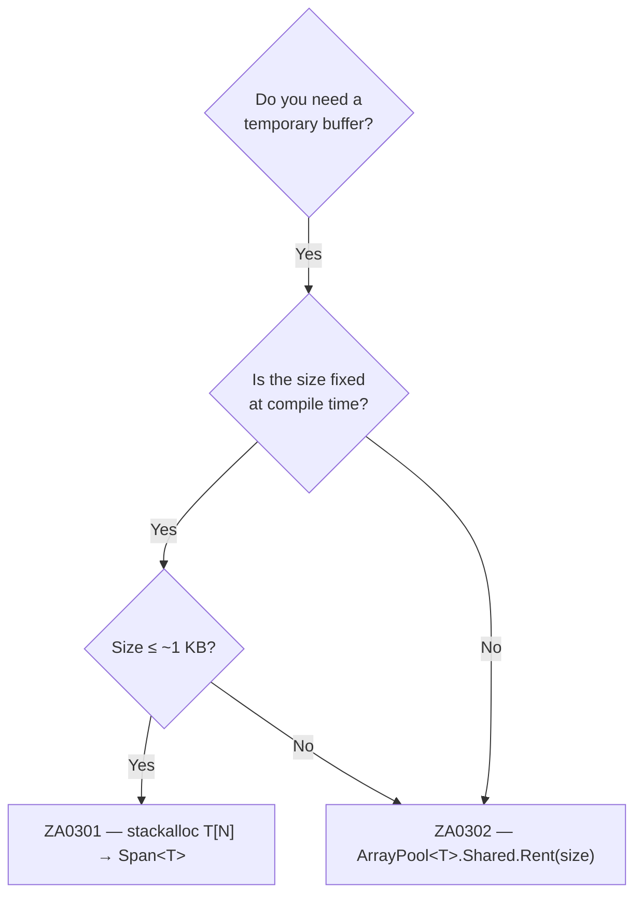

# Memory (ZA03xx)

Array allocations for temporary buffers are a significant source of GC pressure. Every `new byte[N]` allocates a heap object that the garbage collector must eventually track and collect. The ZA03xx rules guide you toward stack allocation for small buffers and pool-based reuse for large ones.



---

## ZA0301 — Use stackalloc for small fixed-size buffers {#za0301}

> **Severity**: Info | **Min TFM**: Any | **Code fix**: No

### Why

`new byte[N]` for a small, fixed N allocates on the heap and will be tracked by the GC. `stackalloc byte[N]` places the buffer on the stack — zero heap allocation, zero GC pressure, and the memory is automatically reclaimed when the method returns. Use `Span<T>` to work with the stackalloc'd memory safely; no `unsafe` block is needed in modern C#. Keep stackalloc sizes to roughly 256–512 bytes or fewer to avoid stack overflow risk — larger buffers belong in a pool (see ZA0302).

### Before

```csharp
// ❌ heap allocation for a tiny temporary buffer
byte[] buffer = new byte[16];
hasher.TryComputeHash(input, buffer, out int written);
return Convert.ToHexString(buffer.AsSpan(0, written));
```

### After

```csharp
// ✓ stack allocation — no heap object
Span<byte> buffer = stackalloc byte[16];
hasher.TryComputeHash(input, buffer, out int written);
return Convert.ToHexString(buffer[..written]);
```

### Real-world example

**Scenario 1 — correlation ID header on every HTTP request**

Every incoming HTTP request needs a correlation ID derived from its `requestId` GUID. This helper is called on the hot path, potentially thousands of times per second. Allocating a 16-byte array per request would be pure GC noise.

```csharp
using System;
using System.Security.Cryptography;

public static class CorrelationHeader
{
    // Called on every incoming HTTP request — must be allocation-free.
    public static string GetCorrelationHeader(Guid requestId)
    {
        // 16 bytes is comfortably within stackalloc budget.
        Span<byte> bytes = stackalloc byte[16];

        // Write the GUID directly into the stack buffer.
        bool ok = requestId.TryWriteBytes(bytes);
        if (!ok)
            throw new InvalidOperationException("TryWriteBytes failed unexpectedly.");

        // Convert.ToHexString accepts a ReadOnlySpan<byte> — no array needed.
        return Convert.ToHexString(bytes);
    }
}
```

**Scenario 2 — parsing a fixed-size binary message header**

A TCP framing protocol prefixes every message with a 12-byte header: 4 magic bytes, a 2-byte version, a 2-byte flags field, and a 4-byte payload length. Reading this header is done once per message; allocating a managed array for 12 bytes every time would be wasteful.

```csharp
using System;
using System.Buffers.Binary;
using System.IO;
using System.Threading;
using System.Threading.Tasks;

public readonly struct MessageHeader
{
    public uint Magic    { get; init; }
    public ushort Version { get; init; }
    public ushort Flags   { get; init; }
    public int PayloadLength { get; init; }
}

public static class MessageFramer
{
    private const int HeaderSize = 12;
    private static readonly uint ExpectedMagic = 0xDEAD_BEEF;

    public static async ValueTask<MessageHeader> ReadHeaderAsync(
        Stream stream, CancellationToken ct = default)
    {
        // 12 bytes on the stack — never touches the heap.
        // Note: stackalloc inside async methods is allowed when the
        // Span does not cross an await boundary.
        byte[] headerBytes = new byte[HeaderSize]; // temporary; see note below
        await stream.ReadExactlyAsync(headerBytes, ct);

        // Once the await completes we work synchronously with a Span.
        ReadOnlySpan<byte> span = headerBytes;

        uint magic         = BinaryPrimitives.ReadUInt32BigEndian(span[..4]);
        ushort version     = BinaryPrimitives.ReadUInt16BigEndian(span[4..6]);
        ushort flags       = BinaryPrimitives.ReadUInt16BigEndian(span[6..8]);
        int payloadLength  = BinaryPrimitives.ReadInt32BigEndian(span[8..12]);

        if (magic != ExpectedMagic)
            throw new InvalidDataException($"Bad magic: 0x{magic:X8}");

        return new MessageHeader
        {
            Magic         = magic,
            Version       = version,
            Flags         = flags,
            PayloadLength = payloadLength,
        };
    }

    // Synchronous variant — can use stackalloc directly because no awaits.
    public static MessageHeader ReadHeaderSync(Stream stream)
    {
        Span<byte> span = stackalloc byte[HeaderSize]; // true stack allocation

        int totalRead = 0;
        while (totalRead < HeaderSize)
        {
            int n = stream.Read(span[totalRead..]);
            if (n == 0)
                throw new EndOfStreamException("Stream ended before header was complete.");
            totalRead += n;
        }

        uint magic        = BinaryPrimitives.ReadUInt32BigEndian(span[..4]);
        ushort version    = BinaryPrimitives.ReadUInt16BigEndian(span[4..6]);
        ushort flags      = BinaryPrimitives.ReadUInt16BigEndian(span[6..8]);
        int payloadLength = BinaryPrimitives.ReadInt32BigEndian(span[8..12]);

        if (magic != ExpectedMagic)
            throw new InvalidDataException($"Bad magic: 0x{magic:X8}");

        return new MessageHeader
        {
            Magic         = magic,
            Version       = version,
            Flags         = flags,
            PayloadLength = payloadLength,
        };
    }
}
```

> **Note on `stackalloc` and `async`:** The C# compiler prohibits `stackalloc` spans from crossing `await` points — the stack frame may be moved or torn down during an async suspension. Split your method: await the I/O into a small managed array (or `Memory<byte>`), then process the result synchronously using a `Span<byte>` derived from that array. For the synchronous read path, `stackalloc` works without restriction.

### Suppression

```csharp
#pragma warning disable ZA0301
// or in .editorconfig: dotnet_diagnostic.ZA0301.severity = none
```

---

## ZA0302 — Use ArrayPool for large temporary arrays {#za0302}

> **Severity**: Info | **Min TFM**: Any | **Code fix**: No

### Why

A large temporary array (e.g. a 4–64 KB read/write buffer) allocated per-call creates significant GC pressure, especially in high-throughput scenarios. Arrays above 85,000 bytes are placed on the Large Object Heap (LOH), which is collected far less frequently and can cause heap fragmentation over time. `ArrayPool<T>.Shared` maintains a pool of pre-allocated arrays — rent a buffer before use, return it when done. The rented array may be larger than requested; always track the actual used length separately. Always return the buffer in a `finally` block to avoid leaking pool entries and causing memory growth under load.

### Before

```csharp
// ❌ fresh allocation on every call — 80 KB hits the LOH on every invocation
public async Task CopyAsync(Stream source, Stream dest, CancellationToken ct)
{
    byte[] buffer = new byte[81920]; // 80 KB, gen1/gen2 or LOH depending on runtime
    int read;
    while ((read = await source.ReadAsync(buffer, ct)) > 0)
        await dest.WriteAsync(buffer.AsMemory(0, read), ct);
}
```

### After

```csharp
// ✓ rented from pool — no per-call allocation
public async Task CopyAsync(Stream source, Stream dest, CancellationToken ct)
{
    byte[] buffer = ArrayPool<byte>.Shared.Rent(81920);
    try
    {
        int read;
        while ((read = await source.ReadAsync(buffer, ct)) > 0)
            await dest.WriteAsync(buffer.AsMemory(0, read), ct);
    }
    finally
    {
        ArrayPool<byte>.Shared.Return(buffer);
    }
}
```

### Real-world example

**Streaming JSON transcoder**

A middleware component reads JSON from an incoming HTTP request body, applies a field-mapping transformation (e.g. camelCase → snake_case key renaming for a legacy back-end), and writes the result to a response stream. Each request goes through this transcoder, so buffer allocations directly translate to GC pauses at scale.

```csharp
using System;
using System.Buffers;
using System.IO;
using System.Text;
using System.Text.Json;
using System.Threading;
using System.Threading.Tasks;

/// <summary>
/// Transcodes a JSON stream by renaming top-level property keys from
/// camelCase to snake_case, forwarding values unchanged.
/// Designed for high-throughput middleware — no per-request heap allocations
/// for I/O buffers.
/// </summary>
public sealed class JsonTranscoder
{
    // A shared, thread-safe pool.  ArrayPool<byte>.Shared is backed by
    // TlsOverPerCoreLockedStacksArrayPool which scales well under concurrency.
    private static readonly ArrayPool<byte> Pool = ArrayPool<byte>.Shared;

    private const int ReadBufferSize  = 65_536; // 64 KB read chunks
    private const int WriteBufferSize = 65_536; // 64 KB write chunks

    /// <summary>
    /// Reads <paramref name="source"/>, rewrites JSON property names, and
    /// writes the result to <paramref name="destination"/>.
    /// </summary>
    public async Task TranscodeAsync(
        Stream source,
        Stream destination,
        CancellationToken ct = default)
    {
        // Rent both buffers up front so the finally block can return them
        // even if an exception is thrown mid-stream.
        byte[] readBuf  = Pool.Rent(ReadBufferSize);
        byte[] writeBuf = Pool.Rent(WriteBufferSize);

        try
        {
            // Accumulate the full input so we can hand it to Utf8JsonReader.
            // For very large bodies a streaming approach with a pipe is
            // preferable, but this covers the common case (< a few MB).
            using var inputMs = new MemoryStream();

            int bytesRead;
            while ((bytesRead = await source.ReadAsync(readBuf, ct)) > 0)
                inputMs.Write(readBuf, 0, bytesRead);

            ReadOnlySpan<byte> inputJson = inputMs.GetBuffer().AsSpan(0, (int)inputMs.Length);

            // Rewrite the JSON into writeBuf / an output MemoryStream.
            using var outputMs = new MemoryStream();
            await using var writer = new Utf8JsonWriter(outputMs, new JsonWriterOptions
            {
                Indented = false,
                SkipValidation = false,
            });

            var reader = new Utf8JsonReader(inputJson, new JsonReaderOptions
            {
                AllowTrailingCommas = true,
                CommentHandling     = JsonCommentHandling.Skip,
            });

            TranscodeTokens(ref reader, writer);
            await writer.FlushAsync(ct);

            // Stream the output in write-buffer-sized chunks.
            outputMs.Position = 0;
            while ((bytesRead = outputMs.Read(writeBuf, 0, writeBuf.Length)) > 0)
                await destination.WriteAsync(writeBuf.AsMemory(0, bytesRead), ct);
        }
        finally
        {
            // Always return — even if an exception propagates.
            // Pass clearArray: false for performance (data will be overwritten
            // on the next Rent anyway); pass true if the buffer held secrets.
            Pool.Return(readBuf,  clearArray: false);
            Pool.Return(writeBuf, clearArray: false);
        }
    }

    // Pure synchronous token rewrite — no allocations beyond the writer's
    // own internal buffers.
    private static void TranscodeTokens(ref Utf8JsonReader reader, Utf8JsonWriter writer)
    {
        while (reader.Read())
        {
            switch (reader.TokenType)
            {
                case JsonTokenType.StartObject:
                    writer.WriteStartObject();
                    break;

                case JsonTokenType.EndObject:
                    writer.WriteEndObject();
                    break;

                case JsonTokenType.StartArray:
                    writer.WriteStartArray();
                    break;

                case JsonTokenType.EndArray:
                    writer.WriteEndArray();
                    break;

                case JsonTokenType.PropertyName:
                    // Convert camelCase → snake_case without allocating a string
                    // when the name fits in a small stack buffer.
                    ReadOnlySpan<byte> originalName = reader.ValueSpan;
                    Span<byte> snakeName = originalName.Length <= 256
                        ? stackalloc byte[originalName.Length * 2]  // worst case: every char needs '_' prefix
                        : new byte[originalName.Length * 2];        // fall back for unusually long names

                    int snakeLen = CamelToSnake(originalName, snakeName);
                    writer.WritePropertyName(snakeName[..snakeLen]);
                    break;

                case JsonTokenType.String:
                    writer.WriteStringValue(reader.ValueSpan);
                    break;

                case JsonTokenType.Number:
                    writer.WriteNumberValue(reader.GetDouble());
                    break;

                case JsonTokenType.True:
                    writer.WriteBooleanValue(true);
                    break;

                case JsonTokenType.False:
                    writer.WriteBooleanValue(false);
                    break;

                case JsonTokenType.Null:
                    writer.WriteNullValue();
                    break;
            }
        }
    }

    /// <summary>
    /// Converts a UTF-8 camelCase property name to snake_case in-place.
    /// Returns the number of bytes written to <paramref name="destination"/>.
    /// </summary>
    private static int CamelToSnake(ReadOnlySpan<byte> source, Span<byte> destination)
    {
        int written = 0;
        for (int i = 0; i < source.Length; i++)
        {
            byte b = source[i];
            if (b >= 'A' && b <= 'Z')
            {
                if (i > 0)
                    destination[written++] = (byte)'_';
                destination[written++] = (byte)(b + 32); // to lower
            }
            else
            {
                destination[written++] = b;
            }
        }
        return written;
    }
}
```

**`MemoryPool<T>` alternative**

If your API is designed around `IMemoryOwner<T>` — common when integrating with `System.IO.Pipelines` or when you want to pass ownership of the buffer to a downstream consumer — prefer `MemoryPool<T>` over `ArrayPool<T>` directly:

```csharp
using System.Buffers;

// MemoryPool<T>.Shared returns an IMemoryOwner<T> that implements IDisposable.
// The using block guarantees the buffer is returned even if an exception is thrown.
using IMemoryOwner<byte> owner = MemoryPool<byte>.Shared.Rent(65_536);
Memory<byte> buffer = owner.Memory; // may be larger than 65_536

int read = await source.ReadAsync(buffer, ct);
await destination.WriteAsync(buffer[..read], ct);
// owner.Dispose() returns the buffer to the pool here.
```

`MemoryPool<T>` is backed by `ArrayPool<T>` internally and gives you the same zero-allocation semantics with a more idiomatic ownership model for async code.

### Suppression

```csharp
#pragma warning disable ZA0302
// or in .editorconfig: dotnet_diagnostic.ZA0302.severity = none
```
