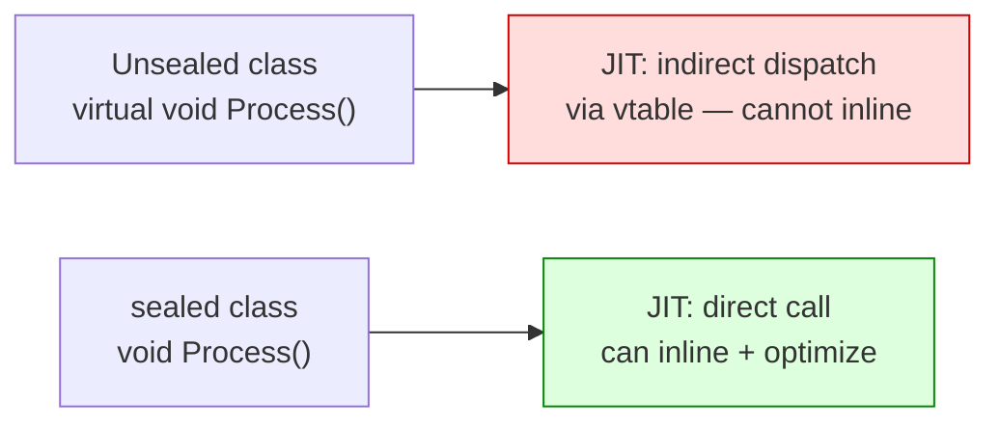

# Sealing (ZA09xx)

Virtual dispatch allows the JIT to inline and devirtualize methods only when it can prove the concrete type at the call site. Sealing a class gives the JIT that proof statically — enabling aggressive inlining and devirtualization without runtime type checks. The ZA09xx rules flag classes that could be sealed for measurable throughput gains.

---

## ZA0901 — Consider sealing classes {#za0901}

> **Severity**: Info | **Min TFM**: Any | **Code fix**: No

### Why

Every virtual method call on an unsealed class requires an indirect dispatch through the vtable. The JIT cannot inline these calls without type profiling data, and even with profiling, devirtualization is speculative and can be invalidated by the introduction of a new subclass at runtime. Sealing the class eliminates the vtable slot, allows the JIT to treat every method call as a direct call that it can inline and optimise freely, and communicates clear design intent to future maintainers. The rule only fires when no type in the same compilation derives from the class, ensuring it never produces a false positive when inheritance is actually used.



### Before

```csharp
// ❌ Unsealed — JIT must use indirect dispatch for every virtual call.
//    The 'virtual' keyword on Process() forces a vtable slot even though
//    nothing ever derives from OrderProcessor in this codebase.
public class OrderProcessor
{
    public virtual void Process(Order order) { /* ... */ }
    public virtual bool Validate(Order order) { /* ... */ }
}
```

### After

```csharp
// ✓ Sealed — JIT can inline Process() and Validate() at every call site.
//    Remove 'virtual' too: a virtual method on a sealed class still
//    dispatches through the vtable. Removing it makes the intent explicit
//    and lets the JIT optimise unconditionally.
public sealed class OrderProcessor
{
    public void Process(Order order) { /* ... */ }
    public bool Validate(Order order) { /* ... */ }
}
```

**Important:** always remove `virtual` when sealing. A method marked both `sealed` and `virtual` (outside of an override context) still carries virtual dispatch semantics. If the class is sealed and no derived type exists, the `virtual` modifier is superfluous and misleads both the reader and the JIT.

### Real-world example

A MediatR command handler that processes order placement. Handlers are registered as concrete types via dependency injection and are never subclassed — they are leaf nodes in the class hierarchy by design. Making the handler `sealed` and removing `virtual` from all methods allows the JIT to inline the handler body directly at the `mediator.Send()` call site when the concrete type is statically visible, and eliminates one level of indirection in every profiling-guided optimisation path.

```csharp
using System;
using System.Threading;
using System.Threading.Tasks;
using MediatR;
using Microsoft.Extensions.Logging;

namespace MyApp.Orders.Commands;

public sealed record ProcessOrderCommand(
    Guid OrderId,
    Guid CustomerId,
    decimal Total) : IRequest<ProcessOrderResult>;

public sealed record ProcessOrderResult(bool Success, string? ErrorMessage);

/// <summary>
/// Handles the <see cref="ProcessOrderCommand"/> use case.
///
/// This class is intentionally sealed:
///   • No type in this assembly derives from it.
///   • The JIT can devirtualize and inline calls to all methods.
///   • Design intent is explicit — this handler is a leaf, not a base class.
/// </summary>
public sealed class ProcessOrderHandler : IRequestHandler<ProcessOrderCommand, ProcessOrderResult>
{
    private readonly IOrderRepository _repository;
    private readonly IPaymentGateway _paymentGateway;
    private readonly ILogger<ProcessOrderHandler> _logger;

    public ProcessOrderHandler(
        IOrderRepository repository,
        IPaymentGateway paymentGateway,
        ILogger<ProcessOrderHandler> logger)
    {
        _repository    = repository    ?? throw new ArgumentNullException(nameof(repository));
        _paymentGateway = paymentGateway ?? throw new ArgumentNullException(nameof(paymentGateway));
        _logger        = logger        ?? throw new ArgumentNullException(nameof(logger));
    }

    // ✓ Not virtual — direct call, inlineable by the JIT.
    public async Task<ProcessOrderResult> Handle(
        ProcessOrderCommand command,
        CancellationToken cancellationToken)
    {
        _logger.LogInformation(
            "Processing order {OrderId} for customer {CustomerId}",
            command.OrderId, command.CustomerId);

        if (!Validate(command))
            return new ProcessOrderResult(false, "Order validation failed.");

        var order = await _repository.GetByIdAsync(command.OrderId, cancellationToken);
        if (order is null)
            return new ProcessOrderResult(false, $"Order {command.OrderId} not found.");

        var paymentResult = await _paymentGateway.ChargeAsync(
            command.CustomerId,
            command.Total,
            cancellationToken);

        if (!paymentResult.Success)
        {
            _logger.LogWarning(
                "Payment failed for order {OrderId}: {Reason}",
                command.OrderId, paymentResult.FailureReason);

            return new ProcessOrderResult(false, paymentResult.FailureReason);
        }

        order.MarkAsProcessed(paymentResult.TransactionId);
        await _repository.SaveAsync(order, cancellationToken);

        _logger.LogInformation(
            "Order {OrderId} processed successfully. Transaction: {TxId}",
            command.OrderId, paymentResult.TransactionId);

        return new ProcessOrderResult(true, null);
    }

    // ✓ Private helper — already non-virtual; sealed makes the class-level
    //    devirtualization guarantee apply to the public surface too.
    private bool Validate(ProcessOrderCommand command)
    {
        if (command.OrderId == Guid.Empty)
        {
            _logger.LogWarning("Rejected order with empty OrderId.");
            return false;
        }

        if (command.CustomerId == Guid.Empty)
        {
            _logger.LogWarning("Rejected order {OrderId}: empty CustomerId.", command.OrderId);
            return false;
        }

        if (command.Total <= 0m)
        {
            _logger.LogWarning(
                "Rejected order {OrderId}: non-positive total {Total}.",
                command.OrderId, command.Total);
            return false;
        }

        return true;
    }
}
```

### Suppression

```csharp
#pragma warning disable ZA0901
// or in .editorconfig: dotnet_diagnostic.ZA0901.severity = none
```
