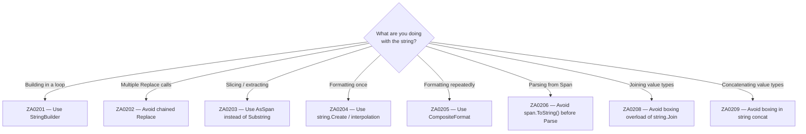

# Strings (ZA02xx)

String operations are deceptively expensive — strings are immutable reference types, so every transformation produces a new heap allocation. The ZA02xx rules help you avoid unnecessary string copies, prefer span-based operations, and use modern allocation-free APIs.



---

## ZA0201 — Avoid string concatenation in loops {#za0201}

> **Severity**: Warning | **Min TFM**: Any | **Code fix**: No

### Why

Each `+=` on a string inside a loop allocates a new string object and copies all previous characters into it. For N iterations this is O(N²) in both time and memory — doubling the number of rows quadruples the allocations. `StringBuilder` amortises allocations over a growing internal buffer, so it performs at O(N) and produces only a single final string allocation when you call `.ToString()`.

### Before

```csharp
// ❌ Each iteration allocates a new string proportional to all previous content
string csv = string.Empty;
foreach (var order in orders)
{
    csv += order.Id + "," + order.Customer + "," + order.Total + "\n";
}
```

### After

```csharp
// ✓ Single buffer allocation, amortised growth, one ToString() at the end
var sb = new StringBuilder();
foreach (var order in orders)
{
    sb.Append(order.Id).Append(',')
      .Append(order.Customer).Append(',')
      .Append(order.Total).Append('\n');
}
string csv = sb.ToString();
```

### Real-world example

```csharp
using System.Collections.Generic;
using System.Text;

public sealed class CsvExporter
{
    private static readonly string[] Headers = ["OrderId", "Customer", "Total", "Status", "PlacedAt"];

    /// <summary>
    /// Generates a UTF-8 CSV export for a report page.
    /// With string concatenation, exporting 10,000 orders allocates ~500 MB of intermediate strings.
    /// With StringBuilder, the same export allocates a single ~800 KB buffer.
    /// </summary>
    public string GenerateCsv(IEnumerable<Order> orders)
    {
        var sb = new StringBuilder(capacity: 64 * 1024); // reasonable starting guess

        // Header row
        sb.AppendJoin(',', Headers).Append('\n');

        foreach (var order in orders)
        {
            sb.Append(order.Id).Append(',')
              .Append(order.Customer).Append(',')
              .Append(order.Total.ToString("F2")).Append(',')
              .Append(order.Status).Append(',')
              .Append(order.PlacedAt.ToString("o")) // ISO 8601
              .Append('\n');
        }

        return sb.ToString();
    }
}

public record Order(int Id, string Customer, decimal Total, string Status, DateTime PlacedAt);
```

### Suppression

```csharp
#pragma warning disable ZA0201
// or in .editorconfig: dotnet_diagnostic.ZA0201.severity = none
```

---

## ZA0202 — Avoid chained string.Replace calls {#za0202}

> **Severity**: Info | **Min TFM**: Any | **Code fix**: No

### Why

Each `.Replace()` call allocates a new intermediate string containing the entire transformed content. Three chained calls on a 10 KB string create three separate 10 KB heap objects that immediately become garbage. For a small, fixed set of replacements, a single `StringBuilder` pass is faster and produces no intermediate strings. For complex or dynamic patterns, `Regex.Replace` with a `MatchEvaluator` handles all substitutions in one traversal.

### Before

```csharp
// ❌ Three intermediate string allocations — the original is never modified in place
string escaped = input
    .Replace("&", "&amp;")
    .Replace("<", "&lt;")
    .Replace(">", "&gt;")
    .Replace("\"", "&quot;");
```

### After

```csharp
// ✓ Single pass, no intermediate strings
static string HtmlEncode(string input)
{
    var sb = new StringBuilder(input.Length + 16);
    foreach (char c in input)
    {
        switch (c)
        {
            case '&':  sb.Append("&amp;");  break;
            case '<':  sb.Append("&lt;");   break;
            case '>':  sb.Append("&gt;");   break;
            case '"':  sb.Append("&quot;"); break;
            default:   sb.Append(c);        break;
        }
    }
    return sb.ToString();
}
```

### Real-world example

```csharp
using System.Text;
using Microsoft.AspNetCore.Html;

/// <summary>
/// Escapes user-provided content before embedding it in an HTML response.
/// The naive chained-Replace approach allocates one full copy of the string per
/// replacement call; this version makes a single linear pass with no intermediate
/// heap objects.
/// </summary>
public sealed class HtmlSanitizer
{
    public HtmlString Sanitize(string userContent)
    {
        if (string.IsNullOrEmpty(userContent))
            return HtmlString.Empty;

        var sb = new StringBuilder(userContent.Length + 32);

        foreach (char c in userContent)
        {
            switch (c)
            {
                case '&':  sb.Append("&amp;");  break;
                case '<':  sb.Append("&lt;");   break;
                case '>':  sb.Append("&gt;");   break;
                case '"':  sb.Append("&quot;"); break;
                case '\'': sb.Append("&#x27;"); break;
                default:   sb.Append(c);        break;
            }
        }

        return new HtmlString(sb.ToString());
    }

    // For patterns that are more dynamic, prefer a compiled Regex with a MatchEvaluator:
    //
    // private static readonly Regex _unsafe = new(@"[&<>""]", RegexOptions.Compiled);
    //
    // public string SanitizeRegex(string input) =>
    //     _unsafe.Replace(input, m => m.Value switch
    //     {
    //         "&"  => "&amp;",
    //         "<"  => "&lt;",
    //         ">"  => "&gt;",
    //         "\"" => "&quot;",
    //         _    => m.Value
    //     });
}
```

### Suppression

```csharp
#pragma warning disable ZA0202
// or in .editorconfig: dotnet_diagnostic.ZA0202.severity = none
```

---

## ZA0203 — Use AsSpan instead of Substring {#za0203}

> **Severity**: Info | **Min TFM**: net5.0 | **Code fix**: No

### Why

`string.Substring(start, length)` always allocates a new string object on the heap and copies the selected characters into it. `AsSpan(start, length)` returns a `ReadOnlySpan<char>` — a zero-allocation stack-only view over the original string's memory. The vast majority of modern .NET APIs — including `Parse`, `TryParse`, `Contains`, `StartsWith`, `SequenceEqual`, and many more — accept `ReadOnlySpan<char>` directly, so the substring never needs to be materialised.

### Before

```csharp
// ❌ Allocates a new string just to parse it immediately
var datePart = line.Substring(0, 8);
DateTime dt = DateTime.ParseExact(datePart, "yyyyMMdd", null);
```

### After

```csharp
// ✓ Zero-allocation span view — no string object created
DateTime dt = DateTime.ParseExact(
    line.AsSpan(0, 8),
    "yyyyMMdd",
    CultureInfo.InvariantCulture,
    DateTimeStyles.None);
```

### Real-world example

```csharp
using System;
using System.Globalization;
using System.IO;

/// <summary>
/// Parses fixed-format application log lines.
/// Format: "20240315 14:23:01.456 [WARN ] Request timed out after 30s"
///          ^------^ ^----------^ ^-----^ ^------------------------------^
///          date     time         level   message
///
/// The Substring-based version allocates 3 strings per line; the AsSpan version
/// allocates nothing until the final message extraction.
/// </summary>
public sealed class LogLineParser
{
    private const int DateEnd    = 8;
    private const int TimeStart  = 9;
    private const int TimeEnd    = 22;
    private const int LevelStart = 24;
    private const int LevelEnd   = 28;
    private const int MsgStart   = 31;

    public LogEntry? TryParse(string line)
    {
        if (line.Length < MsgStart)
            return null;

        // All three fields are parsed without allocating any intermediate strings.
        ReadOnlySpan<char> dateSpan  = line.AsSpan(0, DateEnd);
        ReadOnlySpan<char> timeSpan  = line.AsSpan(TimeStart, TimeEnd - TimeStart);
        ReadOnlySpan<char> levelSpan = line.AsSpan(LevelStart, LevelEnd - LevelStart);

        if (!DateOnly.TryParseExact(dateSpan, "yyyyMMdd", CultureInfo.InvariantCulture,
                DateTimeStyles.None, out var date))
            return null;

        if (!TimeOnly.TryParseExact(timeSpan, "HH:mm:ss.fff", CultureInfo.InvariantCulture,
                DateTimeStyles.None, out var time))
            return null;

        // The message must eventually become a string (it's stored), so ToString() is justified here.
        string message = line.Substring(MsgStart);
        string level   = levelSpan.Trim().ToString();

        return new LogEntry(date, time, level, message);
    }
}

public record LogEntry(DateOnly Date, TimeOnly Time, string Level, string Message);
```

### Suppression

```csharp
#pragma warning disable ZA0203
// or in .editorconfig: dotnet_diagnostic.ZA0203.severity = none
```

---

## ZA0204 — Use string.Create / interpolation instead of string.Format {#za0204}

> **Severity**: Info | **Min TFM**: net6.0 | **Code fix**: No

### Why

`string.Format("...", arg1, arg2)` has two hidden costs: it boxes every value-type argument into an `object[]`, and it re-parses the format string on every call. On .NET 6+, string interpolation (`$"..."`) is lowered by the compiler to `DefaultInterpolatedStringHandler` — a ref struct that lives on the stack, avoids the `object[]` boxing, and writes directly into a pooled or stack-allocated buffer. When you need explicit culture control, `string.Create(CultureInfo, $"...")` gives you the same zero-boxing semantics with a specified locale.

### Before

```csharp
// ❌ Boxes orderId (int) and total (decimal) into object[], re-parses format string each call
string msg = string.Format(
    "Order {0} placed by {1} for ${2:F2}",
    orderId, customerName, total);
```

### After

```csharp
// ✓ No boxing, no format-string parsing — interpolation handler writes directly to buffer
string msg = $"Order {orderId} placed by {customerName} for ${total:F2}";

// ✓ With explicit culture:
string msg = string.Create(
    CultureInfo.InvariantCulture,
    $"Order {orderId} placed by {customerName} for ${total:F2}");
```

### Real-world example

```csharp
using System;
using System.Globalization;

/// <summary>
/// Domain service that raises exceptions with richly formatted messages.
/// These messages are constructed on the hot path (every failed validation),
/// so eliminating boxing and format-string parsing matters at scale.
/// </summary>
public sealed class OrderDomainService
{
    public void PlaceOrder(int orderId, string customerName, decimal total, int stock)
    {
        if (total <= 0m)
        {
            // ❌ Before: boxes orderId (int) and total (decimal)
            // throw new ArgumentException(string.Format(
            //     "Order {0} for customer '{1}' has invalid total {2:F2}",
            //     orderId, customerName, total));

            // ✓ After: interpolation, no boxing
            throw new ArgumentException(
                $"Order {orderId} for customer '{customerName}' has invalid total {total:F2}");
        }

        if (stock <= 0)
        {
            // ✓ With invariant culture for logging/serialisation contexts
            string detail = string.Create(
                CultureInfo.InvariantCulture,
                $"Order {orderId} rejected: stock={stock}, requested total={total:F2}");

            throw new InvalidOperationException(detail);
        }

        // ... fulfil order
    }

    public string BuildReceiptLine(int lineNumber, string sku, int qty, decimal unitPrice)
    {
        decimal lineTotal = qty * unitPrice;

        // ✓ No boxing — qty (int), unitPrice (decimal), and lineTotal (decimal)
        //   are all handled by the interpolation handler without object[] allocation.
        return string.Create(
            CultureInfo.InvariantCulture,
            $"{lineNumber,3}. {sku,-12} {qty,4} × {unitPrice,8:F2} = {lineTotal,10:F2}");
    }
}
```

### Suppression

```csharp
#pragma warning disable ZA0204
// or in .editorconfig: dotnet_diagnostic.ZA0204.severity = none
```

---

## ZA0205 — Use CompositeFormat for repeated format strings {#za0205}

> **Severity**: Info | **Min TFM**: net8.0 | **Code fix**: No

### Why

Even when using the .NET 8 `string.Format` overloads, the format string is re-parsed on every call — the runtime must locate each `{N}` placeholder and its format specifier at runtime each time. `CompositeFormat.Parse(pattern)` does the parse once at startup and stores the compiled segment list. `string.Format(culture, compositeFormat, args)` then uses the pre-parsed representation directly. This is the right pattern for hot paths that apply the same template to thousands of values — for example, report generators, serialisers, and invoice printers.

### Before

```csharp
// ❌ Format string re-parsed on every call, value types boxed into params object[]
foreach (var line in invoiceLines)
{
    string formatted = string.Format(
        "Invoice #{0}: {1} × {2:C} = {3:C}",
        line.InvoiceNumber, line.Quantity, line.UnitPrice, line.LineTotal);
    writer.WriteLine(formatted);
}
```

### After

```csharp
// ✓ Parse once, reuse forever — no repeated parsing, no per-call overhead
private static readonly CompositeFormat InvoiceLineFormat =
    CompositeFormat.Parse("Invoice #{0}: {1} × {2:C} = {3:C}");

foreach (var line in invoiceLines)
{
    string formatted = string.Format(
        CultureInfo.CurrentCulture,
        InvoiceLineFormat,
        line.InvoiceNumber, line.Quantity, line.UnitPrice, line.LineTotal);
    writer.WriteLine(formatted);
}
```

### Real-world example

```csharp
using System;
using System.Collections.Generic;
using System.Globalization;
using System.IO;
using System.Text;

/// <summary>
/// Renders invoice line items into a PDF text buffer.
/// A typical invoice batch contains 5,000–50,000 line items.
/// By parsing the format string once with CompositeFormat, we avoid re-parsing
/// it on each of those calls, which adds up meaningfully in a tight loop.
/// </summary>
public sealed class InvoiceLineFormatter
{
    // CompositeFormat.Parse is called once at class initialisation time.
    private static readonly CompositeFormat LineFormat =
        CompositeFormat.Parse("{0,-6} {1,-30} {2,6} {3,10:C} {4,12:C}");

    private static readonly CompositeFormat TaxLineFormat =
        CompositeFormat.Parse("       {"  + "0,-30} {1,20:P2} {2,12:C}");

    private static readonly CultureInfo ReportCulture =
        new("en-GB"); // pound sterling, DD/MM/YYYY

    public void RenderLines(IEnumerable<InvoiceLine> lines, TextWriter writer)
    {
        // Column headers
        writer.WriteLine(string.Format(
            ReportCulture, LineFormat,
            "#", "Description", "Qty", "Unit Price", "Line Total"));
        writer.WriteLine(new string('-', 70));

        int lineNumber = 1;
        decimal subtotal = 0m;

        foreach (var line in lines)
        {
            // ✓ CompositeFormat — no repeated parse, int and decimal not boxed into object[]
            //   (string.Format(CultureInfo, CompositeFormat, T0..T3) has generic overloads)
            writer.WriteLine(string.Format(
                ReportCulture, LineFormat,
                lineNumber++,
                line.Description,
                line.Quantity,
                line.UnitPrice,
                line.LineTotal));

            subtotal += line.LineTotal;
        }

        writer.WriteLine(new string('-', 70));

        decimal tax = subtotal * 0.20m;
        writer.WriteLine(string.Format(
            ReportCulture, TaxLineFormat,
            "VAT", 0.20m, tax));

        writer.WriteLine(string.Format(
            ReportCulture, LineFormat,
            "", "TOTAL", "", "", subtotal + tax));
    }
}

public record InvoiceLine(string Description, int Quantity, decimal UnitPrice)
{
    public decimal LineTotal => Quantity * UnitPrice;
}
```

### Suppression

```csharp
#pragma warning disable ZA0205
// or in .editorconfig: dotnet_diagnostic.ZA0205.severity = none
```

---

## ZA0206 — Avoid span.ToString() before Parse {#za0206}

> **Severity**: Info | **Min TFM**: net6.0 | **Code fix**: No

### Why

If you already have a `ReadOnlySpan<char>`, calling `.ToString()` converts it to a heap-allocated `string` just to pass it into an overload that accepts `string`. On .NET 6+, `int.Parse`, `double.Parse`, `DateTime.ParseExact`, `Guid.Parse`, `IPAddress.Parse`, and many other types have overloads that accept `ReadOnlySpan<char>` directly, making the intermediate string completely unnecessary. This is especially common in binary protocol readers and high-throughput parsers that work directly over memory buffers.

### Before

```csharp
// ❌ .ToString() allocates a new string that is immediately thrown away
int port = int.Parse(headerSpan.ToString());
```

### After

```csharp
// ✓ ReadOnlySpan<char> overload — no allocation
int port = int.Parse(headerSpan);
```

### Real-world example

```csharp
using System;
using System.Buffers.Text;
using System.Globalization;
using System.Text;

/// <summary>
/// Reads a fixed-format binary protocol header from a received byte buffer.
///
/// Header layout (ASCII-encoded, 64 bytes total):
///   [0..3]   Magic "ZPKT"
///   [4..9]   Version "001.02"
///   [10..14] Port  "08080"
///   [15..19] Timeout ms "30000"
///   [20..35] Session GUID (no dashes, 32 hex chars)
///   [36..63] Padding / reserved
///
/// Without span-aware Parse overloads, each field extraction calls .ToString()
/// on a span slice, producing a short-lived string per field per packet.
/// At 100k packets/sec that is ~400k unnecessary allocations per second.
/// </summary>
public sealed class ProtocolHeaderReader
{
    private const int MagicStart   = 0;
    private const int MagicLen     = 4;
    private const int PortStart    = 10;
    private const int PortLen      = 5;
    private const int TimeoutStart = 15;
    private const int TimeoutLen   = 5;
    private const int SessionStart = 20;
    private const int SessionLen   = 32;

    public bool TryReadHeader(ReadOnlySpan<byte> buffer, out PacketHeader header)
    {
        header = default;

        if (buffer.Length < 64)
            return false;

        // Decode to chars in a stack-allocated buffer — no heap allocation.
        Span<char> chars = stackalloc char[64];
        int charCount = Encoding.ASCII.GetChars(buffer[..64], chars);
        ReadOnlySpan<char> text = chars[..charCount];

        ReadOnlySpan<char> magic = text.Slice(MagicStart, MagicLen);
        if (!magic.SequenceEqual("ZPKT"))
            return false;

        ReadOnlySpan<char> portSpan    = text.Slice(PortStart, PortLen);
        ReadOnlySpan<char> timeoutSpan = text.Slice(TimeoutStart, TimeoutLen);
        ReadOnlySpan<char> sessionSpan = text.Slice(SessionStart, SessionLen);

        // ✓ All three Parse calls accept ReadOnlySpan<char> — zero allocations.
        if (!int.TryParse(portSpan, NumberStyles.None, CultureInfo.InvariantCulture, out int port))
            return false;

        if (!int.TryParse(timeoutSpan, NumberStyles.None, CultureInfo.InvariantCulture, out int timeoutMs))
            return false;

        // Guid.Parse accepts ReadOnlySpan<char> on .NET 6+
        if (!Guid.TryParseExact(sessionSpan, "N", out Guid sessionId))
            return false;

        header = new PacketHeader(port, TimeSpan.FromMilliseconds(timeoutMs), sessionId);
        return true;
    }
}

public readonly record struct PacketHeader(int Port, TimeSpan Timeout, Guid SessionId);
```

### Suppression

```csharp
#pragma warning disable ZA0206
// or in .editorconfig: dotnet_diagnostic.ZA0206.severity = none
```

---

## ZA0208 — Avoid string.Join boxing overload {#za0208}

> **Severity**: Warning | **Min TFM**: Any | **Code fix**: No

### Why

`string.Join(separator, IEnumerable<object>)` and `string.Join(separator, object[])` box every value-type element into an `object` before passing it to the overload. For a list of integers or enum values, this means one heap allocation per element just to convert it to a string. The generic overload `string.Join<T>(separator, IEnumerable<T>)` calls `.ToString()` on each `T` directly without boxing, and is available since .NET 4.0.

### Before

```csharp
// ❌ userId (int), orderId (int), and status (enum) are each boxed to object
string result = string.Join(", ", new object[] { userId, orderId, status });
```

### After

```csharp
// ✓ Generic overload — no boxing, ToString() called on each T in place
string result = string.Join(", ", userId.ToString(), orderId.ToString(), status.ToString());

// ✓ Or use string interpolation for small, fixed sets:
string result = $"{userId}, {orderId}, {status}";
```

### Real-world example

```csharp
using System;
using System.Collections.Generic;

public enum AuditAction { Created, Updated, Deleted, Approved, Rejected }

/// <summary>
/// Writes structured audit log entries correlating multiple integer IDs and enum values.
/// Each call to the old object[] overload boxed every value-type field, producing
/// N short-lived heap objects per log entry. At high audit volume this adds measurable
/// GC pressure. The generic overload eliminates all boxing.
/// </summary>
public sealed class AuditLogger
{
    private readonly IList<string> _entries = new List<string>();

    public void LogAction(
        int tenantId,
        int userId,
        int resourceId,
        AuditAction action,
        DateTimeOffset timestamp)
    {
        // ❌ Before: boxes all five value types into object[]
        // string entry = string.Join(" | ", new object[]
        //     { tenantId, userId, resourceId, action, timestamp });

        // ✓ After: generic overload, no boxing
        string entry = string.Join(" | ",
            tenantId.ToString(),
            userId.ToString(),
            resourceId.ToString(),
            action.ToString(),
            timestamp.ToString("O", System.Globalization.CultureInfo.InvariantCulture));

        _entries.Add(entry);
    }

    /// <summary>
    /// Joins a set of resource IDs affected by a bulk operation.
    /// </summary>
    public string SummariseAffected(IEnumerable<int> resourceIds)
    {
        // ✓ string.Join<T> — no boxing of int elements
        return string.Join(", ", resourceIds);
    }

    /// <summary>
    /// Joins a set of enum flags for a permission change log.
    /// </summary>
    public string SummariseActions(IEnumerable<AuditAction> actions)
    {
        // ✓ string.Join<T> — no boxing of AuditAction (enum) elements
        return string.Join(" + ", actions);
    }
}
```

### Suppression

```csharp
#pragma warning disable ZA0208
// or in .editorconfig: dotnet_diagnostic.ZA0208.severity = none
```

---

## ZA0209 — Avoid value type boxing in string concatenation {#za0209}

> **Severity**: Warning | **Min TFM**: Any | **Code fix**: No

### Why

The `+` operator between a `string` and a value type resolves to `string.Concat(object, object)`, which boxes the value type onto the heap. A single expression like `"Items: " + count + " in " + elapsed + "ms"` boxes each value type once and additionally creates intermediate strings for each sub-concatenation. Switching to string interpolation uses `DefaultInterpolatedStringHandler` on .NET 6+ — a ref struct that writes directly into a stack or pool buffer and calls `.ToString()` on each value without boxing. On older targets, interpolation still avoids the `string.Concat(object, object)` boxing overload by calling `.ToString()` on each operand before concatenation.

### Before

```csharp
// ❌ count (int) and elapsed (long) are each boxed; intermediate strings created
string log = "Processed " + count + " items in " + elapsed + "ms";
```

### After

```csharp
// ✓ No boxing — interpolation handler calls .ToString() on each value type directly
string log = $"Processed {count} items in {elapsed}ms";
```

### Real-world example

```csharp
using System;
using System.Diagnostics;
using System.Runtime.CompilerServices;
using System.Threading;

/// <summary>
/// Emits diagnostic trace messages from a high-frequency event handler.
/// The handler may be called thousands of times per second; each call that
/// uses the + operator with value types produces extra GC pressure from boxing.
/// Switching to interpolation eliminates all boxing in the message construction.
/// </summary>
public sealed class OperationTracer
{
    private readonly ITraceWriter _writer;
    private long _operationCount;

    public OperationTracer(ITraceWriter writer) => _writer = writer;

    /// <summary>
    /// Called on every processed event. Must be allocation-minimal.
    /// </summary>
    public void OnOperationComplete(int batchId, int itemCount, long elapsedMicros, bool hadErrors)
    {
        long opNumber = Interlocked.Increment(ref _operationCount);

        // ❌ Before: batchId, itemCount, elapsedMicros, opNumber all boxed
        // string msg = "Op#" + opNumber + " batch=" + batchId
        //            + " items=" + itemCount + " µs=" + elapsedMicros
        //            + (hadErrors ? " ERRORS" : "");

        // ✓ After: interpolation — no boxing on .NET 6+; .ToString() called per value
        string msg = $"Op#{opNumber} batch={batchId} items={itemCount} µs={elapsedMicros}"
                   + (hadErrors ? " ERRORS" : string.Empty);

        _writer.Write(msg);
    }

    /// <summary>
    /// Logs a periodic summary. Called every 10 seconds — less hot, but same principle.
    /// </summary>
    public void FlushSummary(TimeSpan elapsed, long totalItems, long peakLatencyMicros)
    {
        // ✓ No boxing — all value types handled by interpolation handler
        _writer.Write(
            $"[Summary] elapsed={elapsed.TotalSeconds:F1}s " +
            $"total={totalItems:N0} items " +
            $"peak={peakLatencyMicros}µs");
    }
}

public interface ITraceWriter
{
    void Write(string message);
}
```

### Suppression

```csharp
#pragma warning disable ZA0209
// or in .editorconfig: dotnet_diagnostic.ZA0209.severity = none
```
