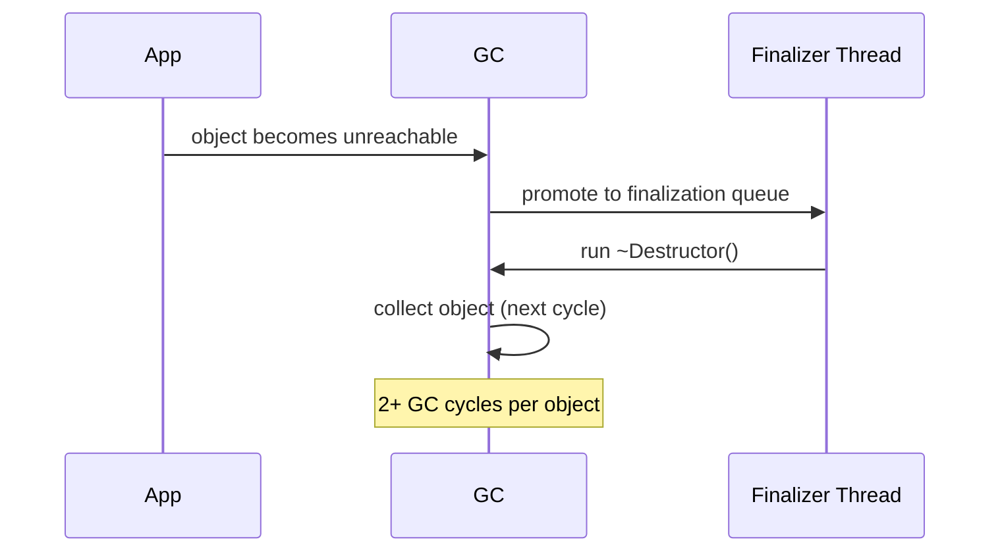

# Value Types (ZA15xx)

Structs have unique performance characteristics that are easy to exploit incorrectly. Using a struct as a dictionary key without overriding `GetHashCode` causes slow reflective hashing; adding a finalizer to any type introduces GC promotion overhead. The ZA15xx rules catch both patterns.

---

## ZA1501 — Override GetHashCode on struct dictionary keys {#za1501}

> **Severity**: Info | **Min TFM**: Any | **Code fix**: No

### Why

The default `ValueType.GetHashCode()` implementation uses reflection to iterate the struct's fields and compute a hash. It is both slow (reflection per call) and potentially allocating. Any struct used as a `Dictionary<TKey, TValue>` key or stored in a `HashSet<T>` should override `GetHashCode()` and `Equals()` with a direct, field-based implementation using `HashCode.Combine`. The custom implementation eliminates reflection, produces a stable and well-distributed hash, and avoids boxing the struct during equality comparisons.

### Before

```csharp
// ❌ no GetHashCode override — uses slow reflective ValueType.GetHashCode()
struct GridCell
{
    public int X;
    public int Y;
}

var grid = new Dictionary<GridCell, Tile>();
```

### After

```csharp
// ✓ explicit, fast hash
readonly struct GridCell : IEquatable<GridCell>
{
    public readonly int X;
    public readonly int Y;

    public GridCell(int x, int y) => (X, Y) = (x, y);

    public override int GetHashCode() => HashCode.Combine(X, Y);
    public bool Equals(GridCell other) => X == other.X && Y == other.Y;
    public override bool Equals(object? obj) => obj is GridCell c && Equals(c);
    public static bool operator ==(GridCell l, GridCell r) => l.Equals(r);
    public static bool operator !=(GridCell l, GridCell r) => !l.Equals(r);
}
```

### Real-world example

A 2D pathfinding algorithm (A\* or Dijkstra) uses a `Dictionary<GridCell, int>` for the cost map and a `HashSet<GridCell>` for the visited set. Every node expansion calls `TryGetValue` and `Contains` — both of which invoke `GetHashCode`. On a 1000×1000 grid, millions of hash calls are made during a single pathfinding run. The reflective default is unacceptably slow and may also box the struct in older runtimes.

```csharp
using System;
using System.Collections.Generic;

// ❌ Before: GridCell uses the slow, reflective ValueType.GetHashCode()
struct GridCellSlow
{
    public int X;
    public int Y;
}

// ✓ After: GridCell with a proper, allocation-free GetHashCode
readonly struct GridCell : IEquatable<GridCell>
{
    public readonly int X;
    public readonly int Y;

    public GridCell(int x, int y) => (X, Y) = (x, y);

    // Direct field hash — no reflection, no allocation
    public override int GetHashCode() => HashCode.Combine(X, Y);

    public bool Equals(GridCell other) => X == other.X && Y == other.Y;
    public override bool Equals(object? obj) => obj is GridCell c && Equals(c);
    public static bool operator ==(GridCell l, GridCell r) => l.Equals(r);
    public static bool operator !=(GridCell l, GridCell r) => !l.Equals(r);

    public override string ToString() => $"({X},{Y})";
}

public static class Pathfinder
{
    private static readonly (int dx, int dy)[] Directions =
    {
        (1, 0), (-1, 0), (0, 1), (0, -1),
    };

    /// <summary>
    /// Dijkstra's shortest path on a grid.
    /// Returns the minimum cost to reach 'goal' from 'start', or -1 if unreachable.
    /// </summary>
    public static int FindShortestPath(
        bool[,] passable,
        GridCell start,
        GridCell goal)
    {
        int rows = passable.GetLength(0);
        int cols = passable.GetLength(1);

        // Both collections hash GridCell on every insert/lookup.
        // Without a custom GetHashCode these hot paths are dominated by reflection.
        var costMap  = new Dictionary<GridCell, int>();
        var visited  = new HashSet<GridCell>();
        var queue    = new PriorityQueue<GridCell, int>();

        costMap[start] = 0;
        queue.Enqueue(start, 0);

        while (queue.Count > 0)
        {
            var current = queue.Dequeue();

            if (current == goal)
                return costMap[current];

            if (!visited.Add(current))
                continue;

            int currentCost = costMap[current];

            foreach (var (dx, dy) in Directions)
            {
                var neighbour = new GridCell(current.X + dx, current.Y + dy);

                if (neighbour.X < 0 || neighbour.X >= rows ||
                    neighbour.Y < 0 || neighbour.Y >= cols)
                    continue;

                if (!passable[neighbour.X, neighbour.Y])
                    continue;

                if (visited.Contains(neighbour))   // ← GetHashCode called here
                    continue;

                int newCost = currentCost + 1;

                if (!costMap.TryGetValue(neighbour, out int oldCost) // ← and here
                    || newCost < oldCost)
                {
                    costMap[neighbour] = newCost;
                    queue.Enqueue(neighbour, newCost);
                }
            }
        }

        return -1; // unreachable
    }
}
```

**Why hash quality matters:**

A poor hash function can cause many `GridCell` values to collide into the same bucket, degrading dictionary lookups from O(1) to O(N). `HashCode.Combine` uses a well-distributed mixing algorithm (based on xxHash32) that spreads grid coordinates evenly across the hash space, keeping bucket chains short and lookup time close to O(1) even on large grids.

### Suppression

```csharp
#pragma warning disable ZA1501
struct MyKey { public int A; public int B; }
#pragma warning restore ZA1501
// or in .editorconfig:
// dotnet_diagnostic.ZA1501.severity = none
```

---

## ZA1502 — Avoid finalizers, use IDisposable {#za1502}

> **Severity**: Info | **Min TFM**: Any | **Code fix**: No

### Why

Any object with a finalizer (`~ClassName()`) is placed on the finalization queue when it becomes unreachable. The GC must promote it to the next generation, run the finalizer on a dedicated thread, and then collect it in a subsequent GC cycle — adding at minimum one extra collection cycle per instance. The standard pattern is `IDisposable` with `GC.SuppressFinalize(this)` in `Dispose()`, so properly-disposed objects bypass the finalization queue entirely. Use a finalizer only as a safety net for unmanaged resources, never as the primary cleanup path.



### Before

```csharp
// ❌ finalizer — 2+ GC cycles per instance
public class NativeBuffer
{
    private IntPtr _handle;

    public NativeBuffer(int size) { _handle = NativeMemory.Alloc((nuint)size); }

    ~NativeBuffer() // finalizer
    {
        if (_handle != IntPtr.Zero)
        {
            NativeMemory.Free((void*)_handle);
            _handle = IntPtr.Zero;
        }
    }
}
```

### After

```csharp
// ✓ IDisposable pattern — finalizer only as safety net
public sealed class NativeBuffer : IDisposable
{
    private IntPtr _handle;
    private bool _disposed;

    public NativeBuffer(int size) { _handle = NativeMemory.Alloc((nuint)size); }

    public void Dispose()
    {
        if (!_disposed && _handle != IntPtr.Zero)
        {
            NativeMemory.Free((void*)_handle);
            _handle = IntPtr.Zero;
            _disposed = true;
        }
        GC.SuppressFinalize(this); // bypass finalizer queue
    }

    ~NativeBuffer() // safety net only — should never run in correct usage
    {
        Dispose();
    }
}
```

### Real-world example

A high-performance binary serializer maintains a pool of native memory buffers to avoid managed heap pressure during serialization. Each buffer wraps a pointer allocated with `NativeMemory.Alloc`. With a finalizer as the only cleanup path, every buffer that is ever created occupies the finalization queue — even buffers returned to the pool promptly. With `IDisposable` and `GC.SuppressFinalize`, returned buffers are freed immediately and never touch the finalization queue at all.

```csharp
using System;
using System.Buffers;
using System.Runtime.InteropServices;

/// <summary>
/// A fixed-size buffer backed by native (unmanaged) memory.
/// Must be disposed after use. The finalizer acts only as a leak-detection
/// safety net and should never fire in correct usage.
/// </summary>
public sealed unsafe class NativeBuffer : IDisposable
{
    private void* _ptr;
    private readonly int _length;
    private bool _disposed;

    public int Length => _length;

    public NativeBuffer(int length)
    {
        if (length <= 0) throw new ArgumentOutOfRangeException(nameof(length));
        _ptr    = NativeMemory.Alloc((nuint)length);
        _length = length;
    }

    /// <summary>Returns a span over the entire buffer.</summary>
    public Span<byte> AsSpan()
    {
        ObjectDisposedException.ThrowIf(_disposed, this);
        return new Span<byte>(_ptr, _length);
    }

    /// <summary>Returns a span over a sub-range of the buffer.</summary>
    public Span<byte> AsSpan(int start, int length)
    {
        ObjectDisposedException.ThrowIf(_disposed, this);
        return new Span<byte>((byte*)_ptr + start, length);
    }

    public void Dispose()
    {
        if (_disposed) return;

        NativeMemory.Free(_ptr);
        _ptr      = null;
        _disposed = true;

        // Removes this object from the finalization queue.
        // When Dispose() is called correctly, the finalizer never runs,
        // and the GC collects this object in a single cycle.
        GC.SuppressFinalize(this);
    }

    // Safety net: fires only if the caller forgot to call Dispose().
    // Logs a diagnostic warning in debug builds to aid detection of leaks.
    ~NativeBuffer()
    {
#if DEBUG
        // Using Console here is intentional — logging infrastructure may be
        // torn down by the time the finalizer runs.
        Console.Error.WriteLine(
            $"[LEAK] NativeBuffer of {_length} bytes was not disposed. " +
            "Ensure every NativeBuffer is used inside a 'using' statement.");
#endif
        Dispose();
    }
}

/// <summary>
/// A simple pool of NativeBuffers reused across serialization calls
/// to avoid repeated allocation and deallocation of native memory.
/// </summary>
public sealed class NativeBufferPool : IDisposable
{
    private readonly int _bufferSize;
    private readonly NativeBuffer?[] _pool;
    private int _count;
    private bool _disposed;

    public NativeBufferPool(int bufferSize, int poolSize = 8)
    {
        _bufferSize = bufferSize;
        _pool       = new NativeBuffer?[poolSize];
    }

    /// <summary>
    /// Rents a buffer from the pool, or allocates a new one if the pool is empty.
    /// The caller MUST return it via <see cref="Return"/> or dispose it directly.
    /// </summary>
    public NativeBuffer Rent()
    {
        ObjectDisposedException.ThrowIf(_disposed, this);

        if (_count > 0)
        {
            var buf = _pool[--_count]!;
            _pool[_count] = null;
            return buf;
        }

        return new NativeBuffer(_bufferSize);
    }

    /// <summary>
    /// Returns a buffer to the pool for reuse. If the pool is full the buffer
    /// is disposed immediately.
    /// </summary>
    public void Return(NativeBuffer buffer)
    {
        if (_disposed || _count == _pool.Length)
        {
            buffer.Dispose(); // pool full or torn down — free immediately
            return;
        }

        _pool[_count++] = buffer;
    }

    public void Dispose()
    {
        if (_disposed) return;
        _disposed = true;

        for (int i = 0; i < _count; i++)
        {
            _pool[i]?.Dispose();
            _pool[i] = null;
        }

        _count = 0;
    }
}

/// <summary>
/// Example call site showing correct usage with 'using'.
/// GC.SuppressFinalize inside NativeBuffer.Dispose() ensures the finalizer
/// never runs for these short-lived buffers, keeping GC pressure minimal.
/// </summary>
public static class SerializerExample
{
    private static readonly NativeBufferPool Pool = new(bufferSize: 65_536);

    public static byte[] Serialize<T>(T value)
    {
        var buffer = Pool.Rent();
        try
        {
            Span<byte> span = buffer.AsSpan();
            // ... write serialized bytes into span ...
            int written = WriteValue(span, value);
            return span[..written].ToArray();
        }
        finally
        {
            // Returning to the pool is equivalent to Dispose() for callers —
            // either way SuppressFinalize is called and the finalizer never runs.
            Pool.Return(buffer);
        }
    }

    private static int WriteValue<T>(Span<byte> destination, T value)
    {
        // Placeholder — real implementation would use e.g. MemoryMarshal
        return 0;
    }
}
```

> **Alternative for OS handles:** When wrapping OS-level handles (file descriptors, sockets, registry keys), prefer deriving from `SafeHandle` or using one of the BCL subclasses (`SafeFileHandle`, `SafeMemoryMappedFileHandle`, etc.). `SafeHandle` already implements the correct `IDisposable` + finalizer pattern with thread-safe reference counting, and the CLR gives it special treatment during GC to prevent handle recycling attacks.

### Suppression

```csharp
#pragma warning disable ZA1502
public class LegacyResource
{
    ~LegacyResource() { /* intentional */ }
}
#pragma warning restore ZA1502
// or in .editorconfig:
// dotnet_diagnostic.ZA1502.severity = none
```
